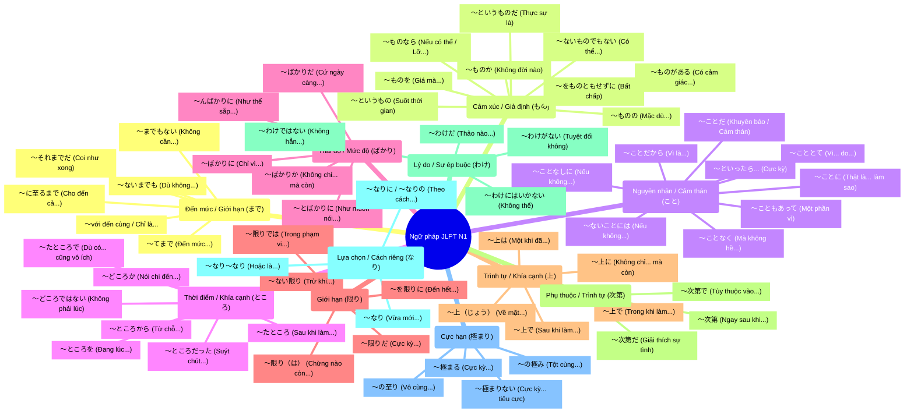

# 📚 Kho Tài Liệu & Sơ Đồ Tư Duy Ngữ Pháp JLPT N1

Chào mừng bạn đến với kho tài liệu ôn luyện ngữ pháp **JLPT N1**. Tại đây, các ngữ pháp nâng cao được nhóm lại theo các từ gốc hoặc danh từ hình thức tương tự nhau để giúp bạn dễ dàng so sánh, đối chiếu và tránh nhầm lẫn trong bài thi.

**🔥 Tổng số mẫu ngữ pháp: 60 mẫu** (chia thành 11 nhóm gốc cơ bản).

---

## 🗺️ Sơ Đồ Tư Duy Tổng Quan (Mindmap)

*Dưới đây là sơ đồ tư duy tương tác trực quan được dựng bằng **Mermaid.js**. GitHub sẽ tự động hiển thị sơ đồ này ngay trên trang này.*

---

## 📂 Danh Sách Tài Liệu Chi Tiết

Dưới đây là liên kết đến các file chi tiết của từng nhóm ngữ pháp. Mỗi file đều có bảng so sánh sắc thái kết nối, giải thích ngữ nghĩa và các ví dụ tiếng Nhật đi kèm dịch nghĩa tiếng Việt.

| Nhóm Ngữ Pháp | Số Lượng | Liên Kết Tài Liệu | Nội Dung Tóm Tắt |
| :--- | :---: | :--- | :--- |
| **まで (Made)** | 6 | [n1_grammar_made.md](./n1_grammar_made.md) | Thể hiện giới hạn cực đoan, điểm dừng của hành động. |
| **もの (Mono)** | 9 | [n1_grammar_mono.md](./n1_grammar_mono.md) | Biểu đạt cảm xúc, giả định, tiếc nuối và phản đối. |
| **こと (Koto)** | 9 | [n1_grammar_koto.md](./n1_grammar_koto.md) | Diễn đạt lý do, điều kiện cần, khuyên bảo và cảm thán. |
| **ところ (Tokoro)** | 7 | [n1_grammar_tokoro.md](./n1_grammar_tokoro.md) | Mô tả bối cảnh thời điểm, nhượng bộ và căn cứ phán đoán. |
| **ばかり (Bakari)** | 5 | [n1_grammar_bakari.md](./n1_grammar_bakari.md) | Chỉ thái độ thay lời nói, trạng thái suýt diễn ra. |
| **限り (Kagiri)** | 5 | [n1_grammar_kagiri.md](./n1_grammar_kagiri.md) | Giới hạn thời gian kết thúc hoặc mức độ cảm xúc tối đa. |
| **上 (Ue)** | 5 | [n1_grammar_ue.md](./n1_grammar_ue.md) | Liên quan đến trình tự thực hiện và khía cạnh đánh giá. |
| **次第 (Shidai)** | 3 | [n1_grammar_shidai.md](./n1_grammar_shidai.md) | Chỉ sự ưu tiên thời gian và sự phụ thuộc quyết định. |
| **わけ (Wake)** | 4 | [n1_grammar_wake.md](./n1_grammar_wake.md) | Đưa ra các suy luận logic và ràng buộc lương tâm/xã hội. |
| **なり (Nari)** | 3 | [n1_grammar_nari.md](./n1_grammar_nari.md) | Biểu thị quan hệ tức thì, lựa chọn ví dụ và sự tương thích. |
| **極まり (Kiwamari)** | 4 | [n1_grammar_kiwamari.md](./n1_grammar_kiwamari.md) | Đạt đến điểm giới hạn tột cùng của cảm xúc/trạng thái. |
| **So Sánh (Mono vs Koto)** | - | [n1_grammar_mono_vs_koto.md](./n1_grammar_mono_vs_koto.md) | Phân biệt chi tiết cách dùng và sắc thái giữa hai hệ ngữ pháp. |
| **So Sánh (Mono vs Wake)** | - | [n1_grammar_mono_vs_wake.md](./n1_grammar_mono_vs_wake.md) | Phân biệt chi tiết cách dùng và sắc thái giữa hai hệ ngữ pháp. |
