# 🎨 Từ Láy & Phó Từ Tượng Hình Tiếng Nhật (Goi - Onomatopoeia)

Sổ tay trực quan tổng hợp 100 từ láy tượng thanh, tượng hình (擬音語・擬態語) và phó từ thường gặp trong JLPT. Các từ được phân nhóm ý nghĩa rõ ràng giúp bạn dễ dàng so sánh và học tập hiệu quả.

---

## 📌 Phân Nhóm: Trạng Thái Tinh Thần & Cảm Xúc

### 1. すっきり
* **Ý nghĩa:** Sảng khoái / Nhẹ nhõm / Gọn gàng (sau khi trút bỏ gánh nặng)

> [!NOTE] **Định nghĩa & Sắc thái**
> * **日本語:** 余計なものや面倒なものがなく、気持ちがよい様子。
> * **Sắc thái:** Cảm giác dễ chịu khi những điều phiền toái, thừa thãi hoặc mập mờ được giải quyết triệt để (ví dụ: dọn dẹp xong phòng sạch sẽ, giải tỏa lo lắng trong lòng, hoặc hát hò giải trí xong).
> * **Từ đồng nghĩa:** さっぱり, ほっと
> * **Từ trái nghĩa:** むかむか, もやもや

> [!TIP] **Ví dụ thực tế (例文)**
> * カラオケで大声で歌ったら、気分がすっきりした。
>   * *Hát thật to ở karaoke xong, tâm trạng sảng khoái hẳn.*

---

### 2. がっかり
* **Ý nghĩa:** Thất vọng / Chán nản / Sụp đổ tinh thần

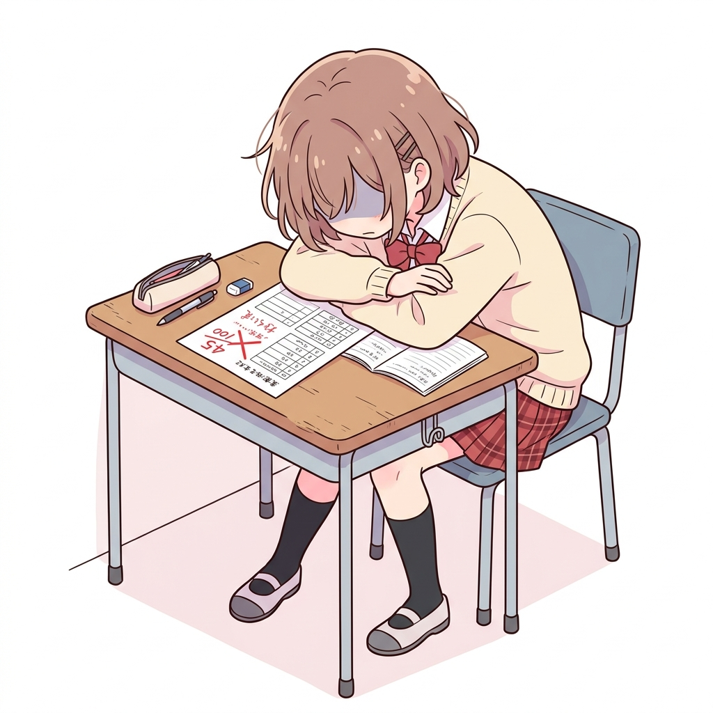

> [!NOTE] **Định nghĩa & Sắc thái**
> * **日本語:** 期待が外れて、力落としをする様子。
> * **Sắc thái:** Trạng thái buồn bã, mất sạch năng lượng khi kỳ vọng lớn của bản thân bị đổ vỡ (dáng vẻ vai sụp xuống, cúi mặt).
> * **Từ đồng nghĩa:** しょんぼり, 失望する
> * **Từ trái nghĩa:** うきうき, わくわく

> [!TIP] **Ví dụ thực tế (例文)**
> * 楽しみにしていたコンサートが中止になり、がっかりした。
>   * *Buổi hòa nhạc mong đợi bấy lâu bị hủy bỏ khiến tôi vô cùng thất vọng.*

---

### 3. いらいら
* **Ý nghĩa:** Bực bội / Sốt ruột / Nóng lòng

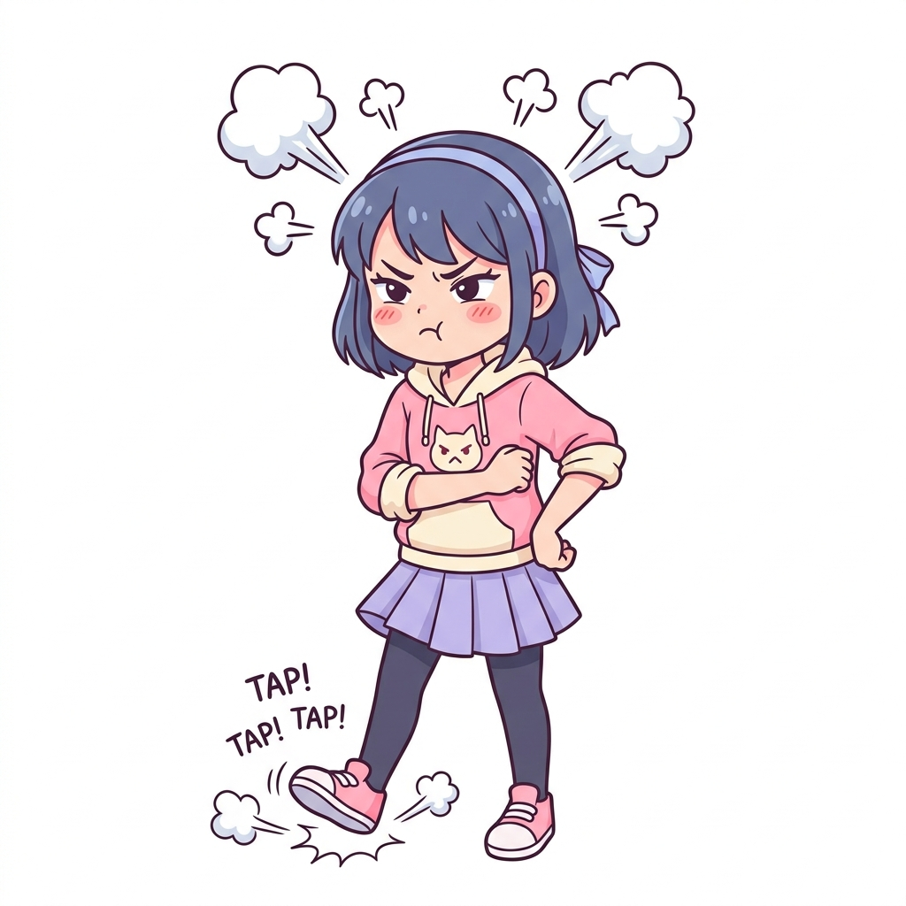

> [!NOTE] **Định nghĩa & Sắc thái**
> * **日本語:** 物事が思うようにならず、気持ちが落ち着かない様子。
> * **Sắc thái:** Cảm xúc bực bội, khó chịu khi mọi việc không diễn ra theo ý muốn hoặc phải chờ đợi lâu mà sốt ruột.
> * **Từ đồng nghĩa:** やきもき, 焦る
> * **Từ trái nghĩa:** のんびり, ほっと

> [!TIP] **Ví dụ thực tế (例文)**
> * 渋滞で車が全然進まず、いらいらする。
>   * *Vì kẹt xe nên xe hoàn toàn không tiến lên được, thật là bực bội.*

---

### 4. どきどき
* **Ý nghĩa:** Hồi hộp / Tim đập thình thịch

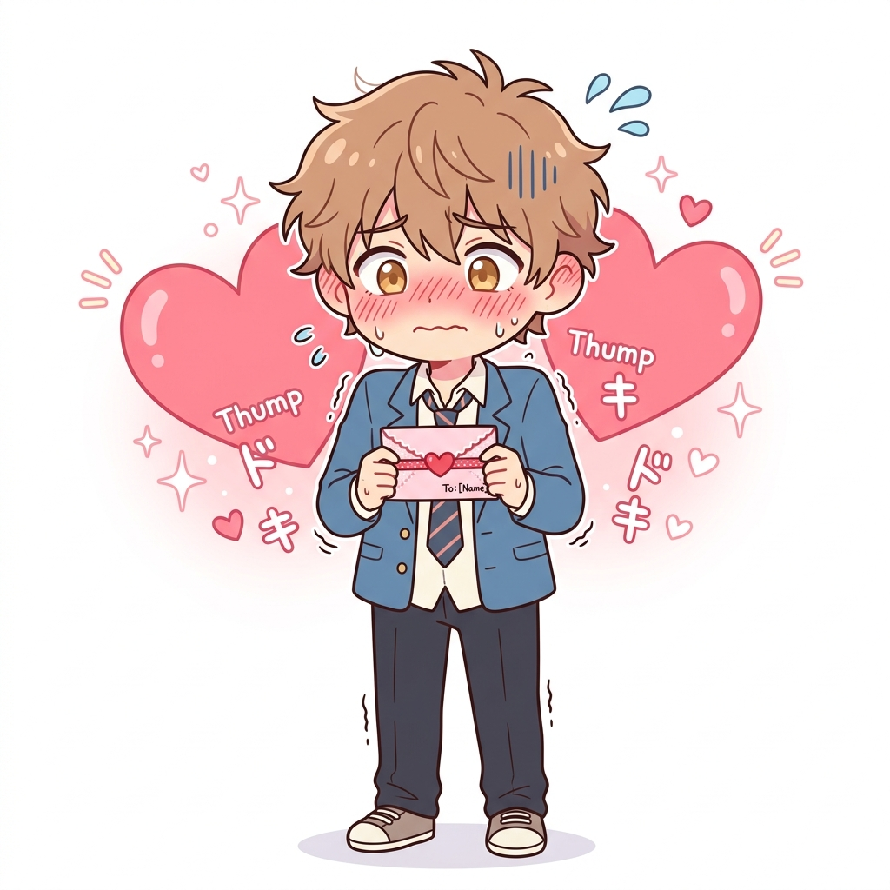

> [!NOTE] **Định nghĩa & Sắc thái**
> * **日本語:** 運動や緊張、驚きなどで心臓の鼓動が速くなる様子。
> * **Sắc thái:** Tiếng tim đập nhanh do lo lắng, căng thẳng, sợ hãi hoặc phấn khích (ví dụ trước khi phát biểu, gặp người yêu, hoặc khi đứng trước kết quả thi).
> * **Từ đồng nghĩa:** はらはら, 緊張する
> * **Từ trái nghĩa:** ほっとする, 落ち着く

> [!TIP] **Ví dụ thực tế (例文)**
> * 発表の番が近づいてきて、胸がどきどきしている。
>   * *Lượt phát biểu đang đến gần, lồng ngực tôi đập thình thịch.*

---

### 5. わくわく
* **Ý nghĩa:** Háo hức / Hồi hộp mong chờ

> [!NOTE] **Định nghĩa & Sắc thái**
> * **日本語:** 期待や喜びで胸が躍り、落ち着かない様子。
> * **Sắc thái:** Trạng thái háo hức, mong đợi những điều tốt đẹp, vui sướng sắp diễn ra (như trước chuyến đi du lịch, trước ngày khai giảng).
> * **Từ đồng nghĩa:** うきうき, 期待する
> * **Từ trái nghĩa:** がっかり, しょんぼり

> [!TIP] **Ví dụ thực tế (例文)**
> * 明日から旅行なので, 心がわくわくしている。
>   * *Vì ngày mai đi du lịch nên trong lòng vô cùng háo hức.*

---

### 6. はらはら
* **Ý nghĩa:** Lo lắng / Nhấp nhổm (lo sợ giùm cho người khác)

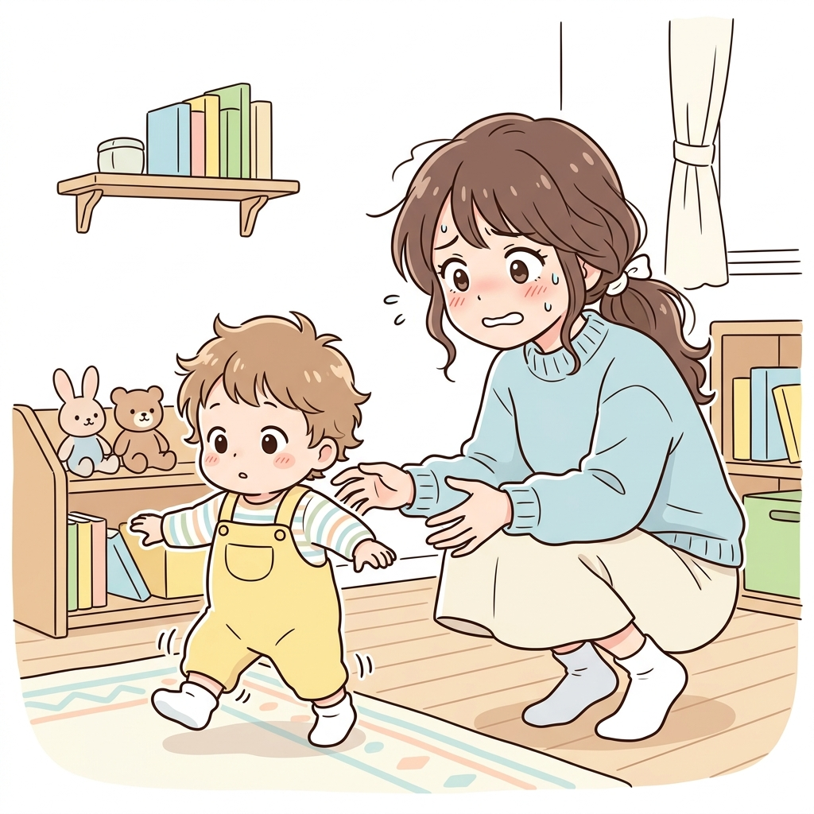

> [!NOTE] **Định nghĩa & Sắc thái**
> * **日本語:** 他人の様子を見て、危なっかしくて心配する様子。
> * **Sắc thái:** Cảm giác lo sợ, hồi hộp khi nhìn thấy người khác ở trong tình thế nguy hiểm (như xem xiếc, nhìn em bé tập đi).
> * **Từ đồng nghĩa:** どきどき, ハラハラする
> * **Từ trái nghĩa:** ほっとする, 安心する

> [!TIP] **Ví dụ thực tế (例文)**
> * 子供が木に登っているのを見て、はらはらした。
>   * *Nhìn thấy đứa trẻ trèo lên cây mà tôi lo nhấp nhổm cả người.*

---

### 7. うっとり
* **Ý nghĩa:** Say đắm / Ngây ngất / Say sưa ngắm nhìn

> [!NOTE] **Định nghĩa & Sắc thái**
> * **日本語:** 美しいものなどに心を奪われて、ぼんやりしている様子。
> * **Sắc thái:** Tâm trạng bị hút hồn, say đắm trước vẻ đẹp hoặc một tác phẩm nghệ thuật, âm nhạc xuất sắc.
> * **Từ đồng nghĩa:** うっとりする, 恍惚とする
> * **Từ trái nghĩa:** 無関心, 興ざめする

> [!TIP] **Ví dụ thực tế (例文)**
> * 彼女は美しいバイオリンの音色にうっとり聞き入っていた。
>   * *Cô ấy say sưa lắng nghe giai điệu vĩ cầm tuyệt đẹp.*

---

### 8. しょんぼり
* **Ý nghĩa:** Ủ rũ / Buồn bã / Thẫn thờ

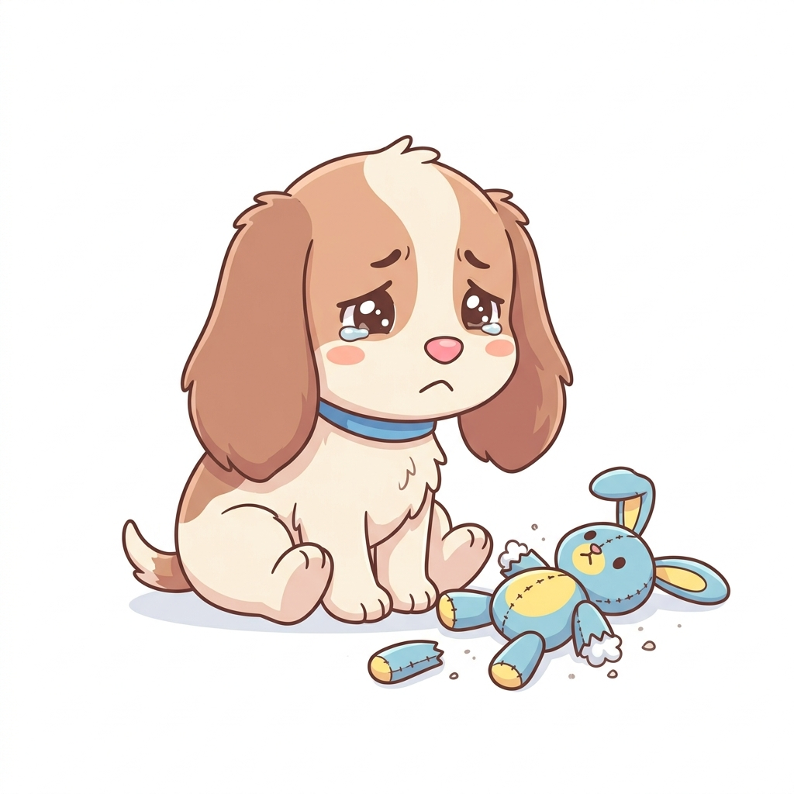

> [!NOTE] **Định nghĩa & Sắc thái**
> * **日本語:** 元気がなく、うなだれている様子。
> * **Sắc thái:** Dáng vẻ buồn bã, ủ rũ vì bị mắng, thất bại nhẹ hoặc gặp chuyện buồn nhỏ.
> * **Từ đồng nghĩa:** がっかり, 落ち込む
> * **Từ trái nghĩa:** うきうき, 元気いっぱい

> [!TIP] **Ví dụ thực tế (例文)**
> * 叱られた犬が、しょんぼりして座っている。
>   * *Chú chó bị mắng đang ngồi ủ rũ một góc.*

---

### 9. びくびく
* **Ý nghĩa:** Run sợ / Phấp phỏng lo sợ / Sợ sệt

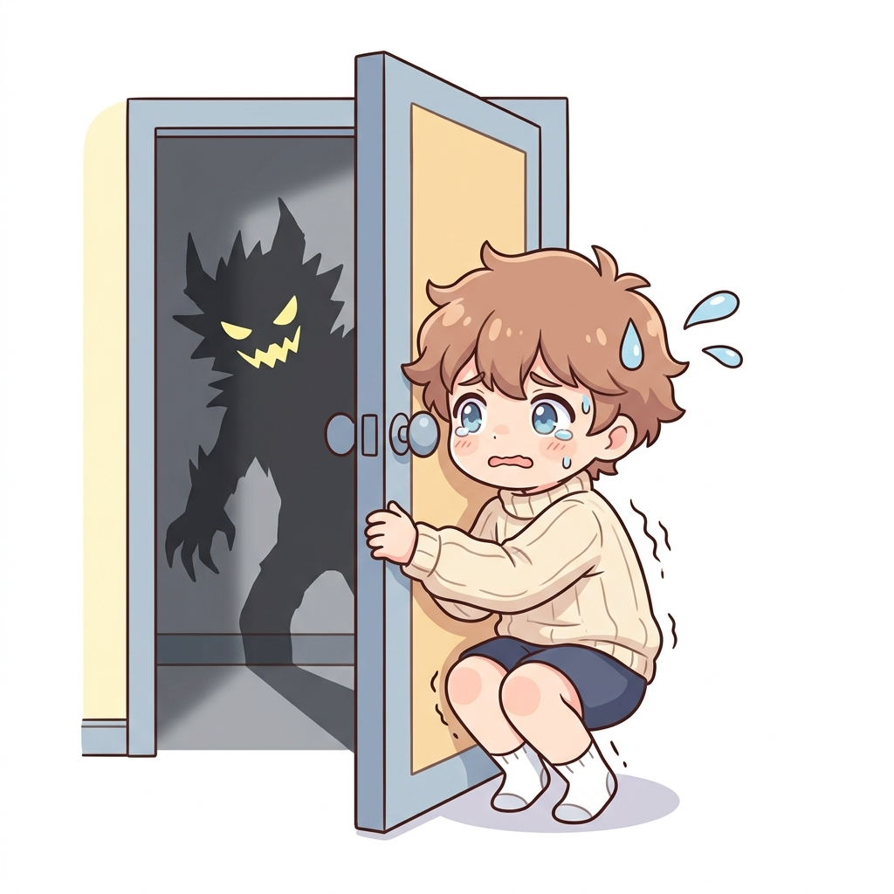

> [!NOTE] **Định nghĩa & Sắc thái**
> * **日本語:** 恐れて、体が震える様子。心配で落ち着かない様子。
> * **Sắc thái:** Sự sợ hãi dồn dập, phấp phỏng vì sợ bị phát hiện lỗi lầm, sợ bị phạt hoặc gặp nguy hiểm.
> * **Từ đồng nghĩa:** おどおど, 恐れる
> * **Từ trái nghĩa:** 堂々とする, 泰然とする

> [!TIP] **Ví dụ thực tế (例文)**
> * 先生に叱られるのではないかと、びくびくしている。
>   * *Tôi cứ phấp phỏng lo sợ không biết có bị thầy giáo mắng hay không.*

---

### 10. おどおど
* **Ý nghĩa:** Rụt rè / Lúng túng / Khép nép (thiếu tự tin)

*(Ảnh minh họa cho từ này sẽ được bổ sung ở các đợt học sau)*

> [!NOTE] **Định nghĩa & Sắc thái**
> * **日本語:** 自信がなく、恐れて落ち着かない態度をとる様子。
> * **Sắc thái:** Thái độ e sợ, không tự tin, ngập ngừng lúng túng khi giao tiếp hoặc đứng trước đám đông.
> * **Từ đồng nghĩa:** びくびく, 卑屈になる
> * **Từ trái nghĩa:** 堂々とする, はきはきする

> [!TIP] **Ví dụ thực tế (例文)**
> * 面接の時、緊張しておどおどしてしまった。
>   * *Lúc phỏng vấn, vì căng thẳng nên tôi cứ lúng ta lúng túng.*

---

### 11. ほっと
* **Ý nghĩa:** Thở phào nhẹ nhõm / Yên tâm

*(Ảnh minh họa cho từ này sẽ được bổ sung ở các đợt học sau)*

> [!NOTE] **Định nghĩa & Sắc thái**
> * **日本語:** 緊張が解けて、安心する様子。
> * **Sắc thái:** Cảm giác trút bỏ căng thẳng, thở phào khi một nguy cơ trôi qua hoặc công việc kết thúc thành công.
> * **Từ đồng nghĩa:** 安心する, 一安心
> * **Từ trái nghĩa:** はらはら, どきどき

> [!TIP] **Ví dụ thực tế (例文)**
> * 試験がすべて終わって、ほっとした。
>   * *Kỳ thi đã kết thúc hoàn toàn, tôi thở phào nhẹ nhõm.*

---

### 12. むかむか
* **Ý nghĩa:** Nôn nao / Bực tức / Tức tối lồng lộn

*(Ảnh minh họa cho từ này sẽ được bổ sung ở các đợt học sau)*

> [!NOTE] **Định nghĩa & Sắc thái**
> * **日本語:** 吐き気がする様子。また、怒りでおさまらない様子。
> * **Sắc thái:** Có hai nghĩa: Cảm thấy nôn nao, buồn nôn ở dạ dày; Hoặc cảm giác tức tối phát điên vì hành động vô lý của ai đó.
> * **Từ đồng nghĩa:** いらいら, 吐き気がする
> * **Từ trái nghĩa:** すっきり, さっぱり

> [!TIP] **Ví dụ thực tế (例文)**
> * 彼の失礼な態度を思い出すと、今でも胸がむかむかする。
>   * *Nghĩ lại thái độ vô lễ của anh ta, đến giờ tôi vẫn thấy tức cành hông.*

---

### 13. やきもき
* **Ý nghĩa:** Sốt ruột / Bồn chồn lo lắng (về chuyện của người khác)

*(Ảnh minh họa cho từ này sẽ được bổ sung ở các đợt học sau)*

> [!NOTE] **Định nghĩa & Sắc thái**
> * **日本語:** 他人のことが心配で、どうしていいか焦る様子。
> * **Sắc thái:** Sự bồn chồn sốt ruột vì lo lắng cho tình hình của người khác mà bản thân không thể can thiệp được.
> * **Từ đồng nghĩa:** いらいら, 心配する
> * **Từ trái nghĩa:** のんびり, 泰然とする

> [!TIP] **Ví dụ thực tế (例文)**
> * 連絡が取れない息子を心配して、母はやきもきしていた。
>   * *Lo lắng cho đứa con trai không liên lạc được, người mẹ cứ bồn chồn đứng ngồi không yên.*

---

### 14. おろおろ
* **Ý nghĩa:** Cuống cuồng / Lúng túng mất phương hướng

*(Ảnh minh họa cho từ này sẽ được bổ sung ở các đợt học sau)*

> [!NOTE] **Định nghĩa & Sắc thái**
> * **日本語:** どうしていいか分からず、慌てふためく様子。
> * **Sắc thái:** Trạng thái rối bời, không biết phải xử lý thế nào khi xảy ra sự cố đột ngột ngoài tầm kiểm soát.
> * **Từ đồng nghĩa:** うろたえる, パニックになる
> * **Từ trái nghĩa:** 冷静沈着, 落ち着く

> [!TIP] **Ví dụ thực tế (例文)**
> * 事故の現場を見て, 何もできずにおろおろするばかりだった。
>   * *Nhìn thấy hiện trường tai nạn, tôi chỉ biết cuống cuồng lúng túng mà không làm được gì.*

---

### 15. びっくり
* **Ý nghĩa:** Giật mình / Kinh ngạc / Bất ngờ

*(Ảnh minh họa cho từ này sẽ được bổ sung ở các đợt học sau)*

> [!NOTE] **Định nghĩa & Sắc thái**
> * **日本語:** 急な出来事に驚く様子。
> * **Sắc thái:** Sự ngạc nhiên, giật mình do những âm thanh lớn hoặc sự việc bất ngờ xảy ra ngay trước mắt.
> * **Từ đồng nghĩa:** 驚く, 仰天する
> * **Từ trái nghĩa:** 平気, 動じない

> [!TIP] **Ví dụ thực tế (例文)**
> * 大きな音がして、びっくりして跳び上がった。
>   * *Có tiếng động lớn phát ra khiến tôi giật mình nhảy dựng lên.*

---

### 16. うきうき
* **Ý nghĩa:** Hân hoan / Rộn ràng vui tươi

*(Ảnh minh họa cho từ này sẽ được bổ sung ở các đợt học sau)*

> [!NOTE] **Định nghĩa & Sắc thái**
> * **日本語:** 嬉しくて気持ちが浮き立ち、楽しそうな様子。
> * **Sắc thái:** Tâm trạng phấn chấn, nhẹ nhàng, vui vẻ biểu hiện ra bên ngoài (như bước đi nhún nhảy vì vui).
> * **Từ đồng nghĩa:** わくわく, うきうきする
> * **Từ trái nghĩa:** しょんぼり, がっかり

> [!TIP] **Ví dụ thực tế (例文)**
> * 彼女は新しいデート服を着て、うきうきと出かけた。
>   * *Cô ấy diện bộ đồ hẹn hò mới rồi hân hoan bước ra ngoài.*

---

### 17. めそめそ
* **Ý nghĩa:** Khóc thút thít / Sụt sùi

*(Ảnh minh họa cho từ này sẽ được bổ sung ở các đợt học sau)*

> [!NOTE] **Định nghĩa & Sắc thái**
> * **日本語:** 弱々しく泣き続ける様子。
> * **Sắc thái:** Hành động khóc nhỏ, kéo dài, thút thít (thường dùng cho trẻ con hoặc người yếu đuối).
> * **Từ đồng nghĩa:** しくしく, 泣く
> * **Từ trái nghĩa:** にこにこ, からから笑う

> [!TIP] **Ví dụ thực tế (例文)**
> * いつまでもめそめそ泣くのはやめなさい。
>   * *Đừng có khóc thút thít suốt như thế nữa.*

---

### 18. おずおず
* **Ý nghĩa:** Rụt rè / Rón rén / Ngần ngại

*(Ảnh minh họa cho từ này sẽ được bổ sung ở các đợt học sau)*

> [!NOTE] **Định nghĩa & Sắc thái**
> * **日本語:** ためらいながら、恐る恐る物事を行う様子。
> * **Sắc thái:** Hành vi ngập ngừng, rụt rè tiến lại gần hoặc đặt câu hỏi vì sợ sệt hay kính cẩn.
> * **Từ đồng nghĩa:** 恐る恐る, ためらう
> * **Từ trái nghĩa:** 堂々と, 思い切って

> [!TIP] **Ví dụ thực tế (例文)**
> * 彼は社長室のドアをおずおずとノックした。
>   * *Anh ấy rụt rè gõ cửa phòng giám đốc.*

---

### 19. もじもじ
* **Ý nghĩa:** Ngượng nghịu / Ngại ngùng lúng túng

*(Ảnh minh họa cho từ này sẽ được bổ sung ở các đợt học sau)*

> [!NOTE] **Định nghĩa & Sắc thái**
> * **日本語:** 恥ずかしがって、言いたいことが言えない様子。
> * **Sắc thái:** Thái độ ngượng ngùng, ngập ngừng không dám bộc lộ ý kiến hay hành động vì xấu hổ trước người khác.
> * **Từ đồng nghĩa:** はにかむ, 照れる
> * **Từ trái nghĩa:** 堂々とする, はきはきする

> [!TIP] **Ví dụ thực tế (例文)**
> * 子供は知らない人の前で、恥ずかしそうにもじもじしていた。
>   * *Đứa bé ngượng nghịu lúng túng trước mặt người lạ.*

---

### 20. てきぱき
* **Ý nghĩa:** Nhanh nhẹn / Tháo vát / Nhanh nhảu

*(Ảnh minh họa cho từ này sẽ được bổ sung ở các đợt học sau)*

> [!NOTE] **Định nghĩa & Sắc thái**
> * **日本語:** 仕事を要領よく、手際よく進める様子。
> * **Sắc thái:** Cách giải quyết công việc vô cùng nhanh chóng, có trình tự và hiệu quả cao.
> * **Từ đồng nghĩa:** さっさと, 手際よく
> * **Từ trái nghĩa:** ぐずぐず, のろのろ

> [!TIP] **Ví dụ thực tế (例文)**
> * 彼女は家事をてきぱきと片付けた。
>   * *Cô ấy tháo vát dọn dẹp nhanh gọn việc nhà.*

---

### 21. ぬくぬく
* **Ý nghĩa:** Ấm êm / Dễ chịu / Sung sướng

*(Ảnh minh họa cho từ này sẽ được bổ sung ở các đợt học sau)*

> [!NOTE] **Định nghĩa & Sắc thái**
> * **日本語:** 暖かく快適に過ごす様子。楽をしている様子。
> * **Sắc thái:** Trạng thái sống thoải mái, ấm áp dễ chịu mà không phải chịu vất vả cực nhọc.
> * **Từ đồng nghĩa:** ぬくぬくする, 快適に過ごす
> * **Từ trái nghĩa:** がたがた, 震える

> [!TIP] **Ví dụ thực tế (例文)**
> * 寒い冬の日に、こたつでぬくぬく過ごすのは最高だ。
>   * *Vào ngày đông giá rét, ngồi ấm êm trong bàn sưởi Kotatsu thì thật tuyệt vời.*

---

### 22. はっきり
* **Ý nghĩa:** Rõ ràng / Dứt khoát

*(Ảnh minh họa cho từ này sẽ được bổ sung ở các đợt học sau)*

> [!NOTE] **Định nghĩa & Sắc thái**
> * **日本語:** 形や意味が明確で、疑う余地がない様子。
> * **Sắc thái:** Trạng thái biểu đạt rõ ràng về mặt hình ảnh, âm thanh hoặc ý chí dứt khoát không mập mờ.
> * **Từ đồng nghĩa:** 明確に, くっきり
> * **Từ trái nghĩa:** ぼんやり, うやむや

> [!TIP] **Ví dụ thực tế (例文)**
> * 富士山がはっきりと見えた。
>   * *Núi Phú Sĩ đã nhìn thấy rõ mồn một.*

---

### 23. すくすく
* **Ý nghĩa:** Mau lớn / Khỏe mạnh (trẻ em, cây cối)

*(Ảnh minh họa cho từ này sẽ được bổ sung ở các đợt học sau)*

> [!NOTE] **Định nghĩa & Sắc thái**
> * **日本語:** 元気に成長する様子。
> * **Sắc thái:** Trạng thái lớn nhanh như thổi, phát triển khỏe mạnh của trẻ nhỏ hoặc thực vật.
> * **Từ đồng nghĩa:** 順調に育つ
> * **Từ trái nghĩa:** 衰える, 枯れる

> [!TIP] **Ví dụ thực tế (例文)**
> * 子供たちは健康に、すくすくと育っている。
>   * *Lũ trẻ đang phát triển vô cùng khỏe mạnh, lớn nhanh như thổi.*

---

### 24. いそいそ
* **Ý nghĩa:** Hớn hở vội vã / Hăm hở

*(Ảnh minh họa cho từ này sẽ được bổ sung ở các đợt học sau)*

> [!NOTE] **Định nghĩa & Sắc thái**
> * **日本語:** 楽しみな事のために、嬉しそうに準備して出かける様子。
> * **Sắc thái:** Dáng vẻ hối hả chuẩn bị ra ngoài với tâm trạng phấn khởi vì có việc vui chờ đợi phía trước.
> * **Từ đồng nghĩa:** うきうき, 嬉しそうに
> * **Từ trái nghĩa:** とぼとぼ, 重い足取りで

> [!TIP] **Ví dụ thực tế (例文)**
> * 彼はパーティーに行くために、いそいそと支度をしている。
>   * *Anh ấy đang hớn hở chuẩn bị sửa soạn để đi dự tiệc.*

---

### 25. じりじり
* **Ý nghĩa:** Nóng ruột chờ đợi / Sốt ruột

*(Ảnh minh họa cho từ này sẽ được bổ sung ở các đợt học sau)*

> [!NOTE] **Định nghĩa & Sắc thái**
> * **日本語:** 焦って、いらだちながら待つ様子。
> * **Sắc thái:** Cảm giác sốt ruột, nóng lòng chờ đợi một thời khắc nào đó đang đến rất chậm.
> * **Từ đồng nghĩa:** いらいら, 焦る
> * **Từ trái nghĩa:** のんびり, 泰然とする

> [!TIP] **Ví dụ thực tế (例文)**
> * 締め切り時間が近づき, じりじりしながら待った。
>   * *Thời hạn chót đang đến gần, tôi sốt ruột nóng lòng chờ đợi.*

---

## 📌 Phân Nhóm: Cảm Giác Cơ Thể & Thể Chất

### 26. さっぱり
* **Ý nghĩa:** Sảng khoái mát mẻ / Thanh đạm (vị ăn) / Hoàn toàn không (kèm phủ định)

> [!NOTE] **Định nghĩa & Sắc thái**
> * **日本語:** 汚れや不快感が消えて爽快な様子。しつこさがない様子。
> * **Sắc thái:** Thường dùng cho sự dễ chịu của cơ thể sau tắm, rửa sạch bụi bẩn, hoặc vị thức ăn thanh mát không ngấy. Ở phủ định chỉ sự hoàn toàn không hiểu/biết.
> * **Từ đồng nghĩa:** すっきり, 清々しい
> * **Từ trái nghĩa:** しつこい, むかむか

> [!TIP] **Ví dụ thực tế (例文)**
> * お風呂に入って汗を流したので, さっぱりした。
>   * *Tắm rửa sạch mồ hôi xong thật là sảng khoái.*

---

### 27. ぴったり
* **Ý nghĩa:** Vừa khít / Vừa vặn hoàn hảo / Phù hợp nhất

> [!NOTE] **Định nghĩa & Sắc thái**
> * **日本語:** すき間なく重なったり合ったりする様子。条件や性格がよく合う様子。
> * **Sắc thái:** Diễn tả hai vật khớp với nhau không kẽ hở (giày vừa chân, quần áo vừa người) hoặc một công việc cực kỳ phù hợp với năng lực/tính cách.
> * **Từ đồng nghĩa:** ちょうど, 適合する
> * **Từ trái nghĩa:** だぶだぶ, ゆるゆる

> [!TIP] **Ví dụ thực tế (例文)**
> * この新しいスニーカーは、私の足にぴったりだ。
>   * *Đôi giày thể thao mới này vừa khít hoàn hảo với chân tôi.*

---

### 28. ぐっすり
* **Ý nghĩa:** Ngủ say / Ngủ ngon giấc

> [!NOTE] **Định nghĩa & Sắc thái**
> * **日本語:** 深く眠っている様子。
> * **Sắc thái:** Trạng thái ngủ sâu, ngon giấc, không bị chập chờn hay thức giấc giữa chừng.
> * **Từ đồng nghĩa:** 熟睡する, ぐうぐう
> * **Từ trái nghĩa:** うとうと, 目をぱちくりする

> [!TIP] **Ví dụ thực tế (例文)**
> * 昨夜は疲れていたので, 朝までぐっすり眠った。
>   * *Tối qua mệt quá nên tôi ngủ một mạch say nồng tới sáng.*

---

### 29. ぺこぺこ
* **Ý nghĩa:** Đói cồn cào / Khúm núm cúi đầu

*(Ảnh minh họa cho từ này sẽ được bổ sung ở các đợt học sau)*

> [!NOTE] **Định nghĩa & Sắc thái**
> * **日本語:** 非常にお腹が空いている様子。また, 頭を何度も下げる様子。
> * **Sắc thái:** Hai ý nghĩa chính: Cảm giác bụng đói cồn cào, kêu réo; Hoặc thái độ cúi đầu khúm núm xin lỗi hay nịnh bợ.
> * **Từ đồng nghĩa:** 腹ペコ, お辞儀する
> * **Từ trái nghĩa:** 満腹, 堂々とする

> [!TIP] **Ví dụ thực tế (例文)**
> * お腹がぺこぺこで、もう歩けない。
>   * *Bụng đói cồn cào rồi, tôi không đi nổi nữa.*

---

### 30. からから
* **Ý nghĩa:** Khô khốc / Khát khô cổ

*(Ảnh minh họa cho từ này sẽ được bổ sung ở các đợt học sau)*

> [!NOTE] **Định nghĩa & Sắc thái**
> * **日本語:** 水分が完全になくなっている様子。
> * **Sắc thái:** Tình trạng khô hạn hoàn toàn (như ruộng đồng khô nứt nẻ), hoặc cổ họng khát khô không có một giọt nước.
> * **Từ đồng nghĩa:** 乾燥する, 乾く
> * **Từ trái nghĩa:** しっとり, じっとり

> [!TIP] **Ví dụ thực tế (例文)**
> * 喉がからからなので, 冷たい水が飲みたい。
>   * *Cổ họng khát khô rồi, tôi muốn uống nước lạnh quá.*

---

### 31. ぱっちり
* **Ý nghĩa:** Tròn xoe / To tròn (mắt)

*(Ảnh minh họa cho từ này sẽ được bổ sung ở các đợt học sau)*

> [!NOTE] **Định nghĩa & Sắc thái**
> * **日本語:** 目が大きく、はっきりと開いている様子。
> * **Sắc thái:** Đôi mắt mở to tròn, sáng ngời, thường dùng mô tả đôi mắt của trẻ em hoặc các cô gái xinh đẹp.
> * **Từ đồng nghĩa:** 目が大きい, はっきり
> * **Từ trái nghĩa:** 糸目, 細い目

> [!TIP] **Ví dụ thực tế (例文)**
> * 彼女はぱっちりした目をしている。
>   * *Cô ấy sở hữu đôi mắt to tròn xoe.*

---

### 32. ぽかぽか
* **Ý nghĩa:** Ấm áp / Dễ chịu (cơ thể, thời tiết)

*(Ảnh minh họa cho từ này sẽ được bổ sung ở các đợt học sau)*

> [!NOTE] **Định nghĩa & Sắc thái**
> * **日本語:** 体が心地よく温まる様子。
> * **Sắc thái:** Cảm giác ấm áp dịu nhẹ từ bên trong cơ thể (như sau khi uống trà nóng) hoặc thời tiết mùa xuân ấm áp dễ chịu.
> * **Từ đồng nghĩa:** ぬくぬく, 暖かい
> * **Từ trái nghĩa:** ぞくぞく, ひんやり

> [!TIP] **Ví dụ thực tế (例文)**
> * 日差しを浴びていると, 体がぽかぽかしてきた。
>   * *Tắm trong ánh nắng làm cơ thể tôi ấm áp hẳn lên.*

---

### 33. ゾクゾク
* **Ý nghĩa:** Rùng mình vì lạnh hoặc vì phấn khích

*(Ảnh minh họa cho từ này sẽ được bổ sung ở các đợt học sau)*

> [!NOTE] **Định nghĩa & Sắc thái**
> * **日本語:** 寒さや恐怖, 興奮で体が震える様子。
> * **Sắc thái:** Cảm giác rùng mình nổi gai ốc do cơ thể sắp bị sốt (ớn lạnh), do sợ hãi hoặc do quá phấn khích, cảm động.
> * **Từ đồng nghĩa:** ぞっとする, ぶるぶる
> * **Từ trái nghĩa:** ぽかぽか, 温まる

> [!TIP] **Ví dụ thực tế (例文)**
> * 熱があるのか、寒気で体がゾクゾクする。
>   * *Hình như bị sốt hay sao mà cơ thể tôi cứ run lên bần bật vì ớn lạnh.*

---

### 34. ずきずき
* **Ý nghĩa:** Đau nhói / Đau buốt liên tục từng cơn

*(Ảnh minh họa cho từ này sẽ được bổ sung ở các đợt học sau)*

> [!NOTE] **Định nghĩa & Sắc thái**
> * **日本語:** 脈打つように、絶えず痛む様子。
> * **Sắc thái:** Cảm giác đau nhức nhối theo từng nhịp đập của mạch máu (thường dùng cho đau răng, vết thương hở hoặc đau đầu).
> * **Từ đồng nghĩa:** ずきずき痛む, 疼く
> * **Từ trái nghĩa:** 痛みが和らぐ

> [!TIP] **Ví dụ thực tế (例文)**
> * 虫歯のせいで、歯がずきずき痛む。
>   * *Do sâu răng nên răng tôi cứ đau buốt lên từng cơn.*

---

### 35. むずむず
* **Ý nghĩa:** Ngứa ngáy / Bứt rứt muốn hành động

*(Ảnh minh họa cho từ này sẽ được bổ sung ở các đợt học sau)*

> [!NOTE] **Định nghĩa & Sắc thái**
> * **日本語:** かゆくて落ち着かない様子。何かしたくてたまらない様子。
> * **Sắc thái:** Có hai nghĩa: Cảm giác ngứa ngáy nhẹ trên da thịt; Hoặc cảm giác bứt rứt, nóng lòng muốn làm việc gì đó ngay lập tức.
> * **Từ đồng nghĩa:** うずうず, かゆい
> * **Từ trái nghĩa:** すっきりする

> [!TIP] **Ví dụ thực tế (例文)**
> * 春になると, 花粉のせいで鼻がむずむずする。
>   * *Cứ đến mùa xuân là mũi tôi lại ngứa ngáy khó chịu vì phấn hoa.*

---

### 36. じんじん
* **Ý nghĩa:** Tê rần rần / Tê buốt

*(Ảnh minh họa cho từ này sẽ được bổ sung ở các đợt học sau)*

> [!NOTE] **Định nghĩa & Sắc thái**
> * **日本語:** しびれたり、痛みが響いたりする様子。
> * **Sắc thái:** Cảm giác tê buốt hoặc tê rần rần ở tay chân khi bị lạnh buốt hoặc sau khi ngồi xếp bằng quá lâu.
> * **Từ đồng nghĩa:** しびれる, 痺痛
> * **Từ trái nghĩa:** 感覚が戻る

> [!TIP] **Ví dụ thực tế (例文)**
> * 寒さで手がかじかんで, じんじんする。
>   * *Cái lạnh làm tay tôi tê buốt rần rần.*

---

### 37. くたくた
* **Ý nghĩa:** Mệt rã rời / Mệt lử / Nhão nhẹt

*(Ảnh minh họa cho từ này sẽ được bổ sung ở các đợt học sau)*

> [!NOTE] **Định nghĩa & Sắc thái**
> * **日本語:** ひどく疲れえて、力が入らない様子。
> * **Sắc thái:** Trạng thái mệt mỏi rã rời, không còn chút sức lực nào sau khi hoạt động nặng nhọc; Hoặc đồ ăn được nấu nhừ nhão.
> * **Từ đồng nghĩa:** へとへと, 疲れ果てる
> * **Từ trái nghĩa:** 元気いっぱい, シャキッとする

> [!TIP] **Ví dụ thực tế (例文)**
> * 一日中歩き回って、もうくたくただ。
>   * *Đi bộ cả ngày trời nên tôi mệt rã rời cả người rồi.*

---

### 38. へとへと
* **Ý nghĩa:** Mệt đứt hơi / Kiệt sức hoàn toàn

*(Ảnh minh họa cho từ này sẽ được bổ sung ở các đợt học sau)*

> [!NOTE] **Định nghĩa & Sắc thái**
> * **日本語:** 疲れ果てて、全く力が出ない様子。
> * **Sắc thái:** Mức độ mệt mỏi cực độ, kiệt quệ hoàn toàn thể lực đến mức không thể đứng vững hay cử động.
> * **Từ đồng nghĩa:** くたくた, 疲労困憊
> * **Từ trái nghĩa:** 元気いっぱい, 活気がある

> [!TIP] **Ví dụ thực tế (例文)**
> * 残業が続いて、毎日へとへとだ。
>   * *Làm thêm giờ liên tục khiến ngày nào tôi cũng kiệt sức hoàn toàn.*

---

### 39. ぶるぶる
* **Ý nghĩa:** Run cầm cập / Run lẩy bẩy

*(Ảnh minh họa cho từ này sẽ được bổ sung ở các đợt học sau)*

> [!NOTE] **Định nghĩa & Sắc thái**
> * **日本語:** 寒さや恐怖で、小刻みに震える様子。
> * **Sắc thái:** Cơ thể run rẩy liên tục do thời tiết quá lạnh hoặc do nỗi sợ hãi tột độ.
> * **Từ đồng nghĩa:** がくがく, ガタガタする
> * **Từ trái nghĩa:** じっとしている

> [!TIP] **Ví dụ thực tế (例文)**
> * 寒さで体がぶるぶる震えた。
>   * *Cơ thể tôi run lên cầm cập vì lạnh.*

---

### 40. がくがく
* **Ý nghĩa:** Run bủn rủn (đầu gối, khớp xương)

*(Ảnh minh họa cho từ này sẽ được bổ sung ở các đợt học sau)*

> [!NOTE] **Định nghĩa & Sắc thái**
> * **日本語:** 関節が緩んで、がたがた震える様子。
> * **Sắc thái:** Cảm giác khớp xương, đầu gối run rẩy bủn rủn đứng không vững sau khi leo núi mệt hoặc do quá sợ hãi.
> * **Từ đồng nghĩa:** ぶるぶる, ガタガタ
> * **Từ trái nghĩa:** しゃんとする, 安定する

> [!TIP] **Ví dụ thực tế (例文)**
> * 登山の後で、足の膝ががくがくしている。
>   * *Sau khi leo núi xong, đầu gối chân tôi cứ run bủn rủn.*

---

### 41. ぞっと
* **Ý nghĩa:** Rợn tóc gáy / Nổi gai ốc / Kinh hãi

*(Ảnh minh họa cho từ này sẽ được bổ sung ở các đợt học sau)*

> [!NOTE] **Định nghĩa & Sắc thái**
> * **日本語:** 恐怖や冷気で、一瞬背筋が寒くなる様子。
> * **Sắc thái:** Cảm giác ớn lạnh chạy dọc sống lưng, rợn người khi nghĩ đến một tình huống đáng sợ đã xảy ra hoặc phim kinh dị.
> * **Từ đồng nghĩa:** ゾクゾクする, 身の毛がよだつ
> * **Từ trái nghĩa:** ほっとする, 安心する

> [!TIP] **Ví dụ thực tế (例文)**
> * 事故のことを考えると、今でもぞっとする。
>   * *Nghĩ lại vụ tai nạn đó, đến giờ tôi vẫn thấy rợn tóc gáy.*

---

### 42. ひんやり
* **Ý nghĩa:** Mát lạnh se se / Dễ chịu

*(Ảnh minh họa cho từ này sẽ được bổ sung ở các đợt học sau)*

> [!NOTE] **Định nghĩa & Sắc thái**
> * **日本語:** 冷たくて心地よく感じられる様子。
> * **Sắc thái:** Cảm giác mát lạnh se se, dễ chịu của không khí ban mai hoặc nước mát.
> * **Từ đồng nghĩa:** 冷やりとする, 涼しい
> * **Từ trái nghĩa:** むんむん, ぽかぽか

> [!TIP] **Ví dụ thực tế (例文)**
> * 早朝の森の空気は、ひんやりとしていて気持ちがいい。
>   * *Không khí rừng lúc sáng sớm mát lạnh se se thật là dễ chịu.*

---

### 43. むんむん
* **Ý nghĩa:** Oi bức nồng nặc / Ngột ngạt

*(Ảnh minh họa cho từ này sẽ được bổ sung ở các đợt học sau)*

> [!NOTE] **Định nghĩa & Sắc thái**
> * **日本語:** 熱気やにおいが立ち込めている様子。
> * **Sắc thái:** Bầu không khí ngột ngạt chứa đầy nhiệt độ nóng bức hoặc mùi hương quá nồng nặc lan tỏa trong không gian kín.
> * **Từ đồng nghĩa:** 蒸し暑い, むっとする
> * **Từ trái nghĩa:** ひんやり, すーすーする

> [!TIP] **Ví dụ thực tế (例文)**
> * 満員電車の中は熱気がむんむんしていた。
>   * *Bên trong toa tàu điện chật ních người tỏa ra hơi nóng ngột ngạt.*

---

### 44. ねばねば
* **Ý nghĩa:** Dính dính nhớp nháp / Độ dính kéo sợi

*(Ảnh minh họa cho từ này sẽ được bổ sung ở các đợt học sau)*

> [!NOTE] **Định nghĩa & Sắc thái**
> * **日本語:** 粘り気があって、糸を引く様子。
> * **Sắc thái:** Trạng thái dính dính và kéo sợi đặc trưng của các món ăn như đậu nành lên men Natto, khoai mỡ.
> * **Từ đồng nghĩa:** べたべた, 粘り気
> * **Từ trái nghĩa:** さらさら, かさかさ

> [!TIP] **Ví dụ thực tế (例文)**
> * この納豆はねばねばしている。
>   * *Món Natto này nhớt và dính dính kéo sợi.*

---

### 45. ぬるぬる
* **Ý nghĩa:** Trơn tuột / Nhớt nhúa

*(Ảnh minh họa cho từ này sẽ được bổ sung ở các đợt học sau)*

> [!NOTE] **Định nghĩa & Sắc thái**
> * **日本語:** 表面が滑りやすく、つかみにくい様子。
> * **Sắc thái:** Trạng thái bề mặt có một lớp nhớt bôi trơn dễ trơn tuột khi chạm vào (như lươn, xà phòng).
> * **Từ đồng nghĩa:** 滑りやすい, ヌルヌル
> * **Từ trái nghĩa:** かさかさ, ざらざら

> [!TIP] **Ví dụ thực tế (例文)**
> * 石鹸で手がぬるぬるする。
>   * *Tay bị trơn tuột nhớt nhúa do dính xà phòng.*

---

### 46. ぴちぴち
* **Ý nghĩa:** Tươi rói (cá nhảy) / Tràn đầy sức sống tươi trẻ

*(Ảnh minh họa cho từ này sẽ được bổ sung ở các đợt học sau)*

> [!NOTE] **Định nghĩa & Sắc thái**
> * **日本語:** 元気がよく、生き生きしている様子。
> * **Sắc thái:** Tả cá vừa đánh bắt nhảy tanh tách tươi rói, hoặc làn da, dáng vẻ trẻ trung căng tràn sức sống tuổi thanh xuân.
> * **Từ đồng nghĩa:** 生き生き, 新鮮な
> * **Từ trái nghĩa:** しなびた, よぼよぼ

> [!TIP] **Ví dụ thực tế (例文)**
> * ぴちぴちした魚が網の中で跳ねている。
>   * *Những con cá tươi rói đang nhảy tanh tách trong lưới.*

---

### 47. がさがさ
* **Ý nghĩa:** Khô ráp / Nhám nhúa / Xột xoạt

*(Ảnh minh họa cho từ này sẽ được bổ sung ở các đợt học sau)*

> [!NOTE] **Định nghĩa & Sắc thái**
> * **日本語:** 水分がなくて荒れている様子。また, 紙などが擦れ合う音。
> * **Sắc thái:** Da dẻ khô ráp, nứt nẻ thiếu độ ẩm; Hoặc âm thanh xột xoạt khi giấy tờ, lá khô chà xát nhau.
> * **Từ đồng nghĩa:** ざらざら, 荒れる
> * **Từ trái nghĩa:** つるつる, すべすべ

> [!TIP] **Ví dụ thực tế (例文)**
> * 冬になると, 手の皮膚ががさがさになる。
>   * *Mỗi khi đông về, da tay tôi lại trở nên khô ráp.*

---

### 48. べたべた
* **Ý nghĩa:** Bết dính / Nhớp nháp khó chịu

*(Ảnh minh họa cho từ này sẽ được bổ sung ở các đợt học sau)*

> [!NOTE] **Định nghĩa & Sắc thái**
> * **日本語:** 粘り気のあるものが付着して、気持ち悪い様子。
> * **Sắc thái:** Cảm giác da dẻ dính dấp mồ hôi khó chịu hoặc đồ ngọt dính ra tay bết lại.
> * **Từ đồng nghĩa:** ねばねば, べったり
> * **Từ trái nghĩa:** さらさら, かさかさ

> [!TIP] **Ví dụ thực tế (例文)**
> * 汗でシャツが体にべたべた貼り付く。
>   * *Mồ hôi làm chiếc áo sơ mi dính dấp bết chặt vào người.*

---

### 49. つるつる
* **Ý nghĩa:** Trơn nhẵn / Láng mịn bóng bẩy

*(Ảnh minh họa cho từ này sẽ được bổ sung ở các đợt học sau)*

> [!NOTE] **Định nghĩa & Sắc thái**
> * **日本語:** 表面が滑らかで、光っている様子。
> * **Sắc thái:** Bề mặt nhẵn bóng không tì vết (như làn da đẹp, mặt đá hoa cương) hoặc trơn trượt dễ ngã.
> * **Từ đồng nghĩa:** すべすべ, なめらか
> * **Từ trái nghĩa:** ざらざら, がさがさ

> [!TIP] **Ví dụ thực tế (例文)**
> * 温泉に入ったら、肌がつるつるになった。
>   * *Tắm suối nước nóng xong, làn da tôi trở nên láng mịn trơn nhẵn.*

---

### 50. ごつごつ
* **Ý nghĩa:** Gồ ghề / Thô ráp / Góc cạnh

*(Ảnh minh họa cho từ này sẽ được bổ sung ở các đợt học sau)*

> [!NOTE] **Định nghĩa & Sắc thái**
> * **日本語:** 表面が硬くて平らでない様子。骨ばっている様子。
> * **Sắc thái:** Bề mặt đá gồ ghề thô ráp hoặc bàn tay xương xẩu góc cạnh, lao động nhiều.
> * **Từ đồng nghĩa:** ざらざら, 骨ばる
> * **Từ trái nghĩa:** なめらか, 柔らかい

> [!TIP] **Ví dụ thực tế (例文)**
> * 彼の父親は, 労働で鍛えられたごつごつした手をしている。
>   * *Bố của anh ấy có bàn tay thô ráp, chai sạn vì lao động.*

---

## 📌 Phân Nhóm: Hành Vi & Thái Độ

### 51. うっかり
* **Ý nghĩa:** Lơ đãng / Vô ý / Lỡ đễnh (quên đồ, làm sai)

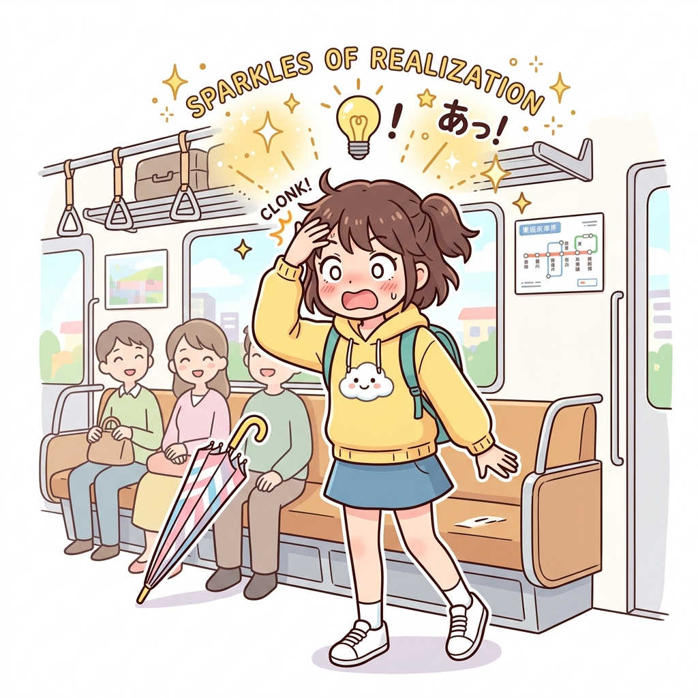

> [!NOTE] **Định nghĩa & Sắc thái**
> * **日本語:** 注意が足りなくて, ぼんやりしている様子。
> * **Sắc thái:** Bản thân thiếu chú ý nhất thời dẫn đến quên việc, nhầm lẫn ngoài ý muốn. Mang sắc thái tự trách nhẹ nhàng.
> * **Từ đồng nghĩa:** うかつにも, 不注意
> * **Từ trái nghĩa:** しっかり, ちゃんと

> [!TIP] **Ví dụ thực tế (例文)**
> * 電車の中にうっかり傘を忘れてきてしまった。
>   * *Tôi lơ đãng quên khuấy mất cây dù trên tàu điện.*

---

### 52. しっかり
* **Ý nghĩa:** Chắc chắn / Vững vàng / Đáng tin cậy

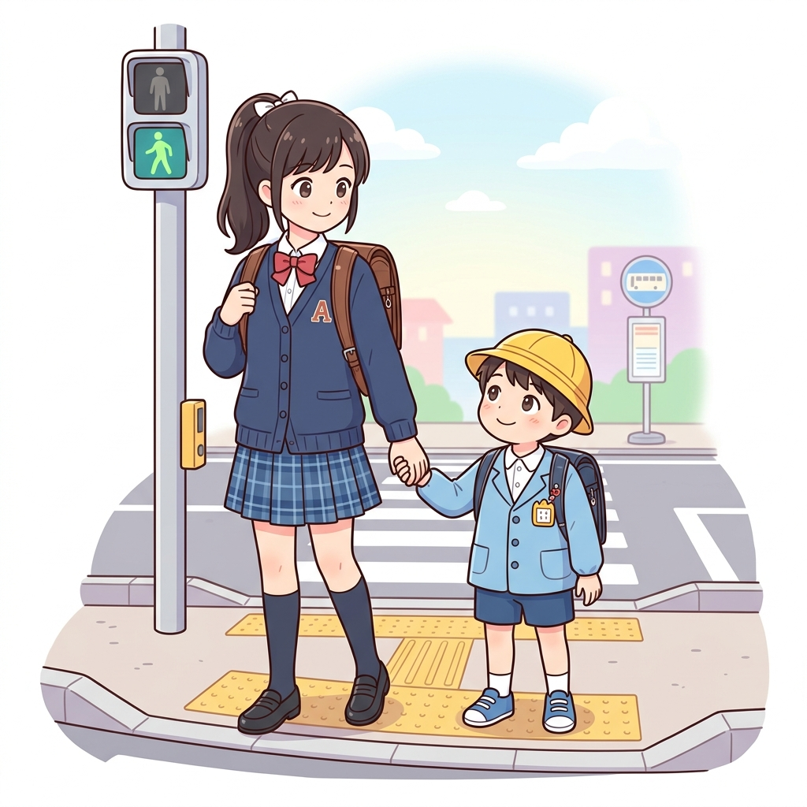

> [!NOTE] **Định nghĩa & Sắc thái**
> * **日本語:** 体制や構造が頑丈で揺るがない様子。考えや人柄が信用できる様子。
> * **Sắc thái:** Nắm chắc vật gì đó (nắm tay, trói chặt), hoặc thái độ/suy nghĩ chín chắn, đáng tin cậy. Dùng để nhắc nhở ai đó nghiêm túc.
> * **Từ đồng nghĩa:** ちゃんと, きちんと
> * **Từ trái nghĩa:** うっかり, ぼんやり

> [!TIP] **Ví dụ thực tế (例文)**
> * お姉ちゃんは弟の手をしっかり握って、道路を渡った。
>   * *Người chị nắm chắc tay em trai dắt qua đường.*

---

### 53. のんびり
* **Ý nghĩa:** Thong thả / Thong dong / Nhàn nhã thảnh thơi

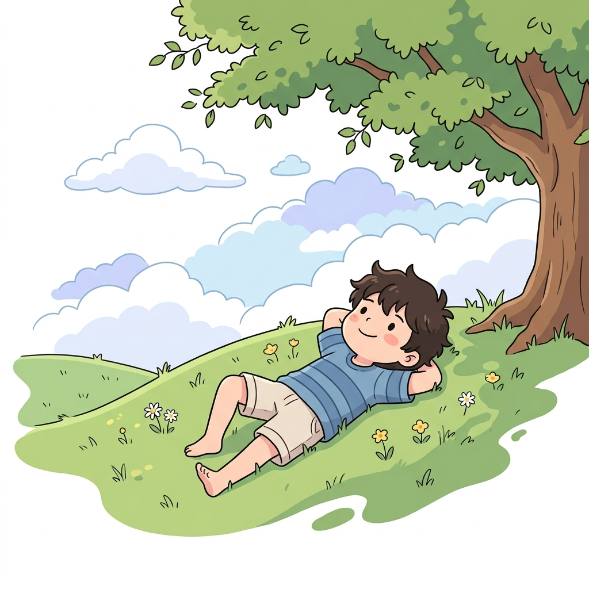

> [!NOTE] **Định nghĩa & Sắc thái**
> * **日本語:** 焦らず、ゆったりとくつろぐ様子。
> * **Sắc thái:** Hành động thong thả, không vội vàng, tận hưởng thời gian nghỉ ngơi thư thái mà không vướng bận lo nghĩ.
> * **Từ đồng nghĩa:** ゆったり, だらだら
> * **Từ trái nghĩa:** いそいそ, せかせか

> [!TIP] **Ví dụ thực tế (例文)**
> * 週末は田舎の温泉でのんびり過ごしたい。
>   * *Cuối tuần tôi muốn dành thời gian nghỉ ngơi thong thả ở suối nước nóng vùng quê.*

---

### 54. うろうろ
* **Ý nghĩa:** Lảng vảng / Đi tới đi lui (không mục đích)

*(Ảnh minh họa cho từ này sẽ được bổ sung ở các đợt học sau)*

> [!NOTE] **Định nghĩa & Sắc thái**
> * **日本語:** 目的もなく、あちこち歩き回る様子。
> * **Sắc thái:** Hành động đi qua đi lại một khu vực nào đó mà không có mục đích rõ ràng (dễ gây nghi ngờ cho cảnh sát).
> * **Từ đồng nghĩa:** うろつく, 徘徊する
> * **Từ trái nghĩa:** じっとする, 立ち止まる

> [!TIP] **Ví dụ thực tế (例文)**
> * 道に迷って、同じ場所をうろうろしてしまった。
>   * *Do lạc đường nên tôi cứ đi quanh quẩn lảng vảng ở cùng một nơi.*

---

### 55. ぶらぶら
* **Ý nghĩa:** Đi loanh quanh dạo chơi / Nhàn rỗi đi dạo

*(Ảnh minh họa cho từ này sẽ được bổ sung ở các đợt học sau)*

> [!NOTE] **Định nghĩa & Sắc thái**
> * **日本語:** 当てもなく、のんびり歩き回る様子。
> * **Sắc thái:** Hành vi đi dạo thong dong thư giãn, ngắm cảnh mà không vội vàng hay có lịch trình ép buộc.
> * **Từ đồng nghĩa:** のんびり歩く, 散策
> * **Từ trái nghĩa:** さっさと走る, 急ぐ

> [!TIP] **Ví dụ thực tế (例文)**
> * 天気がいいので、近所の公園をぶらぶら散歩した。
>   * *Thời tiết đẹp nên tôi đi dạo quanh công viên gần nhà.*

---

### 56. よろよろ
* **Ý nghĩa:** Lảo đảo / Loạng choạng không vững

*(Ảnh minh họa cho từ này sẽ được bổ sung ở các đợt học sau)*

> [!NOTE] **Định nghĩa & Sắc thái**
> * **日本語:** 足元がふらついて, しっかり歩けない様子。
> * **Sắc thái:** Dáng đi không vững vàng, bước thấp bước cao do say xỉn, già yếu hoặc kiệt sức.
> * **Từ đồng nghĩa:** ふらふら, おぼつかない
> * **Từ trái nghĩa:** しゃんとする, しっかり歩く

> [!TIP] **Ví dụ thực tế (例文)**
> * お年寄りが重い荷物を持って, よろよろ歩いている。
>   * *Cụ già mang hành lý nặng bước đi loạng choạng.*

---

### 57. とぼとぼ
* **Ý nghĩa:** Lầm lũi bước đi / Lê lết mệt mỏi

*(Ảnh minh họa cho từ này sẽ được bổ sung ở các đợt học sau)*

> [!NOTE] **Định nghĩa & Sắc thái**
> * **日本語:** 元気なく、力なく歩く様子。
> * **Sắc thái:** Dáng vẻ bước đi chậm chạp, buồn bã, mệt mỏi sau khi gặp chuyện buồn hoặc kiệt sức.
> * **Từ đồng nghĩa:** 力なく歩く, しょんぼり
> * **Từ trái nghĩa:** いそいそ, 軽快に進む

> [!TIP] **Ví dụ thực tế (例文)**
> * 試験に落ちた彼は、とぼとぼと家路についた。
>   * *Cậu ấy trượt kỳ thi nên lầm lũi bước đi trên con đường về nhà.*

---

### 58. こっそり
* **Ý nghĩa:** Lén lút / Vụng trộm / Âm thầm

*(Ảnh minh họa cho từ này sẽ được bổ sung ở các đợt học sau)*

> [!NOTE] **Định nghĩa & Sắc thái**
> * **日本語:** 人に知られないように、秘密裏に行う様子。
> * **Sắc thái:** Hành động che giấu người khác để làm việc gì đó một cách âm thầm, không muốn ai phát hiện.
> * **Từ đồng nghĩa:** こっそり, 秘密裏に
> * **Từ trái nghĩa:** 堂々と, おおやけに

> [!TIP] **Ví dụ thực tế (例文)**
> * 彼は夜中にこっそり台所でケーキを食べた。
>   * *Anh ta lén lút ăn bánh ngọt trong bếp vào nửa đêm.*

---

### 59. こっくり
* **Ý nghĩa:** Gật gù (ngủ gật) / Đồng ý gật đầu

*(Ảnh minh họa cho từ này sẽ được bổ sung ở các đợt học sau)*

> [!NOTE] **Định nghĩa & Sắc thái**
> * **日本語:** 居眠りをして、頭が下に下がる様子。
> * **Sắc thái:** Đầu gật xuống khi ngủ gật trong giờ học hoặc cuộc họp; Hoặc cái gật đầu nhẹ để đồng ý.
> * **Từ đồng nghĩa:** うとうと, 船を漕ぐ
> * **Từ trái nghĩa:** ぱっちり目が覚める

> [!TIP] **Ví dụ thực tế (例文)**
> * 彼は授業中にこっくりこっくり居眠りをしている。
>   * *Cậu ấy cứ ngủ gật gật gù gù trong giờ học.*

---

### 60. さっさと
* **Ý nghĩa:** Nhanh chóng / Mau lẹ (không chần chừ)

*(Ảnh minh họa cho từ này sẽ được bổ sung ở các đợt học sau)*

> [!NOTE] **Định nghĩa & Sắc thái**
> * **日本語:** ためらわずに、素早く物事を行う様子。
> * **Sắc thái:** Làm việc dứt khoát, nhanh gọn, không để phí thời gian hay chần chừ lề mề.
> * **Từ đồng nghĩa:** てきぱき, 素早く
> * **Từ trái nghĩa:** ぐずぐず, のろのろ

> [!TIP] **Ví dụ thực tế (例文)**
> * 無駄口を叩かずに、さっさと仕事を終わらせなさい。
>   * *Đừng nói nhảm nữa, hãy nhanh chóng kết thúc công việc đi.*

---

### 61. せっせと
* **Ý nghĩa:** Cần mẫn / Chăm chỉ / Siêng năng

*(Ảnh minh họa cho từ này sẽ được bổ sung ở các đợt học sau)*

> [!NOTE] **Định nghĩa & Sắc thái**
> * **日本語:** 休まずに、熱心に働き続ける様子。
> * **Sắc thái:** Hành động chăm chỉ làm lụng, tích lũy từng chút một không ngừng nghỉ hướng tới mục tiêu.
> * **Từ đồng nghĩa:** こつこつ, 勤勉に
> * **Từ trái nghĩa:** 怠ける, ぐずぐず

> [!TIP] **Ví dụ thực tế (例文)**
> * 彼女は将来のために、せっせと貯金をしている。
>   * *Cô ấy đang cần mẫn tiết kiệm tiền tích lũy cho tương lai.*

---

### 62. じっと
* **Ý nghĩa:** Chằm chằm (nhìn) / Đứng yên phăng phắc / Chịu đựng

*(Ảnh minh họa cho từ này sẽ được bổ sung ở các đợt học sau)*

> [!NOTE] **Định nghĩa & Sắc thái**
> * **日本語:** 動かずに、同じ状態を保つ様子。
> * **Sắc thái:** Giữ nguyên tư thế không cử động (đứng yên) hoặc nhìn không chớp mắt (nhìn chằm chằm), chịu đựng đau đớn.
> * **Từ đồng nghĩa:** つくづく, 凝視する
> * **Từ trái nghĩa:** きょろきょろ, ちらちら

> [!TIP] **Ví dụ thực tế (例文)**
> * 彼は壁の写真をじっと見つめていた。
>   * *Anh ấy nhìn chằm chằm vào bức ảnh trên tường.*

---

### 63. ぼんやり
* **Ý nghĩa:** Thơ thẩn / Ngẩn ngơ / Mơ hồ không rõ

*(Ảnh minh họa cho từ này sẽ được bổ sung ở các đợt học sau)*

> [!NOTE] **Định nghĩa & Sắc thái**
> * **日本語:** 意識が集中せず、やる気がない様子。形がはっきりしない様子。
> * **Sắc thái:** Tâm trí lơ đãng ngồi không nghĩ ngợi gì; Hoặc phong cảnh mờ ảo khuất sau màn sương.
> * **Từ đồng nghĩa:** うっかり, おぼろげ
> * **Từ trái nghĩa:** はっきり, くっきり

> [!TIP] **Ví dụ thực tế (例文)**
> * 彼は授業中、いつも窓の外をぼんやり眺めている。
>   * *Trong giờ học, anh ấy toàn ngơ ngẩn nhìn ra ngoài cửa sổ.*

---

### 64. ぐずぐず
* **Ý nghĩa:** Lề mề / Chần chừ / Kỳ kèo lười nhác

*(Ảnh minh họa cho từ này sẽ được bổ sung ở các đợt học sau)*

> [!NOTE] **Định nghĩa & Sắc thái**
> * **日本語:** 動作が遅く、決断力がない様子。
> * **Sắc thái:** Hành động chậm chạp kéo dài thời gian, không dứt khoát đưa ra hành động hay quyết định.
> * **Từ đồng nghĩa:** のろのろ, もたもた
> * **Từ trái nghĩa:** さっさと, てきぱき

> [!TIP] **Ví dụ thực tế (例文)**
> * ぐずぐずしていると, 電車に遅れてしまうよ。
>   * *Nếu cứ lề mề như vậy là muộn giờ tàu điện đấy.*

---

### 65. ばたばた
* **Ý nghĩa:** Bận rộn tíu tít / Luống cuống dập dồn

*(Ảnh minh họa cho từ này sẽ được bổ sung ở các đợt học sau)*

> [!NOTE] **Định nghĩa & Sắc thái**
> * **日本語:** 慌ただしく動き回る様子。
> * **Sắc thái:** Trạng thái bận rộn chạy đôn chạy đáo lo toan nhiều việc phát sinh cùng lúc.
> * **Từ đồng nghĩa:** 慌ただしい, あたふた
> * **Từ trái nghĩa:** ゆったり, のんびり

> [!TIP] **Ví dụ thực tế (例文)**
> * 急な来客のせいで, 朝からばたばたしている。
>   * *Có khách đột xuất ghé thăm nên từ sáng tôi đã cứ tíu tít luống cuống cả lên.*

---

### 66. ちょこちょこ
* **Ý nghĩa:** Lăng xăng / Đi thoăn thoắt / Thường xuyên

*(Ảnh minh họa cho từ này sẽ được bổ sung ở các đợt học sau)*

> [!NOTE] **Định nghĩa & Sắc thái**
> * **日本語:** 小股で素早く歩く様子。また、頻繁に物事を行う様子。
> * **Sắc thái:** Bước đi nhỏ nhanh thoăn thoắt (như trẻ em hay động vật nhỏ); Hoặc hành động lặp lại nhiều lần trong khoảng thời gian ngắn.
> * **Từ đồng nghĩa:** ちょこまか, しばしば
> * **Từ trái nghĩa:** じっと, めったに〜ない

> [!TIP] **Ví dụ thực tế (例文)**
> * 妹はちょこちょこと busy そうに動き回っている。
>   * *Em gái tôi cứ lăng xăng đi lại trông thật bận rộn.*

---

### 67. うとうと
* **Ý nghĩa:** Mơ màng / Thiu thiu ngủ / Ngủ gà ngủ gật

*(Ảnh minh họa cho từ này sẽ được bổ sung ở các đợt học sau)*

> [!NOTE] **Định nghĩa & Sắc thái**
> * **日本語:** 浅い眠りに入りかける様子。
> * **Sắc thái:** Cơn buồn ngủ kéo đến nhẹ nhàng khiến mắt lim dim sắp chìm vào giấc ngủ ngắn (thường trên sofa hoặc xe buýt).
> * **Từ đồng nghĩa:** こっくり, とろとろ
> * **Từ trái nghĩa:** ぱっちり目が覚める

> [!TIP] **Ví dụ thực tế (例文)**
> * テレビを見ているうちに、うとうとしてしまった。
>   * *Đang xem tivi thì tôi ngủ thiu thiu lúc nào không biết.*

---

### 68. ぐうぐう
* **Ý nghĩa:** Ngủ khò khò / Kêu réo (bụng đói)

*(Ảnh minh họa cho từ này sẽ được bổ sung ở các đợt học sau)*

> [!NOTE] **Định nghĩa & Sắc thái**
> * **日本語:** 深く眠って、いびきをかく音。また、お腹が鳴る音。
> * **Sắc thái:** Âm thanh ngủ say sưa phát ra tiếng ngáy; Hoặc tiếng bụng đói kêu réo ùng ục.
> * **Từ đồng nghĩa:** ぐっすり, 熟睡
> * **Từ trái nghĩa:** 目をぱちくりする

> [!TIP] **Ví dụ thực tế (例文)**
> * 弟は疲れていたのか、ベッドでぐうぐう寝ている。
>   * *Em trai tôi chắc mệt quá nên đang nằm trên giường ngủ khò khò.*

---

### 69. すらすら
* **Ý nghĩa:** Trôi chảy / Trơn tru / Vèo vèo

*(Ảnh minh họa cho từ này sẽ được bổ sung ở các đợt học sau)*

> [!NOTE] **Định nghĩa & Sắc thái**
> * **日本語:** 滞りなく、順調に進む様子。
> * **Sắc thái:** Làm việc gì đó trôi chảy không bị vấp váp (như đọc bài trơn tru, làm toán vèo vèo).
> * **Từ đồng nghĩa:** すらすらと, 流暢に
> * **Từ trái nghĩa:** つっかえる, どもる

> [!TIP] **Ví dụ thực tế (例文)**
> * 彼女は難しい質問にすらすらと答えた。
>   * *Cô ấy trả lời câu hỏi khó trôi chảy vèo vèo.*

---

### 70. ぺらぺら
* **Ý nghĩa:** Lưu loát (nói ngoại ngữ) / Mỏng dính / Nói hớt

*(Ảnh minh họa cho từ này sẽ được bổ sung ở các đợt học sau)*

> [!NOTE] **Định nghĩa & Sắc thái**
> * **日本語:** 外国語を流暢に話す様子。また, 紙や服が薄い様子。
> * **Sắc thái:** Nói tiếng nước ngoài rất trôi chảy lưu loát; Hoặc quần áo mỏng manh rẻ tiền; Hoặc người ba hoa hay tiết lộ bí mật.
> * **Từ đồng nghĩa:** 流暢に, ペラペラ
> * **Từ trái nghĩa:** 無口, たどたどしい

> [!TIP] **Ví dụ thực tế (例文)**
> * 彼は日本語がぺらぺらだ。
>   * *Anh ấy nói tiếng Nhật trôi chảy lưu loát lắm.*

---

### 71. ちらちら
* **Ý nghĩa:** Liếc nhìn / Lác đác (tuyết rơi) / Chập chờn

*(Ảnh minh họa cho từ này sẽ được bổ sung ở các đợt học sau)*

> [!NOTE] **Định nghĩa & Sắc thái**
> * **日本語:** 小刻みに動いたり、見え隠れしたりする様子。
> * **Sắc thái:** Thỉnh thoảng liếc mắt nhìn trộm ai đó; Hoặc tuyết rơi lác đác bay trước mắt; Hoặc ánh đèn chập chờn.
> * **Từ đồng nghĩa:** ちらりと見る
> * **Từ trái nghĩa:** じっと見る, 凝視

> [!TIP] **Ví dụ thực tế (例文)**
> * 授業中、時計をちらちら見てしまう。
>   * *Trong giờ học, tôi cứ thỉnh thoảng liếc nhìn đồng hồ.*

---

### 72. じろじろ
* **Ý nghĩa:** Nhìn soi mói / Nhìn chằm chằm thiếu lịch sự

*(Ảnh minh họa cho từ này sẽ được bổ sung ở các đợt học sau)*

> [!NOTE] **Định nghĩa & Sắc thái**
> * **日本語:** 人の姿などを、不遠慮に見つめる様子。
> * **Sắc thái:** Nhìn người khác từ đầu đến chân một cách dò xét, thiếu tế nhị khiến họ cảm thấy khó chịu.
> * **Từ đồng nghĩa:** じっと見る, 注視する
> * **Từ trái nghĩa:** ちらちら見る, チラ見

> [!TIP] **Ví dụ thực tế (例文)**
> * 人の顔をじろじろ見るのは失礼だ。
>   * *Nhìn chằm chằm soi mói vào mặt người khác là bất lịch sự.*

---

### 73. ぐんぐん
* **Ý nghĩa:** Vùn vụt / Nhanh như thổi

*(Ảnh minh họa cho từ này sẽ được bổ sung ở các đợt học sau)*

> [!NOTE] **Định nghĩa & Sắc thái**
> * **日本語:** 勢いよく、急速に進む様子。
> * **Sắc thái:** Độ tăng trưởng, tiến bộ vượt bậc, tiến lên phía trước với tốc độ cực nhanh và mạnh mẽ.
> * **Từ đồng nghĩa:** 急速に, どんどん
> * **Từ trái nghĩa:** じわじわ, そろそろ

> [!TIP] **Ví dụ thực tế (例文)**
> * 彼の日本語の実力は、この数ヶ月でぐんぐん伸びた。
>   * *Năng lực tiếng Nhật của anh ấy đã tiến bộ vùn vụt trong vài tháng qua.*

---

### 74. てくてく
* **Ý nghĩa:** Đi bộ túc tắc / Cặm cụi đi bộ

*(Ảnh minh họa cho từ này sẽ được bổ sung ở các đợt học sau)*

> [!NOTE] **Định nghĩa & Sắc thái**
> * **日本語:** 遠い距離を、ただひたすら歩く様子。
> * **Sắc thái:** Hành trình cặm cụi đi bộ quãng đường dài bằng chân một cách đều đặn, bền bỉ.
> * **Từ đồng nghĩa:** とぼとぼ, 歩行する
> * **Từ trái nghĩa:** さっさと走る, 乗車する

> [!TIP] **Ví dụ thực tế (例文)**
> * 駅まで20分、てくてく歩いて通っている。
>   * *Tôi cặm cụi đi bộ túc tắc mất 20 phút để đi đến ga hàng ngày.*

---

### 75. きょろきょろ
* **Ý nghĩa:** Dáo dác nhìn quanh / Lơ ngơ ngó nghiêng

*(Ảnh minh họa cho từ này sẽ được bổ sung ở các đợt học sau)*

> [!NOTE] **Định nghĩa & Sắc thái**
> * **日本語:** 落ち着きなく、あたりを見回す様子。
> * **Sắc thái:** Ngó nghiêng xung quanh một cách không yên lòng (như người lạ lạc đường hoặc tìm kiếm cái gì).
> * **Từ đồng nghĩa:** 見回す, うろうろ
> * **Từ trái nghĩa:** じっと見つめる

> [!TIP] **Ví dụ thực tế (例文)**
> * 知らない街に着いて, 不安そうにきょろきょろした。
>   * *Đến một thành phố lạ, tôi cứ lơ ngơ dáo dác nhìn quanh đầy vẻ lo lắng.*

---

## 📌 Phân Nhóm: Mức Độ & Biến Đổi

### 76. めっきり
* **Ý nghĩa:** Rõ rét / Đáng kể (biến đổi theo thời gian)

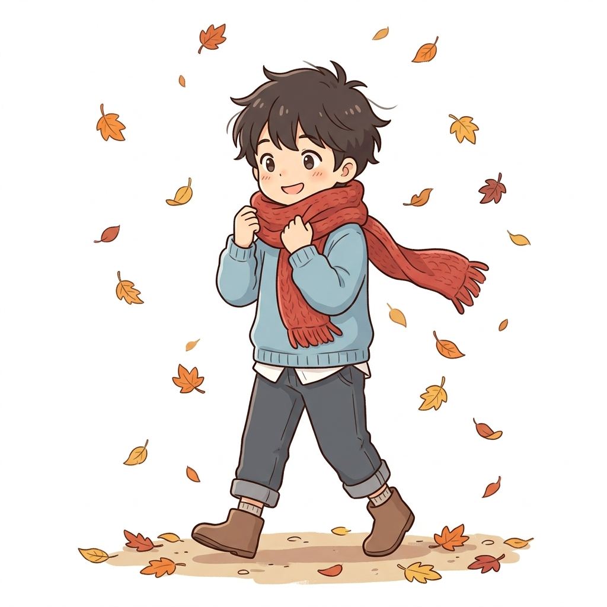

> [!NOTE] **Định nghĩa & Sắc thái**
> * **日本語:** 変化の様子が、目に見えてはっきり感じられる様子。
> * **Sắc thái:** Chỉ sự biến đổi trạng thái diễn ra nhanh và rõ nét tới mức cảm nhận rõ rệt (thời tiết thu lạnh đi, tóc bạc đi, khách khứa giảm đi).
> * **Từ đồng nghĩa:** 顕著に, 急激に
> * **Từ trái nghĩa:** じわじわ, 徐々に

> [!TIP] **Ví dụ thực tế (例文)**
> * 10月に入って、朝晩はめっきり涼しくなった。
>   * *Sang tháng 10, sáng tối thời tiết mát mẻ lên trông thấy (rõ rệt).*

---

### 77. すっかり
* **Ý nghĩa:** Hoàn toàn / Sạch sành sanh

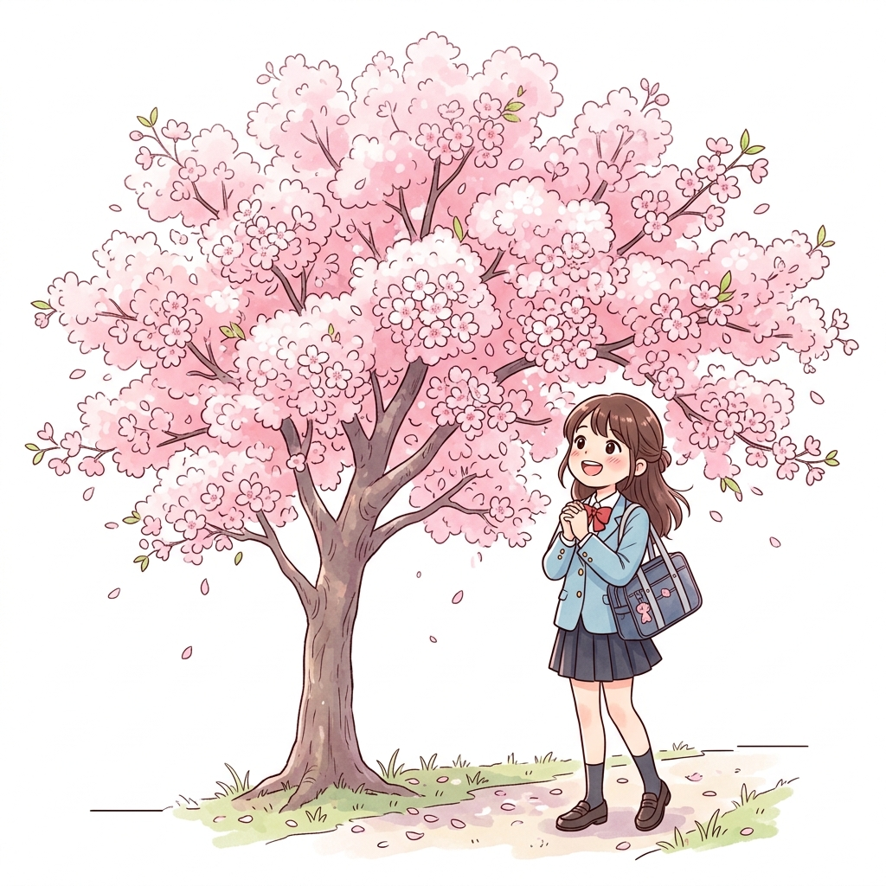

> [!NOTE] **Định nghĩa & Sắc thái**
> * **日本語:** 残るものが全くない様子。完全にその状態になっている様子。
> * **Sắc thái:** Chỉ trạng thái biến đổi đã hoàn thành 100%, không còn gì sót lại (hoa nở rực rỡ hoàn toàn, quên sạch sành sanh, khỏi bệnh hoàn toàn).
> * **Từ đồng nghĩa:** 完全に, 全部
> * **Từ trái nghĩa:** ほとんど, すこし

> [!TIP] **Ví dụ thực tế (例文)**
> * 桜の花がすっかり咲いて、満開になった。
>   * *Hoa anh đào đã nở hoàn toàn, đạt độ rực rỡ nhất.*

---

### 78. ぎっしり
* **Ý nghĩa:** Nét chặt / Đầy chật ních / San sát

*(Ảnh minh họa cho từ này sẽ được bổ sung ở các đợt học sau)*

> [!NOTE] **Định nghĩa & Sắc thái**
> * **日本語:** すき間なく詰まっている様子。
> * **Sắc thái:** Trạng thái đồ đạc hoặc con người được nhét đầy ắp, không còn một kẽ hở nào trống (lịch trình bận kín mít, vali xếp chật đồ).
> * **Từ đồng nghĩa:** みっしり, ぎゅうぎゅう
> * **Từ trái nghĩa:** がらがら, すかすか

> [!TIP] **Ví dụ thực tế (例文)**
> * 箱の中に本がぎっしり詰まっている。
>   * *Trong thùng sách được xếp chật ních đầy ắp.*

---

### 79. ずらり
* **Ý nghĩa:** Xếp hàng san sát / San sát tăm tắp

*(Ảnh minh họa cho từ này sẽ được bổ sung ở các đợt học sau)*

> [!NOTE] **Định nghĩa & Sắc thái**
> * **日本語:** 多くのものが一列に並んでいる様子。
> * **Sắc thái:** Rất nhiều người hoặc vật được sắp xếp thẳng hàng lối, nối đuôi nhau kéo dài (như sách trên kệ, ô tô đỗ bên đường).
> * **Từ đồng nghĩa:** ずらっと, 整列して
> * **Từ trái nghĩa:** ばらばら, ぽつぽつ

> [!TIP] **Ví dụ thực tế (例文)**
> * 本棚には専門書がずらりと並んでいる。
>   * *Trên kệ sách xếp san sát tăm tắp toàn sách chuyên ngành.*

---

### 80. たっぷり
* **Ý nghĩa:** Dồi dào / Đầy ắp / Đầy tràn

*(Ảnh minh họa cho từ này sẽ được bổ sung ở các đợt học sau)*

> [!NOTE] **Định nghĩa & Sắc thái**
> * **日本語:** 十分にあって, ゆとりのある様子。
> * **Sắc thái:** Lượng vật chất hoặc thời gian dư dả, thoải mái, quá đủ để đáp ứng nhu cầu.
> * **Từ đồng nghĩa:** たくさん, 豊富に
> * **Từ trái nghĩa:** すこし, 不足する

> [!TIP] **Ví dụ thực tế (例文)**
> * 時間はたっぷりあるので, 急ぐ必要はない。
>   * *Thời gian còn dồi dào lắm nên không cần phải vội đâu.*

---

### 81. ばらばら
* **Ý nghĩa:** Rời rạc / Rải rác / Mỗi người một ngả

*(Ảnh minh họa cho từ này sẽ được bổ sung ở các đợt học sau)*

> [!NOTE] **Định nghĩa & Sắc thái**
> * **日本語:** まとまりがなく, 別々になっている様子。
> * **Sắc thái:** Không có sự thống nhất, rời rạc rải rác mỗi người một nơi hoặc các mảnh vỡ vụn văng tung tóe.
> * **Từ đồng nghĩa:** ちりぢり, 別々に
> * **Từ trái nghĩa:** ずらり, 一致する

> [!TIP] **Ví dụ thực tế (例文)**
> * 卒業後はクラスメイトがばらばらになった。
>   * *Sau khi tốt nghiệp, các bạn cùng lớp mỗi người đi một ngả.*

---

### 82. めちゃくちゃ
* **Ý nghĩa:** Lộn xộn / Nát bét / Cực kỳ (tiếng lóng)

*(Ảnh minh họa cho từ này sẽ được bổ sung ở các đợt học sau)*

> [!NOTE] **Định nghĩa & Sắc thái**
> * **日本語:** 秩序がなく、ひどい状態である様子。
> * **Sắc thái:** Tình trạng đổ nát, lộn xộn mất trật tự hoàn toàn; Hoặc được dùng như một phó từ cường điệu mang ý nghĩa 'cực kỳ/quá mức'.
> * **Từ đồng nghĩa:** ごちゃごちゃ, 滅茶苦茶
> * **Từ trái nghĩa:** 整然とした, きちんとした

> [!TIP] **Ví dụ thực tế (例文)**
> * 台風の後で、庭の植物がめちゃくちゃになってしまった。
>   * *Sau cơn bão, cây cối trong vườn đã nát bét lộn xộn hết cả.*

---

### 83. ごちゃごちゃ
* **Ý nghĩa:** Bừa bộn / Lộn xộn lung tung

*(Ảnh minh họa cho từ này sẽ được bổ sung ở các đợt học sau)*

> [!NOTE] **Định nghĩa & Sắc thái**
> * **日本語:** 整理されておらず, 乱雑に入り混じっている様子。
> * **Sắc thái:** Rất nhiều đồ vật vụn vặt bị xếp lẫn lộn bừa bãi không ngăn nắp trên mặt bàn hoặc trong tủ.
> * **Từ đồng nghĩa:** めちゃくちゃ, 乱雑
> * **Từ trái nghĩa:** すっきり, 整頓する

> [!TIP] **Ví dụ thực tế (例文)**
> * 机の上がごちゃごちゃしていて, 鍵が見つからない。
>   * *Mặt bàn bừa bộn quá nên tôi mãi không tìm thấy chìa khóa.*

---

### 84. ぴかぴか
* **Ý nghĩa:** Sáng loáng / Lấp lánh / Mới toanh

*(Ảnh minh họa cho từ này sẽ được bổ sung ở các đợt học sau)*

> [!NOTE] **Định nghĩa & Sắc thái**
> * **日本語:** 磨かれて光り輝いている様子。
> * **Sắc thái:** Bề mặt đồ vật được chùi rửa sạch sẽ đến mức phản chiếu ánh sáng lấp lánh (như sàn nhà mới lau, giày da đánh bóng).
> * **Từ đồng nghĩa:** きらきら, 輝く
> * **Từ trái nghĩa:** くすんだ, ぼろぼろ

> [!TIP] **Ví dụ thực tế (例文)**
> * 靴をぴかぴかに磨いた。
>   * *Tôi đã đánh bóng đôi giày của mình sáng loáng.*

---

### 85. がらがら
* **Ý nghĩa:** Trống huơ trống hoác (tàu xe) / Tiếng ầm ầm đổ nát

*(Ảnh minh họa cho từ này sẽ được bổ sung ở các đợt học sau)*

> [!NOTE] **Định nghĩa & Sắc thái**
> * **日本語:** 乗り物や場所が非常にすいている様子。
> * **Sắc thái:** Địa điểm, xe cộ cực kỳ vắng vẻ, hầu như không có người ngồi; Hoặc tiếng sạt lở ầm ầm.
> * **Từ đồng nghĩa:** すいている, 空っぽ
> * **Từ trái nghĩa:** ぎっしり, 満員

> [!TIP] **Ví dụ thực tế (例文)**
> * 平日の昼間なので, 電車はがらがらだった。
>   * *Vì là ban trưa ngày thường nên tàu điện trống huơ trống hoác.*

---

### 86. どんより
* **Ý nghĩa:** U ám / Xám xịt (thời tiết, ánh mắt)

*(Ảnh minh họa cho từ này sẽ được bổ sung ở các đợt học sau)*

> [!NOTE] **Định nghĩa & Sắc thái**
> * **日本語:** 空気が濁って, 暗く沈んでいる様子。
> * **Sắc thái:** Trời nhiều mây mù xám xịt sắp mưa; Hoặc tâm trạng ủ rũ khiến ánh mắt mệt mỏi đờ đẫn.
> * **Từ đồng nghĩa:** 曇る, 暗い
> * **Từ trái nghĩa:** からりと晴れる

> [!TIP] **Ví dụ thực tế (例文)**
> * 今日は朝から空がどんより曇っている。
>   * *Hôm nay từ sáng bầu trời đã nhiều mây u ám xám xịt.*

---

### 87. しっとり
* **Ý nghĩa:** Ẩm mịn / Dịu dàng / Yên ắng dễ chịu

*(Ảnh minh họa cho từ này sẽ được bổ sung ở các đợt học sau)*

> [!NOTE] **Định nghĩa & Sắc thái**
> * **日本語:** 適度に湿り気があって、落ち着いた様子。
> * **Sắc thái:** Bề mặt ẩm mịn dễ chịu (da dẻ, bánh ngọt); Hoặc bầu không khí yên bình tĩnh lặng thấm đẫm chất thơ.
> * **Từ đồng nghĩa:** しっとりする, 潤う
> * **Từ trái nghĩa:** からから, かさかさ

> [!TIP] **Ví dụ thực tế (例文)**
> * 化粧水のおかげで、肌がしっとりしてきた。
>   * *Nhờ có nước hoa hồng nên da tôi đã trở nên ẩm mịn.*

---

### 88. からり
* **Ý nghĩa:** Khô ráo thoáng đãng / Cởi mở dứt khoát

*(Ảnh minh họa cho từ này sẽ được bổ sung ở các đợt học sau)*

> [!NOTE] **Định nghĩa & Sắc thái**
> * **日本語:** 湿気がなく、さわやかに晴れ渡る様子。
> * **Sắc thái:** Thời tiết khô ráo, mây mù tan biến nhường chỗ cho nắng ấm; Hoặc tính cách thẳng thắn cởi mở không để bụng.
> * **Từ đồng nghĩa:** からっと晴れる, カラリ
> * **Từ trái nghĩa:** じめじめ, どんより

> [!TIP] **Ví dụ thực tế (例文)**
> * 雨が上がって、空がからりと晴れた。
>   * *Cơn mưa tạnh hẳn, bầu trời quang đãng khô ráo.*

---

### 89. じっとり
* **Ý nghĩa:** Đầm đìa / Ẩm ướt khó chịu (mồ hôi)

*(Ảnh minh họa cho từ này sẽ được bổ sung ở các đợt học sau)*

> [!NOTE] **Định nghĩa & Sắc thái**
> * **日本語:** 湿気が多くて、じとじと濡れている様子。
> * **Sắc thái:** Mức độ ẩm ướt, nhớp nháp khó chịu do mồ hôi đẫm ra quần áo hoặc không khí phòng quá bí bách.
> * **Từ đồng nghĩa:** じめじめ, 湿る
> * **Từ trái nghĩa:** からり, かさかさ

> [!TIP] **Ví dụ thực tế (例文)**
> * 暑さのせいで、背中にじっとり汗をかいた。
>   * *Cái nóng làm lưng tôi đổ mồ hôi đầm đìa khó chịu.*

---

### 90. どっさり
* **Ý nghĩa:** Nhiều đống lớn / Trĩu nặng

*(Ảnh minh họa cho từ này sẽ được bổ sung ở các đợt học sau)*

> [!NOTE] **Định nghĩa & Sắc thái**
> * **日本語:** 分量が非常に多い様子。
> * **Sắc thái:** Lượng quà cáp, bài tập hoặc tiền bạc chất cao như núi, trĩu nặng.
> * **Từ đồng nghĩa:** たっぷり, 大量に
> * **Từ trái nghĩa:** すこし, わずか

> [!TIP] **Ví dụ thực tế (例文)**
> * お土産にリンゴをどっさりもらった。
>   * *Tôi được tặng nhiều táo chất thành cả đống lớn làm quà.*

---

### 91. びっしょり
* **Ý nghĩa:** Ướt sũng / Ướt đẫm

*(Ảnh minh họa cho từ này sẽ được bổ sung ở các đợt học sau)*

> [!NOTE] **Định nghĩa & Sắc thái**
> * **日本語:** ひどく濡れている様子。
> * **Sắc thái:** Cơ thể hoặc quần áo bị thấm đẫm nước mưa hoặc mồ hôi ướt sũng hoàn toàn.
> * **Từ đồng nghĩa:** びしょ濡れ, ずぶ濡れ
> * **Từ trái nghĩa:** からから, 乾く

> [!TIP] **Ví dụ thực tế (例文)**
> * 突然の雨で、服がびっしょり濡れてしまった。
>   * *Cơn mưa bất chợt khiến quần áo của tôi bị ướt sũng hoàn toàn.*

---

### 92. ぼろぼろ
* **Ý nghĩa:** Rách nát tơi tả / Lã chã (lệ rơi) / Rệu rã

*(Ảnh minh họa cho từ này sẽ được bổ sung ở các đợt học sau)*

> [!NOTE] **Định nghĩa & Sắc thái**
> * **日本語:** ひどく傷んで壊れかかっている様子。粒がこぼれ落ちる様子。
> * **Sắc thái:** Đồ vật rách nát, nhà cũ nát; Hoặc nước mắt rơi lã chã từng hạt; Hoặc tinh thần cơ thể rệu rã kiệt quệ.
> * **Từ đồng nghĩa:** よれよれ, 崩壊する
> * **Từ trái nghĩa:** 新品, ぴかぴか

> [!TIP] **Ví dụ thực tế (例文)**
> * 長年使い込んだ辞書がぼろぼろになった。
>   * *Cuốn từ điển dùng nhiều năm đã rách nát tơi tả.*

---

### 93. ざらざら
* **Ý nghĩa:** Nhám ráp / Đầy cát sạn

*(Ảnh minh họa cho từ này sẽ được bổ sung ở các đợt học sau)*

> [!NOTE] **Định nghĩa & Sắc thái**
> * **日本語:** 表面が荒れていて、滑らかでない様子。
> * **Sắc thái:** Bề mặt thô ráp dính nhiều cát sạn hoặc da dẻ thô ráp không mịn màng.
> * **Từ đồng nghĩa:** がさがさ, 荒い
> * **Từ trái nghĩa:** つるつる, すべすべ

> [!TIP] **Ví dụ thực tế (例文)**
> * 砂浜を歩いたので, 足の裏がざらざらする。
>   * *Đi dạo trên bãi cát làm lòng bàn chân tôi bám đầy cát ráp ráp.*

---

### 94. まるまる
* **Ý nghĩa:** Tròn trịa mập mạp / Tròn vẹn toàn bộ

*(Ảnh minh họa cho từ này sẽ được bổ sung ở các đợt học sau)*

> [!NOTE] **Định nghĩa & Sắc thái**
> * **日本語:** 丸々と太っている様子。全体がそのまま残っている様子。
> * **Sắc thái:** Em bé hoặc thú cưng mập mạp tròn trịa dễ thương; Hoặc thời gian, tiền bạc còn nguyên vẹn chưa sứt mẻ tí nào.
> * **Từ đồng nghĩa:** ぷくぷく, すっかり
> * **Từ trái nghĩa:** やせ細る, わずか

> [!TIP] **Ví dụ thực tế (例文)**
> * まるまると太った可愛い赤ちゃんですね。
>   * *Một em bé mập mạp tròn trịa dễ thương quá nhỉ.*

---

### 95. じわじわ
* **Ý nghĩa:** Từ từ thấm dần / Tác động chậm chắc

*(Ảnh minh họa cho từ này sẽ được bổ sung ở các đợt học sau)*

> [!NOTE] **Định nghĩa & Sắc thái**
> * **日本語:** 少しずつ、確実に変化が進む様子。
> * **Sắc thái:** Sự thay đổi hoặc tác động diễn ra rất chậm rãi từng chút một nhưng mang lại hiệu quả rõ rệt lâu dài.
> * **Từ đồng nghĩa:** じわっと, 徐々に
> * **Từ trái nghĩa:** どんどん, 急激に

> [!TIP] **Ví dụ thực tế (例文)**
> * この薬の効果がじわじわと現れてきた。
>   * *Hiệu quả của thuốc này đã bắt đầu từ từ thấm dần ra.*

---

### 96. どんどん
* **Ý nghĩa:** Nhanh chóng liên tục / Dồn dập

*(Ảnh minh họa cho từ này sẽ được bổ sung ở các đợt học sau)*

> [!NOTE] **Định nghĩa & Sắc thái**
> * **日本語:** 物事が滞りなく、勢いよく進む様子。
> * **Sắc thái:** Hành động hoặc sự việc tiến triển cực kỳ thuận lợi, nhanh chóng dồn dập không có rào cản.
> * **Từ đồng nghĩa:** ぐんぐん, 急速に
> * **Từ trái nghĩa:** じわじわ, とぼとぼ

> [!TIP] **Ví dụ thực tế (例文)**
> * アイデアがどんどん湧いてくる。
>   * *Ý tưởng cứ nhanh chóng tuôn ra dồn dập liên tục.*

---

### 97. ますます
* **Ý nghĩa:** Càng ngày càng / Tăng tiến

*(Ảnh minh họa cho từ này sẽ được bổ sung ở các đợt học sau)*

> [!NOTE] **Định nghĩa & Sắc thái**
> * **日本語:** 前よりも程度が強くなる様子。
> * **Sắc thái:** Độ mạnh hoặc mức độ của trạng thái gia tăng liên tục so với thời điểm trước đó.
> * **Từ đồng nghĩa:** いよいよ, さらに
> * **Từ trái nghĩa:** だんだん衰える

> [!TIP] **Ví dụ thực tế (例文)**
> * 台風が近づいて, 風がますます強くなってきた。
>   * *Cơn bão đang đến gần, gió càng ngày càng mạnh lên.*

---

### 98. いよいよ
* **Ý nghĩa:** Cuối cùng thì / Ngày càng tăng tiến mức độ

*(Ảnh minh họa cho từ này sẽ được bổ sung ở các đợt học sau)*

> [!NOTE] **Định nghĩa & Sắc thái**
> * **日本語:** ある事態が迫ってくる様子。程度が一層強まる様子。
> * **Sắc thái:** Thời khắc mong đợi hoặc một sự kiện trọng đại cuối cùng cũng đã sát nút; Hoặc mức độ nghiêm trọng gia tăng.
> * **Từ đồng nghĩa:** ついに, ますます
> * **Từ trái nghĩa:** はじめは

> [!TIP] **Ví dụ thực tế (例文)**
> * いよいよ明日は大学入試の合格発表だ。
>   * *Cuối cùng thì ngày mai cũng là ngày công bố kết quả thi đại học.*

---

### 99. そろそろ
* **Ý nghĩa:** Sắp sửa đến lúc / Chuẩn bị

*(Ảnh minh họa cho từ này sẽ được bổ sung ở các đợt học sau)*

> [!NOTE] **Định nghĩa & Sắc thái**
> * **日本語:** ある時間や状態になりかけている様子。
> * **Sắc thái:** Đã đến lúc cần thực hiện một hành động nào đó (như chuẩn bị đi ngủ, chuẩn bị ra về).
> * **Từ đồng nghĩa:** まもなく, やがて
> * **Từ trái nghĩa:** まだまだ

> [!TIP] **Ví dụ thực tế (例文)**
> * もう11時なので, そろそろ寝る時間だ。
>   * *Đã 11 giờ rồi, chuẩn bị đến giờ đi ngủ thôi.*

---

### 100. だんだん
* **Ý nghĩa:** Dần dần / Từng bước một

*(Ảnh minh họa cho từ này sẽ được bổ sung ở các đợt học sau)*

> [!NOTE] **Định nghĩa & Sắc thái**
> * **日本語:** 時間の経過とともに、少しずつ変化する様子。
> * **Sắc thái:** Sự biến đổi trạng thái theo thời gian một cách chậm rãi, có trình tự tự nhiên.
> * **Từ đồng nghĩa:** 次第に, 徐々に
> * **Từ trái nghĩa:** 急激に, 突如

> [!TIP] **Ví dụ thực tế (例文)**
> * 春になって、だんだん暖かくなってきた。
>   * *Xuân về, thời tiết dần dần trở nên ấm áp hơn.*

---
