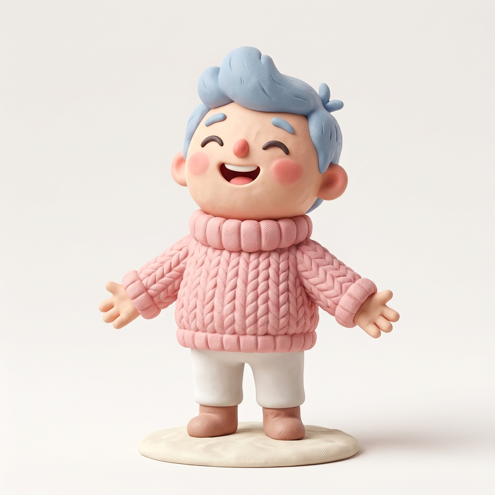
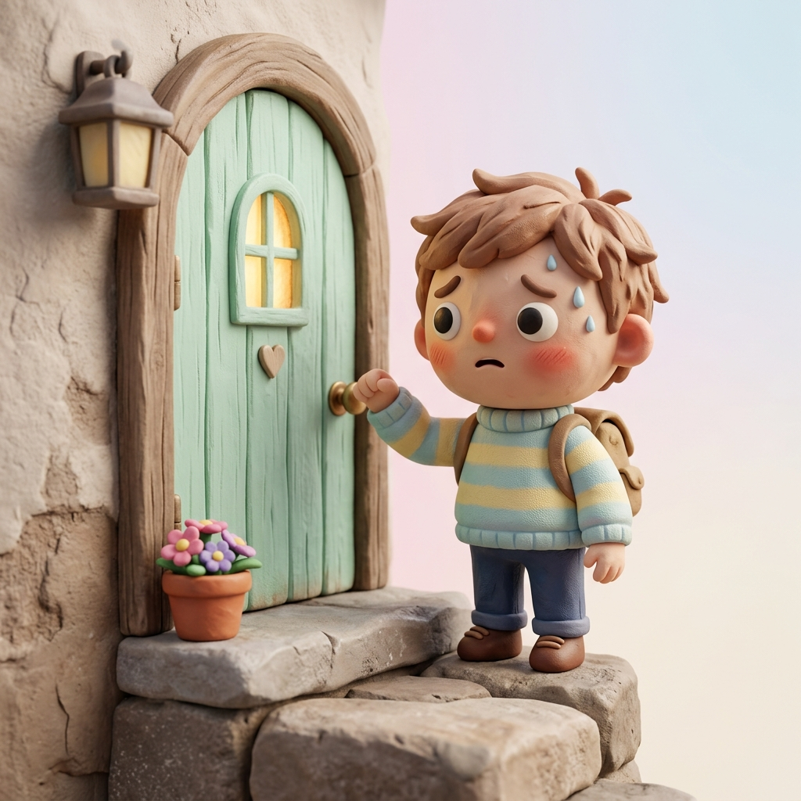
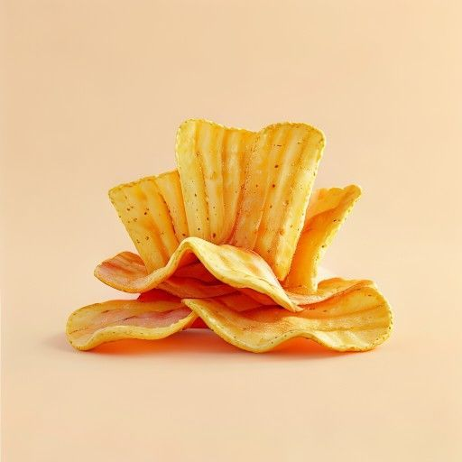
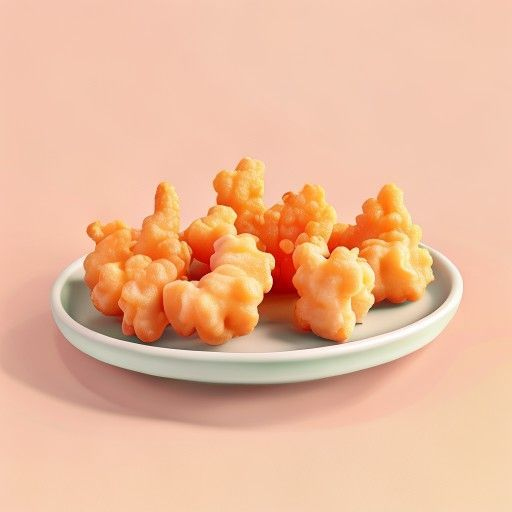

# 🎨 Từ Láy & Phó Từ Tượng Hình Tiếng Nhật (Goi - Onomatopoeia)

Sổ tay trực quan tổng hợp 300 từ láy tượng thanh, tượng hình (擬音語・擬態語) và phó từ thường gặp trong JLPT. Các từ được phân nhóm ý nghĩa rõ ràng giúp bạn dễ dàng so sánh và học tập hiệu quả.

---

## 🗂️ Mục Lục Tra Cứu Nhanh (Table of Contents)

### [Phân Nhóm 1: Trạng Thái Tinh Thần & Cảm Xúc](#nhóm-1)

| | | | | |
| --- | --- | --- | --- | --- |
| [1. すっきり](#1-すっきり) | [2. がっかり](#2-がっかり) | [3. いらいら](#3-いらいら) | [4. どきどき](#4-どきどき) | [5. わくわく](#5-わくわく) |
| [6. はらはら](#6-はらはら) | [7. うっとり](#7-うっとり) | [8. しょんぼり](#8-しょんぼり) | [9. びくびく](#9-びくびく) | [10. おどおど](#10-おどおど) |
| [11. ほっと](#11-ほっと) | [12. むかむか](#12-むかむか) | [13. やきもき](#13-やきもき) | [14. おろおろ](#14-おろおろ) | [15. びっくり](#15-びっくり) |
| [16. うきうき](#16-うきうき) | [17. めそめそ](#17-めそめそ) | [18. おずおず](#18-おずおず) | [19. もじもじ](#19-もじもじ) | [20. てきぱき](#20-てきぱき) |
| [21. ぬくぬく](#21-ぬくぬく) | [22. はっきり](#22-はっきり) | [23. すくすく](#23-すくすく) | [24. いそいそ](#24-いそいそ) | [25. じりじり](#25-じりじり) |
| [26. もやもや](#26-もやもや) | [27. つくづく](#27-つくづく) | [28. あたふた](#28-あたふた) | [29. しみじみ](#29-しみじみ) | [30. うじうじ](#30-うじうじ) |
| [31. そわそわ](#31-そわそわ) | [32. どきっと](#32-どきっと) | [33. きっと](#33-きっと) | [34. はっと](#34-はっと) | [35. むっと](#35-むっと) |
| [36. ぷんぷん](#36-ぷんぷん) | [37. むっつり](#37-むっつり) | [38. げっそり](#38-げっそり) | [39. にこにこ](#39-にこにこ) | [40. にやにや](#40-にやにや) |
| [41. けろっと](#41-けろっと) | [42. けろり](#42-けろり) | [43. ぼうぜん](#43-ぼうぜん) | [44. しゃきっと](#44-しゃきっと) | [45. ぴりぴり](#45-ぴりぴり) |
| [46. はしゃぐ](#46-はしゃぐ) | [47. めげる](#47-めげる) | [48. ひやひや](#48-ひやひや) | [49. げんなり](#49-げんなり) | [50. うんざり](#50-うんざり) |
| [51. ひやっと](#51-ひやっと) | [52. ひやりと](#52-ひやりと) | [53. むかつく](#53-むかつく) | [54. うずうず](#54-うずうず) | [55. のびのび](#55-のびのび) |
| [56. まったり](#56-まったり) | [57. うるうる](#57-うるうる) | [58. げらげら](#58-げらげら) | [59. くすくす](#59-くすくす) | [60. しくしく](#60-しくしく) |
| [61. かんかん](#61-かんかん) | [62. しぶしぶ](#62-しぶしぶ) | [63. いやいや](#63-いやいや) | [64. もんもん](#64-もんもん) | [65. くよくよ](#65-くよくよ) |
| [66. るんるん](#66-るんるん) | [67. きょとん](#67-きょとん) | [68. ぽかん](#68-ぽかん) | [69. うはうは](#69-うはうは) | [70. ぷんすか](#70-ぷんすか) |
| [71. どぎまぎ](#71-どぎまぎ) | [72. のりのり](#72-のりのり) | [73. てれてれ](#73-てれてれ) | [74. おめおめ](#74-おめおめ) | [75. つれづれ](#75-つれづれ) |

### [Phân Nhóm 2: Cảm Giác Cơ Thể & Thể Chất](#nhóm-2)

| | | | | |
| --- | --- | --- | --- | --- |
| [76. さっぱり](#76-さっぱり) | [77. ぴったり](#77-ぴったり) | [78. ぐっすり](#78-ぐっすり) | [79. ぺこぺこ](#79-ぺこぺこ) | [80. からから](#80-からから) |
| [81. ぱっちり](#81-ぱっちり) | [82. ぽかぽか](#82-ぽかぽか) | [83. ゾクゾク](#83-ゾクゾク) | [84. ずきずき](#84-ずきずき) | [85. むずむず](#85-むずむず) |
| [86. じんじん](#86-じんじん) | [87. くたくた](#87-くたくた) | [88. へとへと](#88-へとへと) | [89. ぶるぶる](#89-ぶるぶる) | [90. がくがく](#90-がくがく) |
| [91. ぞっと](#91-ぞっと) | [92. ひんやり](#92-ひんやり) | [93. むんむん](#93-むんむん) | [94. ねばねば](#94-ねばねば) | [95. ぬるぬる](#95-ぬるぬる) |
| [96. ぴちぴち](#96-ぴちぴち) | [97. がさがさ](#97-がさがさ) | [98. べたべた](#98-べたべた) | [99. つるつる](#99-つるつる) | [100. ごつごつ](#100-ごつごつ) |
| [101. あっさり](#101-あっさり) | [102. こってり](#102-こってり) | [103. むせ返る (むせかえる)](#103-むせ返る) | [104. ひりひり](#104-ひりひり) | [105. ちくちく](#105-ちくちく) |
| [106. がたがた](#106-がたがた) | [107. がびがび](#107-がびがび) | [108. かさかさ](#108-かさかさ) | [109. すーすー](#109-すーすー) | [110. じわーっと](#110-じわーっと) |
| [111. ほかほか](#111-ほかほか) | [112. ばったり](#112-ばったり) | [113. へろへろ](#113-へろへろ) | [114. へなへな](#114-へなへな) | [115. ふにゃふにゃ](#115-ふにゃふにゃ) |
| [116. しつこい](#116-しつこい) | [117. くどい](#117-くどい) | [118. ちびちび](#118-ちびちび) | [119. きりきり](#119-きりきり) | [120. むしむし](#120-むしむし) |
| [121. じめじめ](#121-じめじめ) | [122. からっと](#122-からっと) | [123. さらっと](#123-さらっと) | [124. びしょびしょ](#124-びしょびしょ) | [125. ぐしょぐしょ](#125-ぐしょぐしょ) |
| [126. びりびり](#126-びりびり) | [127. てらてら](#127-てらてら) | [128. すやすや](#128-すやすや) | [129. はあはあ](#129-はあはあ) | [130. ふうふう](#130-ふうふう) |
| [131. どろどろ](#131-どろどろ) | [132. べとべと](#132-べとべと) | [133. とろとろ](#133-とろとろ) | [134. ぐにゃり](#134-ぐにゃり) | [135. かちかち](#135-かちかち) |
| [136. こちこち](#136-こちこち) | [137. がちがち](#137-がちがち) | [138. ぱさぱさ](#138-ぱさぱさ) | [139. ばさばさ](#139-ばさばさ) | [140. かりかり](#140-かりかり) |
| [141. さくさく](#141-さくさく) | [142. しゃりしゃり](#142-しゃりしゃり) | [143. こりこり](#143-こりこり) | [144. ぷりぷり](#144-ぷりぷり) | [145. もちもち](#145-もちもち) |
| [146. ぷにぷに](#146-ぷにぷに) | [147. ふわふわ](#147-ふわふわ) | [148. ほくほく](#148-ほくほく) | [149. あつあつ](#149-あつあつ) | [150. ひえひえ](#150-ひえひえ) |

### [Phân Nhóm 3: Hành Vi & Thái Độ](#nhóm-3)

| | | | | |
| --- | --- | --- | --- | --- |
| [151. うっかり](#151-うっかり) | [152. しっかり](#152-しっかり) | [153. のんびり](#153-のんびり) | [154. うろうろ](#154-うろうろ) | [155. ぶらぶら](#155-ぶらぶら) |
| [156. よろよろ](#156-よろよろ) | [157. とぼとぼ](#157-とぼとぼ) | [158. こっそり](#158-こっそり) | [159. こっくり](#159-こっくり) | [160. さっさと](#160-さっさと) |
| [161. せっせと](#161-せっせと) | [162. じっと](#162-じっと) | [163. ぼんやり](#163-ぼんやり) | [164. ぐずぐず](#164-ぐずぐず) | [165. ばたばた](#165-ばたばた) |
| [166. ちょこちょこ](#166-ちょこちょこ) | [167. うとうと](#167-うとうと) | [168. ぐうぐう](#168-ぐうぐう) | [169. すらすら](#169-すらすら) | [170. ぺらぺら](#170-ぺらぺら) |
| [171. ちらちら](#171-ちらちら) | [172. じろじろ](#172-じろじろ) | [173. ぐんぐん](#173-ぐんぐん) | [174. てくてく](#174-てくてく) | [175. きょろきょろ](#175-きょろきょろ) |
| [176. おずおずと](#176-おずおずと) | [177. ちょこまか](#177-ちょこまか) | [178. すたすた](#178-すたすた) | [179. ぐいぐい](#179-ぐいぐい) | [180. こそこそ](#180-こそこそ) |
| [181. ぬきあし](#181-ぬきあし) | [182. ひそひそ](#182-ひそひそ) | [183. へらへら](#183-へらへら) | [184. ふらふら](#184-ふらふら) | [185. のろのろ](#185-のろのろ) |
| [186. そそくさと](#186-そそくさと) | [187. とことこ](#187-とことこ) | [188. もたもたする](#188-もたもたする) | [189. ゆったりする](#189-ゆったりする) | [190. はきはき](#190-はきはき) |
| [191. きっぱり](#191-きっぱり) | [192. ちゃんとする](#192-ちゃんとする) | [193. きちんと](#193-きちんと) | [194. だらだら](#194-だらだら) | [195. ちゃっかり](#195-ちゃっかり) |
| [196. くねくね](#196-くねくね) | [197. ころころ](#197-ころころ) | [198. ごろごろ](#198-ごろごろ) | [199. くどくど](#199-くどくど) | [200. するする](#200-するする) |
| [201. するりと](#201-するりと) | [202. こつこつ](#202-こつこつ) | [203. ちょくちょく](#203-ちょくちょく) | [204. うろちょろ](#204-うろちょろ) | [205. つんつん](#205-つんつん) |
| [206. きびきび](#206-きびきび) | [207. やんわり](#207-やんわり) | [208. のそのそ](#208-のそのそ) | [209. うかうか](#209-うかうか) | [210. もたもた](#210-もたもた) |
| [211. ちゃくちゃくと](#211-ちゃくちゃくと) | [212. ゆうゆうと](#212-ゆうゆうと) | [213. のうのうと](#213-のうのうと) | [214. よちよち](#214-よちよち) | [215. しゃきしゃき](#215-しゃきしゃき) |
| [216. しれっと](#216-しれっと) | [217. しゃあしゃあと](#217-しゃあしゃあと) | [218. ぬけぬけと](#218-ぬけぬけと) | [219. 堂々と (どうどうと)](#219-堂々と) | [220. せかせか](#220-せかせか) |
| [221. まごまご](#221-まごまご) | [222. わいわい](#222-わいわい) | [223. がやがや](#223-がやがや) | [224. にっこり](#224-にっこり) | [225. にやりと](#225-にやりと) |

### [Phân Nhóm 4: Mức Độ & Biến Đổi](#nhóm-4)

| | | | | |
| --- | --- | --- | --- | --- |
| [226. めっきり](#226-めっきり) | [227. すっかり](#227-すっかり) | [228. ぎっしり](#228-ぎっしり) | [229. ずらり](#229-ずらり) | [230. たっぷり](#230-たっぷり) |
| [231. ばらばら](#231-ばらばら) | [232. めちゃくちゃ](#232-めちゃくちゃ) | [233. ごちゃごちゃ](#233-ごちゃごちゃ) | [234. ぴかぴか](#234-ぴかぴか) | [235. がらがら](#235-がらがら) |
| [236. どんより](#236-どんより) | [237. しっとり](#237-しっとり) | [238. からり](#238-からり) | [239. じっとり](#239-じっとり) | [240. どっさり](#240-どっさり) |
| [241. びっしょり](#241-びっしょり) | [242. ぼろぼろ](#242-ぼろぼろ) | [243. ざらざら](#243-ざらざら) | [244. まるまる](#244-まるまる) | [245. じわじわ](#245-じわじわ) |
| [246. どんどん](#246-どんどん) | [247. ますます](#247-ますます) | [248. いよいよ](#248-いよいよ) | [249. そろそろ](#249-そろそろ) | [250. だんだん](#250-だんだん) |
| [251. ほとんど](#251-ほとんど) | [252. おおよそ](#252-おおよそ) | [253. ごくごく](#253-ごくごく) | [254. がらりと](#254-がらりと) | [255. どっと](#255-どっと) |
| [256. ぽつぽつ](#256-ぽつぽつ) | [257. ちらほら](#257-ちらほら) | [258. まちまち](#258-まちまち) | [259. べたっと](#259-べたっと) | [260. すかすか](#260-すかすか) |
| [261. ずっしり](#261-ずっしり) | [262. みっしり](#262-みっしり) | [263. ぎゅうぎゅう](#263-ぎゅうぎゅう) | [264. ずらっと](#264-ずらっと) | [265. ひょっこり](#265-ひょっこり) |
| [266. ふと](#266-ふと) | [267. ちょっぴり](#267-ちょっぴり) | [268. わずか](#268-わずか) | [269. いささか](#269-いささか) | [270. およそ](#270-およそ) |
| [271. ほぼ](#271-ほぼ) | [272. めちゃめちゃ](#272-めちゃめちゃ) | [273. さらさら](#273-さらさら) | [274. めきめき](#274-めきめき) | [275. ぐにゃぐにゃ](#275-ぐにゃぐにゃ) |
| [276. ゆらゆら](#276-ゆらゆら) | [277. ぐらぐら](#277-ぐらぐら) | [278. がたぴし](#278-がたぴし) | [279. がくっと](#279-がくっと) | [280. きらきら](#280-きらきら) |
| [281. ぎらぎら](#281-ぎらぎら) | [282. ざあざあ](#282-ざあざあ) | [283. しとしと](#283-しとしと) | [284. ぱらぱら](#284-ぱらぱら) | [285. ごうごう](#285-ごうごう) |
| [286. そよそよ](#286-そよそよ) | [287. ふっくら](#287-ふっくら) | [288. こんもり](#288-こんもり) | [289. じっくり](#289-じっくり) | [290. ばっちり](#290-ばっちり) |
| [291. がっちり](#291-がっちり) | [292. むっちり](#292-むっちり) | [293. すんなり](#293-すんなり) | [294. うっすら](#294-うっすら) | [295. まるごと](#295-まるごと) |
| [296. そっくり](#296-そっくり) | [297. ぐんと](#297-ぐんと) | [298. うんと](#298-うんと) | [299. ごてごて](#299-ごてごて) | [300. ぼちぼち](#300-ぼちぼち) |

---

## nhóm-1
### 📌 Phân Nhóm 1: Trạng Thái Tinh Thần & Cảm Xúc

### 1-すっきり
* **Ý nghĩa:** Sảng khoái / Nhẹ nhõm / Gọn gàng (sau khi trút bỏ gánh nặng)

> [!NOTE]
> **Định nghĩa & Sắc thái**
> * **日本語:** 余計なものや面倒なものがなく、気持ちがよい様子。
> * **Sắc thái:** Cảm giác dễ chịu khi những điều phiền toái, thừa thãi hoặc mập mờ được giải quyết triệt để (ví dụ: dọn dẹp xong phòng sạch sẽ, giải tỏa lo lắng trong lòng, hoặc hát hò giải trí xong).
> * **Từ đồng nghĩa:** [さっぱり](#76-さっぱり), [ほっと](#11-ほっと)
> * **Từ trái nghĩa:** [むかむか](#12-むかむか), [もやもや](#26-もやもや)

> [!TIP]
> **Ví dụ thực tế (例文)**
> * カラオケで大声で歌ったら、気分がすっきりした。
>   * *Hát thật to ở karaoke xong, tâm trạng sảng khoái hẳn.*

---

### 2-がっかり
* **Ý nghĩa:** Thất vọng / Chán nản / Sụp đổ tinh thần

> [!NOTE]
> **Định nghĩa & Sắc thái**
> * **日本語:** 期待が外れて、力落としをする様子。
> * **Sắc thái:** Trạng thái buồn bã, mất sạch năng lượng khi kỳ vọng lớn của bản thân bị đổ vỡ (dáng vẻ vai sụp xuống, cúi mặt).
> * **Từ đồng nghĩa:** [しょんぼり](#8-しょんぼり), 失望する
> * **Từ trái nghĩa:** [うきうき](#16-うきうき), [わくわく](#5-わくわく)

> [!TIP]
> **Ví dụ thực tế (例文)**
> * 楽しみにしていたコンサートが中止になり、がっかりした。
>   * *Buổi hòa nhạc mong đợi bấy lâu bị hủy bỏ khiến tôi vô cùng thất vọng.*

---

### 3-いらいら
* **Ý nghĩa:** Bực bội / Sốt ruột / Nóng lòng

> [!NOTE]
> **Định nghĩa & Sắc thái**
> * **日本語:** 物事が思うようにならず、気持ちが落ち着かない様子。
> * **Sắc thái:** Cảm xúc bực bội, khó chịu khi mọi việc không diễn ra theo ý muốn hoặc phải chờ đợi lâu mà sốt ruột.
> * **Từ đồng nghĩa:** [やきもき](#13-やきもき), 焦る
> * **Từ trái nghĩa:** [のんびり](#153-のんびり), [ほっと](#11-ほっと)

> [!TIP]
> **Ví dụ thực tế (例文)**
> * 渋滞で車が全然進まず、いらいらする。
>   * *Vì kẹt xe nên xe hoàn toàn không tiến lên được, thật là bực bội.*

---

### 4-どきどき
* **Ý nghĩa:** Hồi hộp / Tim đập thình thịch

> [!NOTE]
> **Định nghĩa & Sắc thái**
> * **日本語:** 運動や緊張、驚きなどで心臓の鼓動が速くなる様子。
> * **Sắc thái:** Tiếng tim đập nhanh do lo lắng, căng thẳng, sợ hãi hoặc phấn khích (ví dụ trước khi phát biểu, gặp người yêu, hoặc khi đứng trước kết quả thi).
> * **Từ đồng nghĩa:** [はらはら](#6-はらはら), 緊張する
> * **Từ trái nghĩa:** ほっとする, 落ち着く

> [!TIP]
> **Ví dụ thực tế (例文)**
> * 発表 of 番が近づいてきて、胸がどきどきしている。
>   * *Lượt phát biểu đang đến gần, lồng ngực tôi đập thình thịch.*

---

### 5-わくわく
* **Ý nghĩa:** Háo hức / Hồi hộp mong chờ

> [!NOTE]
> **Định nghĩa & Sắc thái**
> * **日本語:** 期待や喜びで胸が躍り、落ち着かない様子。
> * **Sắc thái:** Trạng thái háo hức, mong đợi những điều tốt đẹp, vui sướng sắp diễn ra (như trước chuyến đi du lịch, trước ngày khai giảng).
> * **Từ đồng nghĩa:** [うきうき](#16-うきうき), 期待する
> * **Từ trái nghĩa:** [がっかり](#2-がっかり), [しょんぼり](#8-しょんぼり)

> [!TIP]
> **Ví dụ thực tế (例文)**
> * 明日から旅行なので, 心がわくわくしている。
>   * *Vì ngày mai đi du lịch nên trong lòng vô cùng háo hức.*

---

### 6-はらはら
* **Ý nghĩa:** Lo lắng / Nhấp nhổm (lo sợ giùm cho người khác)

> [!NOTE]
> **Định nghĩa & Sắc thái**
> * **日本語:** 他人の様子を見て、危なっかしくて心配する様子。
> * **Sắc thái:** Cảm giác lo sợ, hồi hộp khi nhìn thấy người khác ở trong tình thế nguy hiểm (như xem xiếc, nhìn em bé tập đi).
> * **Từ đồng nghĩa:** [どきどき](#4-どきどき), 緊張する
> * **Từ trái nghĩa:** ほっとする, 安心する

> [!TIP]
> **Ví dụ thực tế (例文)**
> * 子供が木に登っているのを見て、はらはらした。
>   * *Nhìn thấy đứa trẻ trèo lên cây mà tôi lo nhấp nhổm cả người.*

---

### 7-うっとり
* **Ý nghĩa:** Say đắm / Ngây ngất / Say sưa ngắm nhìn

> [!NOTE]
> **Định nghĩa & Sắc thái**
> * **日本語:** 美しいものなどに心を奪われて、ぼんやりしている様子。
> * **Sắc thái:** Tâm trạng bị hút hồn, say đắm trước vẻ đẹp hoặc một tác phẩm nghệ thuật, âm nhạc xuất sắc.
> * **Từ đồng nghĩa:** 恍惚とする, 見とれる
> * **Từ trái nghĩa:** 無関心, 興ざめする

> [!TIP]
> **Ví dụ thực tế (例文)**
> * 彼女は美しいバイオリンの音色にうっとり聞き入っていた。
>   * *Cô ấy say sưa lắng nghe giai điệu vĩ cầm tuyệt đẹp.*

---

### 8-しょんぼり
* **Ý nghĩa:** Ủ rũ / Buồn bã / Thẫn thờ

> [!NOTE]
> **Định nghĩa & Sắc thái**
> * **日本語:** 元気がなく、うなだれている様子。
> * **Sắc thái:** Dáng vẻ buồn bã, ủ rũ vì bị mắng, thất bại nhẹ hoặc gặp chuyện buồn nhỏ.
> * **Từ đồng nghĩa:** [がっかり](#2-がっかり), 落ち込む
> * **Từ trái nghĩa:** [うきうき](#16-うきうき), 元気いっぱい

> [!TIP]
> **Ví dụ thực tế (例文)**
> * 叱られた犬が、しょんぼりして座っている。
>   * *Chú chó bị mắng đang ngồi ủ rũ một góc.*

---

### 9-びくびく
* **Ý nghĩa:** Run sợ / Phấp phỏng lo sợ / Sợ sệt

> [!NOTE]
> **Định nghĩa & Sắc thái**
> * **日本語:** 恐れて、体が震える様子。心配で落ち着かない様子。
> * **Sắc thái:** Sự sợ hãi dồn dập, phấp phỏng vì sợ bị phát hiện lỗi lầm, sợ bị phạt hoặc gặp nguy hiểm.
> * **Từ đồng nghĩa:** [おどおど](#10-おどおど), 恐れる
> * **Từ trái nghĩa:** 堂々とする, 泰然とする

> [!TIP]
> **Ví dụ thực tế (例文)**
> * 先生に叱られるのではないかと、びくびくしている。
>   * *Tôi cứ phấp phỏng lo sợ không biết có bị thầy giáo mắng hay không.*

---

### 10-おどおど
* **Ý nghĩa:** Rụt rè / Lúng túng / Khép nép (thiếu tự tin)

> [!NOTE]
> **Định nghĩa & Sắc thái**
> * **日本語:** 自信がなく、恐れて落ち着かない態度をとる様子。
> * **Sắc thái:** Thái độ e sợ, không tự tin, ngập ngừng lúng túng khi giao tiếp hoặc đứng trước đám đông.
> * **Từ đồng nghĩa:** [びくびく](#9-びくびく), 怯える
> * **Từ trái nghĩa:** 堂々とする, はきはきする

> [!TIP]
> **Ví dụ thực tế (例文)**
> * 面接の時、緊張しておどおどしてしまった。
>   * *Lúc phỏng vấn, vì căng thẳng nên tôi cứ lúng ta lúng túng.*

---

### 11-ほっと
* **Ý nghĩa:** Thở phào nhẹ nhõm / Yên tâm

> [!NOTE]
> **Định nghĩa & Sắc thái**
> * **日本語:** 緊張が解けて、安心する様子。
> * **Sắc thái:** Cảm giác trút bỏ căng thẳng, thở phào khi một nguy cơ trôi qua hoặc công việc kết thúc thành công.
> * **Từ đồng nghĩa:** 安心する, 一安心
> * **Từ trái nghĩa:** [はらはら](#6-はらはら), [どきどき](#4-どきどき)

> [!TIP]
> **Ví dụ thực tế (例文)**
> * 試験がすべて終わって、ほっとした。
>   * *Kỳ thi đã kết thúc hoàn toàn, tôi thở phào nhẹ nhõm.*

---

### 12-むかむか
* **Ý nghĩa:** Nôn nao / Bực tức / Tức tối lồng lộn

> [!NOTE]
> **Định nghĩa & Sắc thái**
> * **日本語:** 吐き気がする様子。また、怒りでおさまらない様子。
> * **Sắc thái:** Có hai nghĩa: Cảm thấy nôn nao, buồn nôn ở dạ dày; Hoặc cảm giác tức tối phát điên vì hành động vô lý của ai đó.
> * **Từ đồng nghĩa:** [いらいら](#3-いらいら), [むかつく](#53-むかつく)
> * **Từ trái nghĩa:** [すっきり](#1-すっきり), [さっぱり](#76-さっぱり)

> [!TIP]
> **Ví dụ thực tế (例文)**
> * 彼の失礼な態度を思い出すと、今でも胸がむかむかする。
>   * *Nghĩ lại thái độ vô lễ của anh ta, đến giờ tôi vẫn thấy tức cành hông.*

---

### 13-やきもき
* **Ý nghĩa:** Sốt ruột / Bồn chồn lo lắng (về chuyện của người khác)

> [!NOTE]
> **Định nghĩa & Sắc thái**
> * **日本語:** 他人のことが心配で、どうしていいか焦る様子。
> * **Sắc thái:** Sự bồn chồn sốt ruột vì lo lắng cho tình hình của người khác mà bản thân không thể can thiệp được.
> * **Từ đồng nghĩa:** [いらいら](#3-いらいら), 気をもむ
> * **Từ trái nghĩa:** [のんびり](#153-のんびり), 泰然とする

> [!TIP]
> **Ví dụ thực tế (例文)**
> * 連絡が取れない息子を心配して、母はやきもきしていた。
>   * *Lo lắng cho đứa con trai không liên lạc được, người mẹ cứ bồn chồn đứng ngồi không yên.*

---

### 14-おろおろ
* **Ý nghĩa:** Cuống cuồng / Lúng túng mất phương hướng

> [!NOTE]
> **Định nghĩa & Sắc thái**
> * **日本語:** どうしていいか分からず、慌てふためく様子。
> * **Sắc thái:** Trạng thái rối bời, không biết phải xử lý thế nào khi xảy ra sự cố đột ngột ngoài tầm kiểm soát.
> * **Từ đồng nghĩa:** うろたえる, 狼狽する
> * **Từ trái nghĩa:** 冷静沈着, 落ち着く

> [!TIP]
> **Ví dụ thực tế (例文)**
> * 事故の現場を見て, 何もできずにおろおろするばかりだった。
>   * *Nhìn thấy hiện trường tai nạn, tôi chỉ biết cuống cuồng lúng túng mà không làm được gì.*

---

### 15-びっくり
* **Ý nghĩa:** Giật mình / Kinh ngạc / Bất ngờ

> [!NOTE]
> **Định nghĩa & Sắc thái**
> * **日本語:** 急な出来事に驚く様子。
> * **Sắc thái:** Sự ngạc nhiên, giật mình do những âm thanh lớn hoặc sự việc bất ngờ xảy ra ngay trước mắt.
> * **Từ đồng nghĩa:** 驚く, 仰天する
> * **Từ trái nghĩa:** 平気, 動じない

> [!TIP]
> **Ví dụ thực tế (例文)**
> * 大きな音がして、びっくりして跳び上がった。
>   * *Có tiếng động lớn phát ra khiến tôi giật mình nhảy dựng lên.*

---

### 16-うきうき
* **Ý nghĩa:** Hân hoan / Rộn ràng vui tươi

> [!NOTE]
> **Định nghĩa & Sắc thái**
> * **日本語:** 嬉しくて気持ちが浮き立ち、楽しそうな様子。
> * **Sắc thái:** Tâm trạng phấn chấn, nhẹ nhàng, vui vẻ biểu hiện ra bên ngoài (như bước đi nhún nhảy vì vui).
> * **Từ đồng nghĩa:** [わくわく](#5-わくわく)
> * **Từ trái nghĩa:** [しょんぼり](#8-しょんぼり), [がっかり](#2-がっかり)

> [!TIP]
> **Ví dụ thực tế (例文)**
> * 彼女は新しいデート服を着て、うきうきと出かけた。
>   * *Cô ấy diện bộ đồ hẹn hò mới rồi hân hoan bước ra ngoài.*

---

### 17-めそめそ
* **Ý nghĩa:** Khọc thút thít / Sụt sùi

> [!NOTE]
> **Định nghĩa & Sắc thái**
> * **日本語:** 弱々しく泣き続ける様子。
> * **Sắc thái:** Hành động khóc nhỏ, kéo dài, thút thít (thường dùng cho trẻ con hoặc người yếu đuối).
> * **Từ đồng nghĩa:** [しくしく](#60-しくしく), すすり泣く
> * **Từ trái nghĩa:** [にこにこ](#39-にこにこ), [げらげら](#58-げらげら)

> [!TIP]
> **Ví dụ thực tế (例文)**
> * いつまでもめそめそ泣くのはやめなさい。
>   * *Đừng có khóc thút thít suốt như thế nữa.*

---

### 18-おずおず
* **Ý nghĩa:** Rụt rè / Rón rén / Ngần ngại

> [!NOTE]
> **Định nghĩa & Sắc thái**
> * **日本語:** ためらいながら、恐る恐る物事を行う様子。
> * **Sắc thái:** Hành vi ngập ngừng, rụt rè tiến lại gần hoặc đặt câu hỏi vì sợ sệt hay kính cẩn.
> * **Từ đồng nghĩa:** 恐る恐る, ためらう
> * **Từ trái nghĩa:** [堂々と](#219-堂々と), 大胆に

> [!TIP]
> **Ví dụ thực tế (例文)**
> * 彼は社長室のドアをおずおずとノックした。
>   * *Anh ấy rụt rè gõ cửa phòng giám đốc.*

---

### 19-もじもじ
* **Ý nghĩa:** Ngượng nghịu / Ngại ngùng lúng túng

> [!NOTE]
> **Định nghĩa & Sắc thái**
> * **日本語:** 恥ずかしがって、言いたいことが言えない様子。
> * **Sắc thái:** Thái độ ngượng ngùng, ngập ngừng không dám bộc lộ ý kiến hay hành động vì xấu hổ trước người khác.
> * **Từ đồng nghĩa:** はにかむ
> * **Từ trái nghĩa:** 堂々とする, はきはきする

> [!TIP]
> **Ví dụ thực tế (例文)**
> * 子供は知らない人の前で、恥ずかしそうにもじもじしていた。
>   * *Đứa bé ngượng nghịu lúng túng trước mặt người lạ.*

---

### 20-てきぱき
* **Ý nghĩa:** Nhanh nhẹn / Tháo vát / Nhanh nhảu

> [!NOTE]
> **Định nghĩa & Sắc thái**
> * **日本語:** 仕事を要領よく、手際よく進める様子。
> * **Sắc thái:** Cách giải quyết công việc vô cùng nhanh chóng, có trình tự và hiệu quả cao.
> * **Từ đồng nghĩa:** [さっさと](#160-さっさと), [はきはき](#190-はきはき)
> * **Từ trái nghĩa:** [ぐずぐず](#164-ぐずぐず), [のろのろ](#185-のろのろ)

> [!TIP]
> **Ví dụ thực tế (例文)**
> * 彼女は家事をてきぱきと片付けた。
>   * *Cô ấy tháo vát dọn dẹp nhanh gọn việc nhà.*

---

### 21-ぬくぬく
* **Ý nghĩa:** Ấm êm / Dễ chịu / Sung sướng

> [!NOTE]
> **Định nghĩa & Sắc thái**
> * **日本語:** 暖かく快適に過ごす様子。楽をしている様子。
> * **Sắc thái:** Trạng thái sống thoải mái, ấm áp dễ chịu mà không phải chịu vất vả cực nhọc.
> * **Từ đồng nghĩa:** [ぽかぽか](#82-ぽかぽか), 快適
> * **Từ trái nghĩa:** [がたがた](#106-がたがた), 寒い

> [!TIP]
> **Ví dụ thực tế (例文)**
> * 寒い冬の日に、こたつでぬくぬく過ごすのは最高だ。
>   * *Vào ngày đông giá rét, ngồi ấm êm trong bàn sưởi Kotatsu thì thật tuyệt vời.*

---

### 22-はっきり
* **Ý nghĩa:** Rõ ràng / Dứt khoát

> [!NOTE]
> **Định nghĩa & Sắc thái**
> * **日本語:** 形や意味が明確で、疑う余地がない様子。
> * **Sắc thái:** Trạng thái biểu đạt rõ ràng về mặt hình ảnh, âm thanh hoặc ý chí dứt khoát không mập mờ.
> * **Từ đồng nghĩa:** 明確に, くっきり
> * **Từ trái nghĩa:** [ぼんやり](#163-ぼんやり), うやむや

> [!TIP]
> **Ví dụ thực tế (例文)**
> * 富士山がはっきりと見えた。
>   * *Núi Phú Sĩ đã nhìn thấy rõ mồn một.*

---

### 23-すくすく
* **Ý nghĩa:** Mau lớn / Khỏe mạnh (trẻ em, cây cối)

> [!NOTE]
> **Định nghĩa & Sắc thái**
> * **日本語:** 元気に成長する様子。
> * **Sắc thái:** Trạng thái lớn nhanh như thổi, phát triển khỏe mạnh của trẻ nhỏ hoặc thực vật.
> * **Từ đồng nghĩa:** 順調に育つ
> * **Từ trái nghĩa:** 衰える, 枯れる

> [!TIP]
> **Ví dụ thực tế (例文)**
> * 子供たちは健康に、すくすくと育っている。
>   * *Lũ trẻ đang phát triển vô cùng khỏe mạnh, lớn nhanh như thổi.*

---

### 24-いそいそ
* **Ý nghĩa:** Hớn hở vội vã / Hăm hở

> [!NOTE]
> **Định nghĩa & Sắc thái**
> * **日本語:** 楽しみな事のために、嬉しそうに準備して出かける様子。
> * **Sắc thái:** Dáng vẻ hối hả chuẩn bị ra ngoài với tâm trạng phấn khởi vì có việc vui chờ đợi phía trước.
> * **Từ đồng nghĩa:** [うきうき](#16-うきうき), 嬉しそうに
> * **Từ trái nghĩa:** [とぼとぼ](#157-とぼとぼ), 重い足取りで

> [!TIP]
> **Ví dụ thực tế (例文)**
> * 彼はパーティーに行くために、いそいそと支度をしている。
>   * *Anh ấy đang hớn hở chuẩn bị sửa soạn để đi dự tiệc.*

---

### 25-じりじり
* **Ý nghĩa:** Nóng ruột chờ đợi / Sốt ruột

> [!NOTE]
> **Định nghĩa & Sắc thái**
> * **日本語:** 焦って、いらだちながら待つ様子。
> * **Sắc thái:** Cảm giác sốt ruột, nóng lòng chờ đợi một thời khắc nào đó đang đến rất chậm.
> * **Từ đồng nghĩa:** [いらいら](#3-いらいら), 焦る
> * **Từ trái nghĩa:** [のんびり](#153-のんびり), 泰然とする

> [!TIP]
> **Ví dụ thực tế (例文)**
> * 締め切り時間が近づき, じりじりしながら待った。
>   * *Thời hạn chót đang đến gần, tôi sốt ruột nóng lòng chờ đợi.*

---

### 26-もやもや
* **Ý nghĩa:** Bức bối / Bứt rứt / U ám trong lòng

> [!NOTE]
> **Định nghĩa & Sắc thái**
> * **日本語:** すっきりせず、心の中にわだかまりがある様子。
> * **Sắc thái:** Cảm giác vướng bận, khó chịu, không thoải mái trong lòng về một mối quan hệ hoặc sự việc chưa sáng tỏ.
> * **Từ đồng nghĩa:** [むかむか](#12-むかむか), すっきりしない
> * **Từ trái nghĩa:** [すっきり](#1-すっきり), [さっぱり](#76-さっぱり)

> [!TIP]
> **Ví dụ thực tế (例文)**
> * 友達に嘘をついてしまい, 心の中がもやもやしている。
>   * *Vì lỡ nói dối bạn bè nên trong lòng tôi cứ bứt rứt không yên.*

---

### 27-つくづく
* **Ý nghĩa:** Thấu đáo / Sâu sắc / Tỉ mỉ

> [!NOTE]
> **Định nghĩa & Sắc thái**
> * **日本語:** 物事を深く考えたり, 痛切に感じたりする様子。
> * **Sắc thái:** Cảm nhận sâu sắc, thấm thía một sự thật nào đó (như tuổi tác, sự cô đơn) hoặc nhìn nhận một vấn đề vô cùng thấu đáo.
> * **Từ đồng nghĩa:** [しみじみ](#29-しみじみ), 痛切に
> * **Từ trái nghĩa:** うわの空, [ぼんやり](#163-ぼんやり)

> [!TIP]
> **Ví dụ thực tế (例文)**
> * 最近、自分の年齢をつくづく感じるようになった。
>   * *Gần đây, tôi cảm thấy vô cùng thấm thía về tuổi tác của mình.*

---

### 28-あたふた
* **Ý nghĩa:** Luống cuống / Cuống quýt / Vội vã

> [!NOTE]
> **Định nghĩa & Sắc thái**
> * **日本語:** 慌てて落ち着かない様子。
> * **Sắc thái:** Hành động vội vàng, bối rối luống cuống khi gặp tình huống bất ngờ hoặc khi sắp trễ giờ.
> * **Từ đồng nghĩa:** [おろおろ](#14-おろおろ), 慌てる
> * **Từ trái nghĩa:** 冷静沈着, 落ち着く

> [!TIP]
> **Ví dụ thực tế (例文)**
> * 急にテストがあると聞いて、あたふた準備した。
>   * *Nghe tin sắp có kiểm tra đột xuất, tôi luống cuống chuẩn bị.*

---

### 29-しみじみ
* **Ý nghĩa:** Thấm thía / Sâu sắc / Lắng đọng

> [!NOTE]
> **Định nghĩa & Sắc thái**
> * **日本語:** 心の底から深く感じる様子。しみ入るように感じる様子。
> * **Sắc thái:** Cảm giác xúc động lắng đọng từ sâu thẳm con tim (như khi nghe một bài hát cũ, nhớ lại tình cảm cha mẹ).
> * **Từ đồng nghĩa:** [つくづく](#27-つくづく), 深々
> * **Từ trái nghĩa:** [あっさり](#101-あっさり), 淡々と

> [!TIP]
> **Ví dụ thực tế (例文)**
> * 親のありがたさをしみじみと感じる。
>   * *Tôi cảm nhận sâu sắc thấm thía công ơn của cha mẹ.*

---

### 30-うじうじ
* **Ý nghĩa:** Do dự / Thiếu quyết đoán / Kỳ kèo

> [!NOTE]
> **Định nghĩa & Sắc thái**
> * **日本語:** 決断力がなく、物事をいつまでも気に病む様子。
> * **Sắc thái:** Thái độ chần chừ, băn khoăn mãi không dám đưa ra quyết định hoặc hành động dứt khoát vì sợ sệt.
> * **Từ đồng nghĩa:** [ぐずぐず](#164-ぐずぐず), [もじもじ](#19-もじもじ)
> * **Từ trái nghĩa:** [きっぱり](#191-きっぱり), 素早く

> [!TIP]
> **Ví dụ thực tế (例文)**
> * いつまでもうじうじしていないで、早く決めなさい。
>   * *Đừng có chần chừ do dự mãi thế nữa, hãy quyết định nhanh đi.*

---

### 31-そわそわ
* **Ý nghĩa:** Nhấp nhổm / Bồn chồn (đứng ngồi không yên)

> [!NOTE]
> **Định nghĩa & Sắc thái**
> * **日本語:** 緊張や興奮などで、落ち着きがない様子。
> * **Sắc thái:** Trạng thái nôn nóng, phấn khích hoặc lo lắng khiến cơ thể không thể ngồi yên một chỗ (như trước giờ hẹn hò, chờ kết quả).
> * **Từ đồng nghĩa:** [どきどき](#4-どきどき), 落ち着かない
> * **Từ trái nghĩa:** じっとする, 冷静

> [!TIP]
> **Ví dụ thực tế (例文)**
> * 彼はテストの結果が気になるのか, そわそわしている。
>   * *Cậu ấy nhấp nhổm không yên, có vẻ như đang lo lắng về kết quả bài kiểm tra.*

---

### 32-どきっと
* **Ý nghĩa:** Giật nảy mình / Hoảng hốt bất ngờ

> [!NOTE]
> **Định nghĩa & Sắc thái**
> * **日本語:** 不意の出来事に一瞬驚き、心臓が大きく鳴る様子。
> * **Sắc thái:** Trạng thái giật mình hoảng hốt trong tích tắc khi bất ngờ bị hỏi trúng tim đen hoặc gặp sự cố bất ngờ.
> * **Từ đồng nghĩa:** はっとする, びっくりする
> * **Từ trái nghĩa:** 平気, 動じない

> [!TIP]
> **Ví dụ thực tế (例文)**
> * 突然名前を呼ばれて、どきっとした。
>   * *Bất thình lình bị gọi tên làm tôi giật nảy mình.*

---

### 33-きっと
* **Ý nghĩa:** Nghiêm nghị / Cứng rắn / Chắc chắn

> [!NOTE]
> **Định nghĩa & Sắc thái**
> * **日本語:** 表情や態度を厳しくする様子。または強い決意を表す。
> * **Sắc thái:** Nét mặt nghiêm nghị hẳn lên khi tập trung hoặc thái độ cứng rắn biểu thị quyết tâm cao.
> * **Từ đồng nghĩa:** きりっと, 厳格に
> * **Từ trái nghĩa:** [へらへら](#183-へらへら), [にやにや](#40-にやにや)

> [!TIP]
> **Ví dụ thực tế (例文)**
> * 叱られて、子供の顔がきっとなった。
>   * *Bị mắng, nét mặt đứa trẻ trở nên nghiêm nghị hẳn.*

---

### 34-はっと
* **Ý nghĩa:** Giật mình nhận ra / Sực tỉnh

> [!NOTE]
> **Định nghĩa & Sắc thái**
> * **日本語:** 急に気がついて驚く様子。
> * **Sắc thái:** Sự thức tỉnh sực nhận ra một điều gì đó mà trước đó mình vô ý bỏ qua hoặc quên mất.
> * **Từ đồng nghĩa:** [どきっと](#32-どきっと), [びっくり](#15-びっくり)
> * **Từ trái nghĩa:** [ぼんやり](#163-ぼんやり)

> [!TIP]
> **Ví dụ thực tế (例文)**
> * 彼の言葉に、はっと我に返った。
>   * *Lời nói của anh ấy khiến tôi sực tỉnh nhận ra.*

---

### 35-むっと
* **Ý nghĩa:** Hậm hực / Khó chịu ra mặt

> [!NOTE]
> **Định nghĩa & Sắc thái**
> * **日本語:** 不愉快に思って、怒りを顔に表す様子。
> * **Sắc thái:** Thái độ giận dỗi, hậm hực biểu hiện rõ ra khuôn mặt nhưng không thốt lên lời nói.
> * **Từ đồng nghĩa:** [いらいら](#3-いらいら), 不機嫌
> * **Từ trái nghĩa:** [にこにこ](#39-にこにこ), 穏やか

> [!TIP]
> **Ví dụ thực tế (例文)**
> * 皮肉を言われて、彼はむっとした顔をした。
>   * *Bị mỉa mai, anh ta lộ rõ vẻ mặt hậm hực khó chịu.*

---

### 36-ぷんぷん
* **Ý nghĩa:** Giận đùng đùng / Mùi bay nồng nặc

*(Ảnh minh họa cho từ này sẽ được bổ sung ở các đợt học sau)*

> [!NOTE]
> **Định nghĩa & Sắc thái**
> * **日本語:** ひどく怒っている様子。または、においが強く漂う様子。
> * **Sắc thái:** Cơn giận bốc lên đùng đùng thường thấy ở trẻ nhỏ hay các cô gái; Hoặc mùi nước hoa, mùi hôi lan tỏa nồng nặc.
> * **Từ đồng nghĩa:** むっとする, カンカン
> * **Từ trái nghĩa:** にこやか

> [!TIP]
> **Ví dụ thực tế (例文)**
> * 彼女は約束を破られて、ぷんぷん怒っている。
>   * *Cô ấy đang giận đùng đùng vì bị lỡ hẹn.*

---

### 37-むっつり
* **Ý nghĩa:** Lầm lì / Lầm rầm / Ít nói

> [!NOTE]
> **Định nghĩa & Sắc thái**
> * **日本語:** 口数が少なく、愛想のない様子。
> * **Sắc thái:** Vẻ mặt lạnh lùng, lầm lì không chịu trò chuyện hay biểu lộ sự cởi mở với người xung quanh.
> * **Từ đồng nghĩa:** ぶっきらぼう, 不愛想
> * **Từ trái nghĩa:** [はきはき](#190-はきはき), 愛想がいい

> [!TIP]
> **Ví dụ thực tế (例文)**
> * 彼は一日中むっつりしていて、誰とも口を利かない。
>   * *Anh ta cứ lầm lì suốt cả ngày, chẳng chịu nói chuyện với ai.*

---

### 38-げっそり
* **Ý nghĩa:** Gầy rộc đi / Hốc hác / Chán nản cực độ

*(Ảnh minh họa cho từ này sẽ được bổ sung ở các đợt học sau)*

> [!NOTE]
> **Định nghĩa & Sắc thái**
> * **日本語:** 急激に痩せる様子。また, がっかりして元気を失う様子。
> * **Sắc thái:** Ngoại hình gầy đi nhanh chóng sau trận ốm nặng hoặc làm việc quá sức; Hoặc tâm trạng sụp đổ thất vọng nặng nề.
> * **Từ đồng nghĩa:** やつれる, [がっかり](#2-がっかり)
> * **Từ trái nghĩa:** [ふっくら](#287-ふっくら), 元気いっぱい

> [!TIP]
> **Ví dụ thực tế (例文)**
> * 病気の後で, 彼の顔はげっそり痩せてしまった。
>   * *Sau trận ốm, khuôn mặt anh ấy gầy rộc hốc hác hẳn đi.*

---

### 39-にこにこ
* **Ý nghĩa:** Mỉm cười rạng rỡ / Vui vẻ

*(Ảnh minh họa cho từ này sẽ được bổ sung ở các đợt học sau)*

> [!NOTE]
> **Định nghĩa & Sắc thái**
> * **日本語:** 嬉しそうに微笑んでいる様子。
> * **Sắc thái:** Khuôn mặt cười tươi tắn, thân thiện và tràn đầy niềm vui phát ra từ ánh mắt.
> * **Từ đồng nghĩa:** [にっこり](#224-にっこり), 微笑む
> * **Từ trái nghĩa:** むっとする, [ぷんぷん](#36-ぷんぷん)

> [!TIP]
> **Ví dụ thực tế (例文)**
> * お母さんはいつもにこにこしていて優しい。
>   * *Mẹ tôi lúc nào cũng mỉm cười rạng rỡ và rất dịu dàng.*

---

### 40-にやにや
* **Ý nghĩa:** Cười đểu / Cười ẩn ý / Cười một mình

*(Ảnh minh họa cho từ này sẽ được bổ sung ở các đợt học sau)*

> [!NOTE]
> **Định nghĩa & Sắc thái**
> * **日本語:** 薄気味悪く、または含み笑いをする様子。
> * **Sắc thái:** Điệu cười thầm, cười một mình khi nghĩ tới điều mờ ám hoặc nụ cười có ý chế nhạo lịch sự.
> * **Từ đồng nghĩa:** にやつく, 含み笑い
> * **Từ trái nghĩa:** 真面目な顔, きっとする

> [!TIP]
> **Ví dụ thực tế (例文)**
> * スマホを見ながらにやにやしている彼は怪しい。
>   * *Anh ta cứ cười tủm tỉm một mình khi nhìn điện thoại trông thật khả nghi.*

---

### 41-けろっと
* **Ý nghĩa:** Thản nhiên / Như không có chuyện gì

*(Ảnh minh họa cho từ này sẽ được bổ sung ở các đợt học sau)*

> [!NOTE]
> **Định nghĩa & Sắc thái**
> * **日本語:** 大ごとがあった後なのに, 平気でいる様子。
> * **Sắc thái:** Thái độ thản nhiên, coi như chưa từng xảy ra sự cố lớn nào (ví dụ đứa trẻ khóc thét rồi nín ngay lập tức và cười tươi).
> * **Từ đồng nghĩa:** [けろり](#42-けろり), 平然とする
> * **Từ trái nghĩa:** くよくよする, 落ち込む

> [!TIP]
> **Ví dụ thực tế (例文)**
> * 注射のときは泣いたが, すぐにけろっとして遊び始めた。
>   * *Lúc tiêm thì khóc thét nhưng sau đó đứa bé đã thản nhiên chơi đùa như không có gì.*

---

### 42-けろり
* **Ý nghĩa:** Thản nhiên bình phục / Khỏi hẳn

*(Ảnh minh họa cho từ này sẽ được bổ sung ở các đợt học sau)*

> [!NOTE]
> **Định nghĩa & Sắc thái**
> * **日本語:** 病気や傷がすっかり治り、あとに残らない様子。
> * **Sắc thái:** Tình trạng vết thương hoặc bệnh tật biến mất hoàn toàn, cơ thể khỏe mạnh thản nhiên như chưa từng đau ốm.
> * **Từ đồng nghĩa:** [けろっと](#41-けろっと), 完治する
> * **Từ trái nghĩa:** 長引く, 悪化する

> [!TIP]
> **Ví dụ thực tế (例文)**
> * 熱があったのに、翌朝にはけろりと治っていた。
>   * *Mới hôm trước còn sốt mà sáng hôm sau đã khỏi bệnh hoàn toàn thản nhiên.*

---

### 43-ぼうぜん
* **Ý nghĩa:** Bàng hoàng / Ngơ ngác / Thẫn thờ

*(Ảnh minh họa cho từ này sẽ được bổ sung ở các đợt học sau)*

> [!NOTE]
> **Định nghĩa & Sắc thái**
> * **日本語:** 驚きやあきれで, 言葉が出ない様子。
> * **Sắc thái:** Trạng thái đờ đẫn, bàng hoàng không nói nên lời khi nghe tin sốc hoặc chứng kiến một hiện tượng kinh ngạc.
> * **Từ đồng nghĩa:** 呆然, 茫然とする
> * **Từ trái nghĩa:** 泰然自若

> [!TIP]
> **Ví dụ thực tế (例文)**
> * 事故の惨状を見て、ただぼうぜんと立ち尽くしていた。
>   * *Nhìn thảm cảnh tai nạn, tôi chỉ biết bàng hoàng đứng sững sờ.*

---

### 44-しゃきっと
* **Ý nghĩa:** Tỉnh táo hẳn / Dứt khoát vững vàng

*(Ảnh minh họa cho từ này sẽ được bổ sung ở các đợt học sau)*

> [!NOTE]
> **Định nghĩa & Sắc thái**
> * **日本語:** 態度や気持ちが引き締まり, はっきりする様子。
> * **Sắc thái:** Cơ thể tỉnh táo sảng khoái hẳn lên sau khi rửa mặt hoặc uống cà phê; Hoặc thái độ dứt khoát nghiêm túc.
> * **Từ đồng nghĩa:** [しっかり](#152-しっかり), [きちんと](#193-きちんと)
> * **Từ trái nghĩa:** [ぼんやり](#163-ぼんやり), [ふにゃふにゃ](#115-ふにゃふにゃ)

> [!TIP]
> **Ví dụ thực tế (例文)**
> * 冷たい水を浴びて、頭をしゃきっとさせた。
>   * *Dội nước lạnh giúp đầu óc tôi tỉnh táo hẳn lên.*

---

### 45-ぴりぴり
* **Ý nghĩa:** Căng thẳng nhạy cảm / Tê rát (vị cay)

*(Ảnh minh họa cho từ này sẽ được bổ sung ở các đợt học sau)*

> [!NOTE]
> **Định nghĩa & Sắc thái**
> * **日本語:** 神経を尖らせて、緊張している様子。舌が痛む様子。
> * **Sắc thái:** Không khí căng thẳng bao trùm phòng thi hoặc thái độ vô cùng nhạy cảm dễ nổi giận; Hoặc vị cay làm tê đầu lưỡi.
> * **Từ đồng nghĩa:** [ひりひり](#104-ひりひり), 緊張する
> * **Từ trái nghĩa:** [のんびり](#153-のんびり), 穏やか

> [!TIP]
> **Ví dụ thực tế (例文)**
> * 試験前なので, 教室の空気がぴりぴりしている。
>   * *Vì sắp thi nên bầu không khí trong lớp học vô cùng căng thẳng.*

---

### 46-はしゃぐ
* **Ý nghĩa:** Vui đùa quá trớn / Phấn khích huyên náo

*(Ảnh minh họa cho từ này sẽ được bổ sung ở các đợt học sau)*

> [!NOTE]
> **Định nghĩa & Sắc thái**
> * **日本語:** 嬉しさのあまり、騒ぎ回る様子。
> * **Sắc thái:** Hành động nô đùa vui vẻ thái quá, phấn khích làm ồn xung quanh (thường nói về lũ trẻ khi đi chơi viên giải trí).
> * **Từ đồng nghĩa:** 騒ぐ, はしゃぎ回る
> * **Từ trái nghĩa:** おとなしくする, 沈む

> [!TIP]
> **Ví dụ thực tế (例文)**
> * 遠足の日、子供たちは朝からはしゃいでいた。
>   * *Ngày đi dã ngoại, lũ trẻ đã phấn khích vui đùa từ sáng sớm.*

---

### 47-めげる
* **Ý nghĩa:** Nản lòng / Thoái chí / Sụp đổ trước áp lực

*(Ảnh minh họa cho từ này sẽ được bổ sung ở các đợt học sau)*

> [!NOTE]
> **Định nghĩa & Sắc thái**
> * **日本語:** 困難に負けて、元気をなくす様子。
> * **Sắc thái:** Trạng thái mất ý chí, nản lòng thoái chí trước những khó khăn trở ngại liên tục ập đến.
> * **Từ đồng nghĩa:** へこむ, 気を落とす
> * **Từ trái nghĩa:** 奮起する, 立ち上がる

> [!TIP]
> **Ví dụ thực tế (例文)**
> * 失敗が続いても、彼は決してめげない。
>   * *Dù thất bại liên tiếp nhưng anh ấy quyết không nản chí.*

---

### 48-ひやひや
* **Ý nghĩa:** Lo sợ run rẩy / Sợ dựng tóc gáy / Ớn lạnh

*(Ảnh minh họa cho từ này sẽ được bổ sung ở các đợt học sau)*

> [!NOTE]
> **Định nghĩa & Sắc thái**
> * **日本語:** 危なっかしくて、恐ろしさを感じる様子。
> * **Sắc thái:** Cảm giác lạnh sống lưng vì lo sợ nguy hiểm xảy ra cho bản thân hoặc người khác khi đứng bên bờ vực.
> * **Từ đồng nghĩa:** はらはらする, 冷や冷や
> * **Từ trái nghĩa:** 安心する

> [!TIP]
> **Ví dụ thực tế (例文)**
> * 見ていてひやひやするような運転だった。
>   * *Đó là kiểu lái xe khiến người xem phải lo sợ dựng cả tóc gáy.*

---

### 49-げんなり
* **Ý nghĩa:** Chán nản / Mệt mỏi / Phát ngấy

*(Ảnh minh họa cho từ này sẽ được bổ sung ở các đợt học sau)*

> [!NOTE]
> **Định nghĩa & Sắc thái**
> * **日本語:** すっかり嫌になる様子。また、ひどく疲れる様子。
> * **Sắc thái:** Trạng thái chán ngán, kiệt sức và mất sạch tinh thần do phải nghe đi nghe lại một câu chuyện hoặc làm việc quá tải.
> * **Từ đồng nghĩa:** [うんざり](#50-うんざり), [がっかり](#2-がっかり)
> * **Từ trái nghĩa:** [すっきり](#1-すっきり), 張り切る

> [!TIP]
> **Ví dụ thực tế (例文)**
> * 毎日残業ばかりで、げんなりする。
>   * *Ngày nào cũng làm thêm giờ khiến tôi chán nản mệt mỏi.*

---

### 50-うんざり
* **Ý nghĩa:** Chán ngấy / Phát ngán / Ngán ngẩm

*(Ảnh minh họa cho từ này sẽ được bổ sung ở các đợt học sau)*

> [!NOTE]
> **Định nghĩa & Sắc thái**
> * **日本語:** 物物が度重なって嫌になる様子。
> * **Sắc thái:** Cảm giác chán ngấy đến mức không muốn nhìn thấy hay nghe thấy nữa do một sự việc lặp đi lặp lại quá nhiều lần.
> * **Từ đồng nghĩa:** [げんなり](#49-げんなり), 飽き飽き
> * **Từ trái nghĩa:** [すっきり](#1-すっきり), 満足する

> [!TIP]
> **Ví dụ thực tế (例文)**
> * 彼の長い自慢話には、もううんざりだ。
>   * *Tôi phát ngán với những câu chuyện tự cao dài dòng của anh ta rồi.*

---

### 51-ひやっと
* **Ý nghĩa:** Ớn lạnh (lo sợ đột ngột) / Mát lạnh se se

*(Ảnh minh họa cho từ này sẽ được bổ sung ở các đợt học sau)*

> [!NOTE]
> **Định nghĩa & Sắc thái**
> * **日本語:** 急に冷たさを感じる様子。また、一瞬恐怖や危機を感じる様子。
> * **Sắc thái:** Cảm giác giật mình ớn lạnh vì suýt xảy ra tai nạn nguy hiểm, hoặc vị mát lạnh se se.
> * **Từ đồng nghĩa:** ひやりとする, [どきっと](#32-どきっと)
> * **Từ trái nghĩa:** ほっとする, 安心する

> [!TIP]
> **Ví dụ thực tế (例文)**
> * 飛び出してきた車を見て、ひやっとした。
>   * *Nhìn thấy chiếc xe đột ngột lao ra, tôi giật mình ớn lạnh cả người.*

---

### 52-ひやりと
* **Ý nghĩa:** Ớn lạnh sống lưng / Rùng mình (lo sợ nguy hiểm)

*(Ảnh minh họa cho từ này sẽ được bổ sung ở các đợt học sau)*

> [!NOTE]
> **Định nghĩa & Sắc thái**
> * **日本語:** 冷やりとする様子。恐怖で身の毛がよだつ様子。
> * **Sắc thái:** Tương tự như ひやっと nhưng nhấn mạnh vào cảm giác rùng mình, ớn lạnh chạy dọc sống lưng do lo sợ tai nạn sắp xảy ra.
> * **Từ đồng nghĩa:** ひやっとする, はらはらする
> * **Từ trái nghĩa:** 安心する

> [!TIP]
> **Ví dụ thực tế (例文)**
> * 子供が道路に飛び出し、ひやりとした。
>   * *Đứa bé đột ngột lao ra đường khiến tôi ớn lạnh sống lưng.*

---

### 53-むかつく
* **Ý nghĩa:** Cảm thấy bực mình / Nôn nao khó chịu

*(Ảnh minh họa cho từ này sẽ được bổ sung ở các đợt học sau)*

> [!NOTE]
> **Định nghĩa & Sắc thái**
> * **日本語:** 腹が立つ様子。また、胃が気持ち悪い様子。
> * **Sắc thái:** Cảm xúc giận dữ, bực tức trước lời nói khó nghe của ai đó; Hoặc cảm giác nôn nao ở dạ dày.
> * **Từ đồng nghĩa:** [いらいら](#3-いらいら), 腹が立つ
> * **Từ trái nghĩa:** [すっきり](#1-すっきり), さっぱりする

> [!TIP]
> **Ví dụ thực tế (例文)**
> * 彼の傲慢な態度には、本当にむかつく。
>   * *Thái độ ngạo mạn của anh ta thật sự làm tôi bực mình chết đi được.*

---

### 54-うずうず
* **Ý nghĩa:** Bứt rứt ngứa ngáy (muốn làm gì đó ngay)

*(Ảnh minh họa cho từ này sẽ được bổ sung ở các đợt học sau)*

> [!NOTE]
> **Định nghĩa & Sắc thái**
> * **日本語:** 何かしたくて、じっとしていられない様子。
> * **Sắc thái:** Tâm trạng nóng lòng, bứt rứt muốn hành động ngay lập tức (như muốn đi du lịch, ra sân chơi bóng).
> * **Từ đồng nghĩa:** [むずむず](#85-むずむず), 焦がれる
> * **Từ trái nghĩa:** 落ち着く, 平気

> [!TIP]
> **Ví dụ thực tế (例文)**
> * 体がなまって、早く運動したくてうずうずしている。
>   * *Cơ thể uể oải quá rồi, tôi ngứa ngáy chân tay muốn vận động ngay lập tức.*

---

### 55-のびのび
* **Ý nghĩa:** Thong dong / Vui vẻ thoải mái / Vươn mình khỏe mạnh

*(Ảnh minh họa cho từ này sẽ được bổ sung ở các đợt học sau)*

> [!NOTE]
> **Định nghĩa & Sắc thái**
> * **日本語:** 何の制約もなく、気持ちよく過ごす様子。
> * **Sắc thái:** Trạng thái tự do tự tại, không bị gò bó áp lực; Hoặc cây cối vươn cành xanh tốt thoải mái.
> * **Từ đồng nghĩa:** [のんびり](#153-のんびり), ゆったり
> * **Từ trái nghĩa:** 窮屈な, 緊張する

> [!TIP]
> **Ví dụ thực tế (例文)**
> * 試験が終わって、のびのびと連休を楽しんだ。
>   * *Kỳ thi kết thúc, tôi thong dong tận hưởng kỳ nghỉ dài một cách thoải mái.*

---

### 56-まったり
* **Ý nghĩa:** Thong thả nhàn nhã / Vị tròn trịa đậm đà

*(Ảnh minh họa cho từ này sẽ được bổ sung ở các đợt học sau)*

> [!NOTE]
> **Định nghĩa & Sắc thái**
> * **日本語:** のんびりした様子。また、味がまろやかで深い様子。
> * **Sắc thái:** Trạng thái nghỉ ngơi thong thả nhàn nhã không vội vã; Hoặc hương vị đồ ăn ngậy, béo dịu nhẹ.
> * **Từ đồng nghĩa:** [のんびり](#153-のんびり), ゆったり
> * **Từ trái nghĩa:** [ばたばた](#165-ばたばた), 忙しい

> [!TIP]
> **Ví dụ thực tế (例文)**
> * 休日はカフェでまったり過ごすのが好きだ。
>   * *Tôi thích dành những ngày nghỉ để ngồi thong thả nhàn nhã ở quán cà phê.*

---

### 57-うるうる
* **Ý nghĩa:** Mắt rưng rưng / Căng mọng nước

*(Ảnh minh họa cho từ này sẽ được bổ sung ở các đợt học sau)*

> [!NOTE]
> **Định nghĩa & Sắc thái**
> * **日本語:** 涙が目にたまっている様子。また、水分を含んで潤っている様子。
> * **Sắc thái:** Đôi mắt rưng rưng lệ vì cảm động sắp khóc; Hoặc làn da căng mọng đầy nước ẩm mịn.
> * **Từ đồng nghĩa:** 涙ぐむ, 潤う
> * **Từ trái nghĩa:** [かさかさ](#108-かさかさ), 乾く

> [!TIP]
> **Ví dụ thực tế (例文)**
> * 映画の結末を見て、目がうるうるしてきた。
>   * *Xem xong kết cục bộ phim, mắt tôi rưng rưng nước mắt.*

---

### 58-げらげら
* **Ý nghĩa:** Cười ha hả / Cười toác miệng sằng sặc

*(Ảnh minh họa cho từ này sẽ được bổ sung ở các đợt học sau)*

> [!NOTE]
> **Định nghĩa & Sắc thái**
> * **日本語:** 大声で品なく笑う様子。
> * **Sắc thái:** Điệu cười rất to, sằng sặc, cười lớn không giữ kẽ khi nghe chuyện cực kỳ hài hước.
> * **Từ đồng nghĩa:** 大笑い, げらげら笑う
> * **Từ trái nghĩa:** [しくしく](#60-しくしく), [めそめそ](#17-めそめそ)

> [!TIP]
> **Ví dụ thực tế (例文)**
> * テレビのお笑い番組を見て、げらげら笑った。
>   * *Xem chương trình hài trên tivi rồi cười ha hả sằng sặc.*

---

### 59-くすくす
* **Ý nghĩa:** Cười khúc khích / Cười thầm trộm

*(Ảnh minh họa cho từ này sẽ được bổ sung ở các đợt học sau)*

> [!NOTE]
> **Định nghĩa & Sắc thái**
> * **日本語:** 声を抑えて笑う様子。
> * **Sắc thái:** Tiếng cười nhỏ, khúc khích, cố kìm nén âm lượng trong lớp học hoặc cuộc họp khi có chuyện ngộ nghĩnh.
> * **Từ đồng nghĩa:** クスクス, 含み笑い
> * **Từ trái nghĩa:** [げらげら](#58-げらげら), 大声で笑う

> [!TIP]
> **Ví dụ thực tế (例文)**
> * 授業中なのに、面白くてくすくす笑ってしまった。
>   * *Đang trong giờ học mà vì buồn cười quá nên tôi cứ cười khúc khích.*

---

### 60-しくしく
* **Ý nghĩa:** Khọc thút thít nhỏ lệ / Đau âm ỉ (bụng)

*(Ảnh minh họa cho từ này sẽ được bổ sung ở các đợt học sau)*

> [!NOTE]
> **Định nghĩa & Sắc thái**
> * **日本語:** 静かに泣き続ける様子。また、鈍い痛みが続く様子。
> * **Sắc thái:** Nghĩa chính: Khóc nhỏ nhẹ, sụt sùi thút thít một mình; Hoặc cảm giác đau bụng âm ỉ dai dẳng.
> * **Từ đồng nghĩa:** [めそめそ](#17-めそめそ), 泣く, 痛む
> * **Từ trái nghĩa:** [にこにこ](#39-にこにこ), [げらげら](#58-げらげら)

> [!TIP]
> **Ví dụ thực tế (例文)**
> * 失恋した彼女は、部屋の隅でしくしく泣いていた。
>   * *Cô ấy bị thất tình đang ngồi khóc thút thít ở góc phòng.*

---

### 61-かんかん
* **Ý nghĩa:** Nổi giận lôi đình / Nắng chang chang

*(Ảnh minh họa cho từ này sẽ được bổ sung ở các đợt học sau)*

> [!NOTE]
> **Định nghĩa & Sắc thái**
> * **日本語:** 激しく怒っている様子。太陽が強く照りつける様子。
> * **Sắc thái:** Cơn giận dữ bốc hỏa đùng đùng, nổi lôi đình của bố mẹ; Hoặc thời tiết nắng chang chang gay gắt.
> * **Từ đồng nghĩa:** 激怒する, [ぷんぷん](#36-ぷんぷん)
> * **Từ trái nghĩa:** にこやか, 穏やか

> [!TIP]
> **Ví dụ thực tế (例文)**
> * 約束の時間を大幅に遅れて、彼はかんかんに怒っている。
>   * *Trễ hẹn quá lâu khiến anh ấy nổi giận lôi đình.*

---

### 62-しぶしぶ
* **Ý nghĩa:** Miễn cưỡng / Uể oải làm vì bắt buộc

*(Ảnh minh họa cho từ này sẽ được bổ sung ở các đợt học sau)*

> [!NOTE]
> **Định nghĩa & Sắc thái**
> * **日本語:** 気が進まないながらも, 仕方なく行動する様子。
> * **Sắc thái:** Làm việc gì đó một cách miễn cưỡng, không tự nguyện nhưng vẫn phải làm vì nghĩa vụ hoặc bị ép buộc.
> * **Từ đồng nghĩa:** [いやいや](#63-いやいや), 不承不承
> * **Từ trái nghĩa:** 喜んで, 進んで

> [!TIP]
> **Ví dụ thực tế (例文)**
> * 彼はしぶしぶ部屋の掃除を始めた。
>   * *Anh ta miễn cưỡng bắt đầu dọn dẹp phòng ngủ.*

---

### 63-いやいや
* **Ý nghĩa:** Miễn cưỡng / Không tình nguyện

*(Ảnh minh họa cho từ này sẽ được bổ sung ở các đợt học sau)*

> [!NOTE]
> **Định nghĩa & Sắc thái**
> * **日本語:** 嫌がりながらも、仕方なく物事を行う様子。
> * **Sắc thái:** Thái độ không thích, không muốn làm rõ rệt nhưng vẫn phải thực hiện.
> * **Từ đồng nghĩa:** [しぶしぶ](#62-しぶしぶ), 嫌々ながら
> * **Từ trái nghĩa:** 快く, 進んで

> [!TIP]
> **Ví dụ thực tế (例文)**
> * 子供はいやいや宿題を片付けた。
>   * *Đứa trẻ miễn cưỡng làm cho xong bài tập về nhà.*

---

### 64-もんもん
* **Ý nghĩa:** Muộn phiền / Trăn trở khôn nguôi / Khổ tâm

*(Ảnh minh họa cho từ này sẽ được bổ sung ở các đợt học sau)*

> [!NOTE]
> **Định nghĩa & Sắc thái**
> * **日本語:** 悩み苦しんで、心が晴れない様子。
> * **Sắc thái:** Trạng thái tâm lý bế tắc, lo lắng, suy nghĩ quẩn quanh không tìm ra lối thoát hoặc lời giải đáp.
> * **Từ đồng nghĩa:** [くよくよ](#65-くよくよ), 悩み苦しむ
> * **Từ trái nghĩa:** [すっきり](#1-すっきり), 晴れやか

> [!TIP]
> **Ví dụ thực tế (例文)**
> * どうすべきか一人で悶悶と悩んでいた。
>   * *Tôi cứ một mình trăn trở muộn phiền khôn nguôi không biết nên làm thế nào.*

---

### 65-くよくよ
* **Ý nghĩa:** Lo nghĩ vớ vẩn / Suy nghĩ tiêu cực / U sầu vì chuyện đã qua

*(Ảnh minh họa cho từ này sẽ được bổ sung ở các đợt học sau)*

> [!NOTE]
> **Định nghĩa & Sắc thái**
> * **日本語:** 済んだことをいつまでも気にして悩む様子。
> * **Sắc thái:** Cứ mãi để tâm và buồn bã vì những chuyện nhỏ nhặt đã xảy ra trong quá khứ mà không thể thay đổi.
> * **Từ đồng nghĩa:** 悩む, 悔やむ
> * **Từ trái nghĩa:** [あっさり](#101-あっさり), 気にしない

> [!TIP]
> **Ví dụ thực tế (例文)**
> * 失敗したことをいつまでもくよくよするな。
>   * *Đừng có mãi lo nghĩ buồn bã về chuyện đã thất bại nữa.*

---

### 66-るんるん
* **Ý nghĩa:** Phơi phới / Hớn hở vui tươi / Tâm trạng bay bổng

> [!NOTE]
> **Định nghĩa & Sắc thái**
> * **日本語:** 気分が軽やかで、楽しそうにしている様子。
> * **Sắc thái:** Tâm trạng vui vẻ, nhẹ nhàng đến mức muốn ngân nga hát thầm (thường dùng cho các bạn trẻ hoặc khi có tin vui).
> * **Từ đồng nghĩa:** [うきうき](#16-うきうき), [わくわく](#5-わくわく)
> * **Từ trái nghĩa:** [しょんぼり](#8-しょんぼり), [げんなり](#49-げんなり)

> [!TIP]
> **Ví dụ thực tế (例文)**
> * 彼女はデートの前でルンルン気分だ。
>   * *Cô ấy đang ở trong tâm trạng phơi phới hớn hở trước buổi hẹn hò.*

---

### 67-きょとん
* **Ý nghĩa:** Ngơ ngác / Nghệt mặt ra (không hiểu chuyện gì)

*(Ảnh minh họa cho từ này sẽ được bổ sung ở các đợt học sau)*

> [!NOTE]
> **Định nghĩa & Sắc thái**
> * **日本語:** 何が起こったか分からず、ぼんやりしている様子。
> * **Sắc thái:** Dáng vẻ ngơ ngác, thất thần một lúc khi đột ngột nghe một tin tức bất ngờ hoặc không hiểu lời người khác nói.
> * **Từ đồng nghĩa:** [ぽかん](#68-ぽかん), 呆然
> * **Từ trái nghĩa:** [しゃきっと](#44-しゃきっと), [はっきり](#22-はっきり)

> [!TIP]
> **Ví dụ thực tế (例文)**
> * 注意されて、彼はきょとんとしていた。
>   * *Bị nhắc nhở mà cậu ta cứ nghệt mặt ra ngơ ngác không hiểu gì.*

---

### 68-ぽかん
* **Ý nghĩa:** Hốc mồm ngơ ngác / Đờ đẫn / Há hốc mồm

*(Ảnh minh họa cho từ này sẽ được bổ sung ở các đợt học sau)*

> [!NOTE]
> **Định nghĩa & Sắc thái**
> * **日本語:** 口を開けてぼんやりしている様子。
> * **Sắc thái:** Trạng thái ngạc nhiên đến mức há hốc mồm ra đờ đẫn, hoặc đầu óc trống rỗng không suy nghĩ gì.
> * **Từ đồng nghĩa:** [きょとん](#67-きょとん), 呆然
> * **Từ trái nghĩa:** [しっかり](#152-しっかり), [はっきり](#22-はっきり)

> [!TIP]
> **Ví dụ thực tế (例文)**
> * 美しい景色にぽかんと口を開けて見とれていた。
>   * *Tôi há hốc mồm ngơ ngác ngắm nhìn cảnh sắc tuyệt đẹp.*

---

### 69-うはうは
* **Ý nghĩa:** Cười toe toét (trúng đậm, kiếm bộn tiền)

> [!NOTE]
> **Định nghĩa & Sắc thái**
> * **日本語:** 思いがけない利益を得て、喜びが隠せない様子。
> * **Sắc thái:** Cảm giác vui sướng tột độ, không giấu được nụ cười hỉ hả khi kiếm được khoản tiền lớn hoặc trúng số bất ngờ.
> * **Từ đồng nghĩa:** [ほくほく](#148-ほくほく), 悦に入る
> * **Từ trái nghĩa:** [げんなり](#49-げんなり), がっくり

> [!TIP]
> **Ví dụ thực tế (例文)**
> * ボーナスがたくさん出て、今月はウハウハだ。
>   * *Thưởng nhiều quá nên tháng này tôi cứ cười toe toét sung sướng.*

---

### 70-ぷんすか
* **Ý nghĩa:** Hầm hầm tức giận / Dỗi (phồng má tức tối)

*(Ảnh minh họa cho từ này sẽ được bổ sung ở các đợt học sau)*

> [!NOTE]
> **Định nghĩa & Sắc thái**
> * **日本語:** 不機嫌そうに怒っている様子。
> * **Sắc thái:** Dáng vẻ tức giận giận dỗi, hầm hầm phồng má (thường mang sắc thái hơi đáng yêu của trẻ con hoặc người yêu).
> * **Từ đồng nghĩa:** [ぷんぷん](#36-ぷんぷん), [むっと](#35-むっと)
> * **Từ trái nghĩa:** [にこにこ](#39-にこにこ), 穏やか

> [!TIP]
> **Ví dụ thực tế (例文)**
> * 妹は怒ってプンスカしながら部屋に戻った。
>   * *Em gái tức giận hầm hầm giận dỗi đi thẳng về phòng.*

---

### 71-どぎまぎ
* **Ý nghĩa:** Bối rối / Luống cuống / Ngượng ngùng (khi bất ngờ)

*(Ảnh minh họa cho từ này sẽ được bổ sung ở các đợt học sau)*

> [!NOTE]
> **Định nghĩa & Sắc thái**
> * **日本語:** 不意をつかれて慌てたり、どうしていいか分からなくなったりする様子。
> * **Sắc thái:** Trạng thái luống cuống, mặt đỏ bối rối khi bất ngờ bị chú ý hoặc bị hỏi dồn.
> * **Từ đồng nghĩa:** 慌てる, [おろおろ](#14-おろおろ)
> * **Từ trái nghĩa:** 冷静, 落ち着く

> [!TIP]
> **Ví dụ thực tế (例文)**
> * 先生に急に指名されて、どぎまぎしてしまった。
>   * *Bất ngờ bị thầy giáo chỉ định, tôi đã luống cuống bối rối.*

---

### 72-のりのり
* **Ý nghĩa:** Phấn khích tột độ / Hăng hái cuồng nhiệt

> [!NOTE]
> **Định nghĩa & Sắc thái**
> * **日本語:** 気分が最高潮に達し, 進んで行動する様子。
> * **Sắc thái:** Tâm trạng cực kỳ hăng hái, bắt đúng nhịp vui vẻ và hòa mình vào đám đông một cách phấn khích.
> * **Từ đồng nghĩa:** [うきうき](#16-うきうき), ノリが良い
> * **Từ trái nghĩa:** しらける, 無関心

> [!TIP]
> **Ví dụ thực tế (例文)**
> * パーティーで彼はノリノリで踊っていた。
>   * *Tại bữa tiệc, anh ấy đã phấn khích nhảy múa cực kỳ nhiệt tình.*

---

### 73-てれてれ
* **Ý nghĩa:** Ngượng ngùng / Bẽn lẽn / Gãi đầu gãi tai

*(Ảnh minh họa cho từ này sẽ được bổ sung ở các đợt học sau)*

> [!NOTE]
> **Định nghĩa & Sắc thái**
> * **日本語:** 照れて、落ち着かない様子。
> * **Sắc thái:** Trạng thái ngượng ngùng đỏ mặt khi được khen ngợi hoặc khi đứng trước người mình thích.
> * **Từ đồng nghĩa:** 照れる, [もじもじ](#19-もじもじ)
> * **Từ trái nghĩa:** 堂々とする, 平気

> [!TIP]
> **Ví dụ thực tế (例文)**
> * 褒められて、彼はてれてれと照れていた。
>   * *Được khen ngợi, cậu ấy ngượng ngùng gãi đầu bẽn lẽn.*

---

### 74-おめおめ
* **Ý nghĩa:** Trơ trẽn / Muối mặt / Mặt dày chịu nhục

*(Ảnh minh họa cho từ này sẽ được bổ sung ở các đợt học sau)*

> [!NOTE]
> **Định nghĩa & Sắc thái**
> * **日本語:** 恥ずべき状況にありながら, 平気でいる様子。
> * **Sắc thái:** Mặt dày chịu đựng sự nhục nhã mà đáng lẽ ra phải cảm thấy vô cùng xấu hổ (thường dùng trong văn chương cổ hoặc phê phán).
> * **Từ đồng nghĩa:** 恥知らず, 厚かましい
> * **Từ trái nghĩa:** 潔い, 潔白な

> [!TIP]
> **Ví dụ thực tế (例文)**
> * ライバルに敗北し、おめおめと戻ってくるわけにはいかない。
>   * *Bị thua cuộc trước đối thủ thì tôi không thể muối mặt trơ trẽn quay về được.*

---

### 75-つれづれ
* **Ý nghĩa:** Buồn chán / Vô công rỗi nghề

*(Ảnh minh họa cho từ này sẽ được bổ sung ở các đợt học sau)*

> [!NOTE]
> **Định nghĩa & Sắc thái**
> * **日本語:** することもなく、退屈で寂しい様子。
> * **Sắc thái:** Cảm giác cô đơn rảnh rỗi không có việc gì làm, thời gian trôi qua tẻ nhạt vô vị (từ cổ, nổi tiếng trong tác phẩm Tsurezuregusa).
> * **Từ đồng nghĩa:** 退屈, 寂しい
> * **Từ trái nghĩa:** にぎやか, 忙しい

> [!TIP]
> **Ví dụ thực tế (例文)**
> * 徒然なるままに日記を書き綴った。
>   * *Trong những lúc buồn chán tẻ nhạt, tôi lại viết nguệch ngoạc vào nhật ký.*

---

## nhóm-2
### 📌 Phân Nhóm 2: Cảm Giác Cơ Thể & Thể Chất

### 76-さっぱり
* **Ý nghĩa:** Sảng khoái mát mẻ / Thanh đạm (vị ăn) / Hoàn toàn không (kèm phủ định)

> [!NOTE]
> **Định nghĩa & Sắc thái**
> * **日本語:** 汚れや不快感が消えて爽快な様子。しつこさがない様子。
> * **Sắc thái:** Thường dùng cho sự dễ chịu của cơ thể sau tắm, rửa sạch bụi bẩn, hoặc vị thức ăn thanh mát không ngấy. Ở phủ định chỉ sự hoàn toàn không hiểu/biết.
> * **Từ đồng nghĩa:** [すっきり](#1-すっきり), 清々しい
> * **Từ trái nghĩa:** [しつこい](#116-しつこい), [むかむか](#12-むかむか)

> [!TIP]
> **Ví dụ thực tế (例文)**
> * お風呂に入って汗を流したので, さっぱりした。
>   * *Tắm rửa sạch mồ hôi xong thật là sảng khoái.*

---

### 77-ぴったり
* **Ý nghĩa:** Vừa khít / Vừa vặn hoàn hảo / Phù hợp nhất

> [!NOTE]
> **Định nghĩa & Sắc thái**
> * **日本語:** すき間なく重なったり合ったりする様子。条件や性格がよく合う様子。
> * **Sắc thái:** Diễn tả hai vật khớp với nhau không kẽ hở (giày vừa chân, quần áo vừa người) hoặc một công việc cực kỳ phù hợp với năng lực/tính cách.
> * **Từ đồng nghĩa:** ちょうど, 適合する
> * **Từ trái nghĩa:** だぶだぶ, ゆるゆる

> [!TIP]
> **Ví dụ thực tế (例文)**
> * この新しいスニーカーは、私の足にぴったりだ。
>   * *Đôi giày thể thao mới này vừa khít hoàn hảo với chân tôi.*

---

### 78-ぐっすり
* **Ý nghĩa:** Ngủ say / Ngủ ngon giấc

> [!NOTE]
> **Định nghĩa & Sắc thái**
> * **日本語:** 深く眠っている様子。
> * **Sắc thái:** Trạng thái ngủ sâu, ngon giấc, không bị chập chờn hay thức giấc giữa chừng.
> * **Từ đồng nghĩa:** 熟睡する, [ぐうぐう](#168-ぐうぐう)
> * **Từ trái nghĩa:** [うとうと](#167-うとうと), 目をぱちくりする

> [!TIP]
> **Ví dụ thực tế (例文)**
> * 昨夜は疲れていたので, 朝までぐっすり眠った。
>   * *Tối qua mệt quá nên tôi ngủ một mạch say nồng tới sáng.*

---

### 79-ぺこぺこ
* **Ý nghĩa:** Đói cồn cào / Khúm núm cúi đầu

*(Ảnh minh họa cho từ này sẽ được bổ sung ở các đợt học sau)*

> [!NOTE]
> **Định nghĩa & Sắc thái**
> * **日本語:** 非常にお腹が空いている様子。また, 頭を何度も下げる様子。
> * **Sắc thái:** Hai ý nghĩa chính: Cảm giác bụng đói cồn cào, kêu réo; Hoặc thái độ cúi đầu khúm núm xin lỗi hay nịnh bợ.
> * **Từ đồng nghĩa:** 腹ペコ, お辞儀する
> * **Từ trái nghĩa:** 満腹, 堂々とする

> [!TIP]
> **Ví dụ thực tế (例文)**
> * お腹がぺこぺこで、もう歩けない。
>   * *Bụng đói cồn cào rồi, tôi không đi nổi nữa.*

---

### 80-からから
* **Ý nghĩa:** Khô khốc / Khát khô cổ

*(Ảnh minh họa cho từ này sẽ được bổ sung ở các đợt học sau)*

> [!NOTE]
> **Định nghĩa & Sắc thái**
> * **日本語:** 水分が完全になくなっている様子。
> * **Sắc thái:** Tình trạng khô hạn hoàn toàn (như ruộng đồng khô nứt nẻ), hoặc cổ họng khát khô không có một giọt nước.
> * **Từ đồng nghĩa:** 乾燥する, 乾く
> * **Từ trái nghĩa:** [しっとり](#237-しっとり), [じっとり](#239-じっとり)

> [!TIP]
> **Ví dụ thực tế (例文)**
> * 喉がからからなので, 冷たい水が飲みたい。
>   * *Cổ họng khát khô rồi, tôi muốn uống nước lạnh quá.*

---

### 81-ぱっちり
* **Ý nghĩa:** Tròn xoe / To tròn (mắt)

*(Ảnh minh họa cho từ này sẽ được bổ sung ở các đợt học sau)*

> [!NOTE]
> **Định nghĩa & Sắc thái**
> * **日本語:** 目が大きく、はっきりと開いている様子。
> * **Sắc thái:** Đôi mắt mở to tròn, sáng ngời, thường dùng mô tả đôi mắt của trẻ em hoặc các cô gái xinh đẹp.
> * **Từ đồng nghĩa:** 目が大きい, [はっきり](#22-はっきり)
> * **Từ trái nghĩa:** 糸目, 細い目

> [!TIP]
> **Ví dụ thực tế (例文)**
> * 彼女はぱっちりした目をしている。
>   * *Cô ấy sở hữu đôi mắt to tròn xoe.*

---

### 82-ぽかぽか
* **Ý nghĩa:** Ấm áp / Dễ chịu (cơ thể, thời tiết)

*(Ảnh minh họa cho từ này sẽ được bổ sung ở các đợt học sau)*

> [!NOTE]
> **Định nghĩa & Sắc thái**
> * **日本語:** 体が心地よく温まる様子。
> * **Sắc thái:** Cảm giác ấm áp dịu nhẹ từ bên trong cơ thể (như sau khi uống trà nóng) hoặc thời tiết mùa xuân ấm áp dễ chịu.
> * **Từ đồng nghĩa:** [ぬくぬく](#21-ぬくぬく), 暖かい
> * **Từ trái nghĩa:** ぞくぞく, [ひんやり](#92-ひんやり)

> [!TIP]
> **Ví dụ thực tế (例文)**
> * 日差しを浴びていると, 体がぽかぽかしてきた。
>   * *Tắm trong ánh nắng làm cơ thể tôi ấm áp hẳn lên.*

---

### 83-ゾクゾク
* **Ý nghĩa:** Rùng mình vì lạnh hoặc vì phấn khích

*(Ảnh minh họa cho từ này sẽ được bổ sung ở các đợt học sau)*

> [!NOTE]
> **Định nghĩa & Sắc thái**
> * **日本語:** 寒さや恐怖, 興奮で体が震える様子。
> * **Sắc thái:** Cảm giác rùng mình nổi gai ốc do cơ thể sắp bị sốt (ớn lạnh), do sợ hãi hoặc do quá phấn khích, cảm động.
> * **Từ đồng nghĩa:** ぞっとする, [ぶるぶる](#89-ぶるぶる)
> * **Từ trái nghĩa:** [ぽかぽか](#82-ぽかぽか), 温まる

> [!TIP]
> **Ví dụ thực tế (例文)**
> * 熱があるのか、寒気で体がゾクゾクする。
>   * *Hình như bị sốt hay sao mà cơ thể tôi cứ run lên bần bật vì ớn lạnh.*

---

### 84-ずきずき
* **Ý nghĩa:** Đau nhói / Đau buốt liên tục từng cơn

*(Ảnh minh họa cho từ này sẽ được bổ sung ở các đợt học sau)*

> [!NOTE]
> **Định nghĩa & Sắc thái**
> * **日本語:** 脈打つように、絶えず痛む様子。
> * **Sắc thái:** Cảm giác đau nhức nhối theo từng nhịp đập của mạch máu (thường dùng cho đau răng, vết thương hở hoặc đau đầu).
> * **Từ đồng nghĩa:** ずきずき痛む, 疼く
> * **Từ trái nghĩa:** 痛みが和らぐ

> [!TIP]
> **Ví dụ thực tế (例文)**
> * 虫歯のせいで、歯がずきずき痛む。
>   * *Do sâu răng nên răng tôi cứ đau buốt lên từng cơn.*

---

### 85-むずむず
* **Ý nghĩa:** Ngứa ngáy / Bứt rứt muốn hành động

*(Ảnh minh họa cho từ này sẽ được bổ sung ở các đợt học sau)*

> [!NOTE]
> **Định nghĩa & Sắc thái**
> * **日本語:** かゆくて落ち着かない様子。何かしたくてたまらない様子。
> * **Sắc thái:** Có hai nghĩa: Cảm giác ngứa ngáy nhẹ trên da thịt; Hoặc cảm giác bứt rứt, nóng lòng muốn làm việc gì đó ngay lập tức.
> * **Từ đồng nghĩa:** [うずうず](#54-うずうず), かゆい
> * **Từ trái nghĩa:** すっきりする

> [!TIP]
> **Ví dụ thực tế (例文)**
> * 春になると, 花粉のせいで鼻がむずむずする。
>   * *Cứ đến mùa xuân là mũi tôi lại ngứa ngáy khó chịu vì phấn hoa.*

---

### 86-じんじん
* **Ý nghĩa:** Tê rần rần / Tê buốt

*(Ảnh minh họa cho từ này sẽ được bổ sung ở các đợt học sau)*

> [!NOTE]
> **Định nghĩa & Sắc thái**
> * **日本語:** しびれたり、痛みが響いたりする様子。
> * **Sắc thái:** Cảm giác tê buốt hoặc tê rần rần ở tay chân khi bị lạnh buốt hoặc sau khi ngồi xếp bằng quá lâu.
> * **Từ đồng nghĩa:** しびれる, 痺れ感
> * **Từ trái nghĩa:** 感覚が戻る

> [!TIP]
> **Ví dụ thực tế (例文)**
> * 寒さで手がかじかんで, じんじんする。
>   * *Cái lạnh làm tay tôi tê buốt rần rần.*

---

### 87-くたくた
* **Ý nghĩa:** Mệt rã rời / Mệt lử / Nhão nhẹt

*(Ảnh minh họa cho từ này sẽ được bổ sung ở các đợt học sau)*

> [!NOTE]
> **Định nghĩa & Sắc thái**
> * **日本語:** ひどく疲れて、力が入らない様子。
> * **Sắc thái:** Trạng thái mệt mỏi rã rời, không còn chút sức lực nào sau khi hoạt động nặng nhọc; Hoặc đồ ăn được nấu nhừ nhão.
> * **Từ đồng nghĩa:** [へとへと](#88-へとへと), 疲れ果てる
> * **Từ trái nghĩa:** 元気いっぱい, シャキッとする

> [!TIP]
> **Ví dụ thực tế (例文)**
> * 一日中歩き回って、もうくたくただ。
>   * *Đi bộ cả ngày trời nên tôi mệt rã rời cả người rồi.*

---

### 88-へとへと
* **Ý nghĩa:** Mệt đứt hơi / Kiệt sức hoàn toàn

*(Ảnh minh họa cho từ này sẽ được bổ sung ở các đợt học sau)*

> [!NOTE]
> **Định nghĩa & Sắc thái**
> * **日本語:** 疲れ果てて、全く力が出ない様子。
> * **Sắc thái:** Mức độ mệt mỏi cực độ, kiệt quệ hoàn toàn thể lực đến mức không thể đứng vững hay cử động.
> * **Từ đồng nghĩa:** [くたくた](#87-くたくた), 疲労困憊
> * **Từ trái nghĩa:** 元気いっぱい, 活気がある

> [!TIP]
> **Ví dụ thực tế (例文)**
> * 残業が続いて、毎日へとへとだ。
>   * *Làm thêm giờ liên tục khiến ngày nào tôi cũng kiệt sức hoàn toàn.*

---

### 89-ぶるぶる
* **Ý nghĩa:** Run cầm cập / Run lẩy bẩy

*(Ảnh minh họa cho từ này sẽ được bổ sung ở các đợt học sau)*

> [!NOTE]
> **Định nghĩa & Sắc thái**
> * **日本語:** 寒さや恐怖で、小刻みに震える様子。
> * **Sắc thái:** Cơ thể run rẩy liên tục do thời tiết quá lạnh hoặc do nỗi sợ hãi tột độ.
> * **Từ đồng nghĩa:** [がくがく](#90-がくがく), ガタガタする
> * **Từ trái nghĩa:** じっとしている

> [!TIP]
> **Ví dụ thực tế (例文)**
> * 寒さで体がぶるぶる震えた。
>   * *Cơ thể tôi run lên cầm cập vì lạnh.*

---

### 90-がくがく
* **Ý nghĩa:** Run bủn rủn (đầu gối, khớp xương)

*(Ảnh minh họa cho từ này sẽ được bổ sung ở các đợt học sau)*

> [!NOTE]
> **Định nghĩa & Sắc thái**
> * **日本語:** 関節が緩んで、がたがた震える様子。
> * **Sắc thái:** Cảm giác khớp xương, đầu gối run rẩy bủn rủn đứng không vững sau khi leo núi mệt hoặc do quá sợ hãi.
> * **Từ đồng nghĩa:** [ぶるぶる](#89-ぶるぶる), ガタガタ
> * **Từ trái nghĩa:** しゃんとする, 安定する

> [!TIP]
> **Ví dụ thực tế (例文)**
> * 登山の後で、足の膝ががくがくしている。
>   * *Sau khi leo núi xong, đầu gối chân tôi cứ run bủn rủn.*

---

### 91-ぞっと
* **Ý nghĩa:** Rợn tóc gáy / Nổi gai ốc / Kinh hãi

*(Ảnh minh họa cho từ này sẽ được bổ sung ở các đợt học sau)*

> [!NOTE]
> **Định nghĩa & Sắc thái**
> * **日本語:** 恐怖や冷気で、一瞬背筋が寒くなる様子。
> * **Sắc thái:** Cảm giác ớn lạnh chạy dọc sống lưng, rợn người khi nghĩ đến một tình huống đáng sợ đã xảy ra hoặc phim kinh dị.
> * **Từ đồng nghĩa:** ゾクゾクする, 身の毛がよだつ
> * **Từ trái nghĩa:** ほっとする, 安心する

> [!TIP]
> **Ví dụ thực tế (例文)**
> * 事故のことを考えると、今でもぞっとする。
>   * *Nghĩ lại vụ tai nạn đó, đến giờ tôi vẫn thấy rợn tóc gáy.*

---

### 92-ひんやり
* **Ý nghĩa:** Mát lạnh se se / Dễ chịu

*(Ảnh minh họa cho từ này sẽ được bổ sung ở các đợt học sau)*

> [!NOTE]
> **Định nghĩa & Sắc thái**
> * **日本語:** 冷たくて心地よく感じられる様子。
> * **Sắc thái:** Cảm giác mát lạnh se se, dễ chịu của không khí ban mai hoặc nước mát.
> * **Từ đồng nghĩa:** 冷やりとする, 涼しい
> * **Từ trái nghĩa:** [むんむん](#93-むんむん), [ぽかぽか](#82-ぽかぽか)

> [!TIP]
> **Ví dụ thực tế (例文)**
> * 早朝の森の空気は、ひんやりとしていて気持ちがいい。
>   * *Không khí rừng lúc sáng sớm mát lạnh se se thật là dễ chịu.*

---

### 93-むんむん
* **Ý nghĩa:** Oi bức nồng nặc / Ngột ngạt

*(Ảnh minh họa cho từ này sẽ được bổ sung ở các đợt học sau)*

> [!NOTE]
> **Định nghĩa & Sắc thái**
> * **日本語:** 熱気やにおいが立ち込めている様子。
> * **Sắc thái:** Bầu không khí ngột ngạt chứa đầy nhiệt độ nóng bức hoặc mùi hương quá nồng nặc lan tỏa trong không gian kín.
> * **Từ đồng nghĩa:** 蒸し暑い, むっとする
> * **Từ trái nghĩa:** [ひんやり](#92-ひんやり), すーすーする

> [!TIP]
> **Ví dụ thực tế (例文)**
> * 満員電車の中は熱気がむんむんしていた。
>   * *Bên trong toa tàu điện chật ních người tỏa ra hơi nóng ngột ngạt.*

---

### 94-ねばねば
* **Ý nghĩa:** Dính dính nhớp nháp / Độ dính kéo sợi

*(Ảnh minh họa cho từ này sẽ được bổ sung ở các đợt học sau)*

> [!NOTE]
> **Định nghĩa & Sắc thái**
> * **日本語:** 粘り気があって、糸を引く様子。
> * **Sắc thái:** Trạng thái dính dính và kéo sợi đặc trưng của các món ăn như đậu nành lên men Natto, khoai mỡ.
> * **Từ đồng nghĩa:** [べたべた](#98-べたべた), 粘り気
> * **Từ trái nghĩa:** [さらさら](#273-さらさら), [かさかさ](#108-かさかさ)

> [!TIP]
> **Ví dụ thực tế (例文)**
> * この納豆はねばねばしている。
>   * *Món Natto này nhớt và dính dính kéo sợi.*

---

### 95-ぬるぬる
* **Ý nghĩa:** Trơn tuột / Nhớt nhúa

*(Ảnh minh họa cho từ này sẽ được bổ sung ở các đợt học sau)*

> [!NOTE]
> **Định nghĩa & Sắc thái**
> * **日本語:** 表面が滑りやすく、つかみにくい様子。
> * **Sắc thái:** Trạng thái bề mặt có một lớp nhớt bôi trơn dễ trơn tuột khi chạm vào (như lươn, xà phòng).
> * **Từ đồng nghĩa:** 滑りやすい, ヌルヌル
> * **Từ trái nghĩa:** [かさかさ](#108-かさかさ), [ざらざら](#243-ざらざら)

> [!TIP]
> **Ví dụ thực tế (例文)**
> * 石鹸で手がぬるぬるする。
>   * *Tay bị trơn tuột nhớt nhúa do dính xà phòng.*

---

### 96-ぴちぴち
* **Ý nghĩa:** Tươi rói (cá nhảy) / Tràn đầy sức sống tươi trẻ

*(Ảnh minh họa cho từ này sẽ được bổ sung ở các đợt học sau)*

> [!NOTE]
> **Định nghĩa & Sắc thái**
> * **日本語:** 元気がよく、生き生きしている様子。
> * **Sắc thái:** Tả cá vừa đánh bắt nhảy tanh tách tươi rói, hoặc làn da, dáng vẻ trẻ trung căng tràn sức sống tuổi thanh xuân.
> * **Từ đồng nghĩa:** 生き生き, 新鮮な
> * **Từ trái nghĩa:** しなびた, よぼよぼ

> [!TIP]
> **Ví dụ thực tế (例文)**
> * ぴちぴちした魚が網の中で跳ねている。
>   * *Những con cá tươi rói đang nhảy tanh tách trong lưới.*

---

### 97-がさがさ
* **Ý nghĩa:** Khô ráp / Nhám nhúa / Xột xoạt

*(Ảnh minh họa cho từ này sẽ được bổ sung ở các đợt học sau)*

> [!NOTE]
> **Định nghĩa & Sắc thái**
> * **日本語:** 水分がなくて荒れている様子。また, 紙などが擦れ合う音。
> * **Sắc thái:** Da dẻ khô ráp, nứt nẻ thiếu độ ẩm; Hoặc âm thanh xột xoạt khi giấy tờ, lá khô chà xát nhau.
> * **Từ đồng nghĩa:** [ざらざら](#243-ざらざら), 荒れる
> * **Từ trái nghĩa:** [つるつる](#99-つるつる), すべすべ

> [!TIP]
> **Ví dụ thực tế (例文)**
> * 冬になると, 手の皮膚ががさがさになる。
>   * *Mỗi khi đông về, da tay tôi lại trở nên khô ráp.*

---

### 98-べたべた
* **Ý nghĩa:** Bết dính / Nhớp nháp khó chịu

*(Ảnh minh họa cho từ này sẽ được bổ sung ở các đợt học sau)*

> [!NOTE]
> **Định nghĩa & Sắc thái**
> * **日本語:** 粘り気のあるものが付着して、気持ち悪い様子。
> * **Sắc thái:** Cảm giác da dẻ dính dấp mồ hôi khó chịu hoặc đồ ngọt dính ra tay bết lại.
> * **Từ đồng nghĩa:** [ねばねば](#94-ねばねば), べったり
> * **Từ trái nghĩa:** [さらさら](#273-さらさら), [かさかさ](#108-かさかさ)

> [!TIP]
> **Ví dụ thực tế (例文)**
> * 汗でシャツが体にべたべた貼り付く。
>   * *Mồ hôi làm chiếc áo sơ mi dính dấp bết chặt vào người.*

---

### 99-つるつる
* **Ý nghĩa:** Trơn nhẵn / Láng mịn bóng bẩy

*(Ảnh minh họa cho từ này sẽ được bổ sung ở các đợt học sau)*

> [!NOTE]
> **Định nghĩa & Sắc thái**
> * **日本語:** 表面が滑らかで、光っている様子。
> * **Sắc thái:** Bề mặt nhẵn bóng không tì vết (như làn da đẹp, mặt đá hoa cương) hoặc trơn trượt dễ ngã.
> * **Từ đồng nghĩa:** すべすべ, なめらか
> * **Từ trái nghĩa:** [ざらざら](#243-ざらざら), [がさがさ](#97-がさがさ)

> [!TIP]
> **Ví dụ thực tế (例文)**
> * 温泉に入ったら、肌がつるつるになった。
>   * *Tắm suối nước nóng xong, làn da tôi trở nên láng mịn trơn nhẵn.*

---

### 100-ごつごつ
* **Ý nghĩa:** Gồ ghề / Thô ráp / Góc cạnh

*(Ảnh minh họa cho từ này sẽ được bổ sung ở các đợt học sau)*

> [!NOTE]
> **Định nghĩa & Sắc thái**
> * **日本語:** 表面が硬くて平らでない様子。骨ばっている様子。
> * **Sắc thái:** Bề mặt đá gồ ghề thô ráp hoặc bàn tay xương xẩu góc cạnh, lao động nhiều.
> * **Từ đồng nghĩa:** [ざらざら](#243-ざらざら), 骨ばる
> * **Từ trái nghĩa:** なめらか, 柔らかい

> [!TIP]
> **Ví dụ thực tế (例文)**
> * 彼の父親は, 労働で鍛えられたごつごつした手をしている。
>   * *Bố của anh ấy có bàn tay thô ráp, chai sạn vì lao động.*

---

### 101-あっさり
* **Ý nghĩa:** Thanh mát nhẹ nhàng / Dễ dàng / Đơn giản không cầu kỳ

*(Ảnh minh họa cho từ này sẽ được bổ sung ở các đợt học sau)*

> [!NOTE]
> **Định nghĩa & Sắc thái**
> * **日本語:** 食物がしつこくなく、口当たりがよい様子。物事が簡単に行われる様子。
> * **Sắc thái:** Món ăn có vị thanh nhã nhẹ nhàng, không béo ngậy ngấy dầu mỡ; Hoặc tính cách con người cởi mở dễ chịu; Hoặc công việc được xử lý một cách cực kỳ nhanh chóng dễ dàng.
> * **Từ đồng nghĩa:** [さっぱり](#76-さっぱり), 淡白な
> * **Từ trái nghĩa:** [こってり](#102-こってり), むつこい, 困難に

> [!TIP]
> **Ví dụ thực tế (例文)**
> * 暑い日は、あっさりした味のスープが美味しい。
>   * *Những ngày oi bức thì bát canh vị thanh mát nhẹ nhàng thật là ngon lành.*

---

### 102-こってり
* **Ý nghĩa:** Đậm đà béo ngậy / Mức độ nặng

*(Ảnh minh họa cho từ này sẽ được bổ sung ở các đợt học sau)*

> [!NOTE]
> **Định nghĩa & Sắc thái**
> * **日本語:** 食べ物の脂気が多くて味が濃い様子。しつこく注意される様子。
> * **Sắc thái:** Hương vị thức ăn vô cùng đậm đà, ngấy mỡ béo (như mỳ ramen nước xương hầm cô đặc); Hoặc bị mắng mỏ một trận tơi tả.
> * **Từ đồng nghĩa:** 濃厚な, 油っこい
> * **Từ trái nghĩa:** [あっさり](#101-あっさり), [さっぱり](#76-さっぱり)

> [!TIP]
> **Ví dụ thực tế (例文)**
> * このラーメンのスープは、こってりしていて重い。
>   * *Nước súp của bát mì Ramen này béo ngậy đậm đà và đặc quá.*

---

### 103-むせ返る
* **Cách đọc:** むせかえる
* **Ý nghĩa:** Ngạt thở / Sặc sụa (vì mùi hoặc khói)

*(Ảnh minh họa cho từ này sẽ được bổ sung ở các đợt học sau)*

> [!NOTE]
> **Định nghĩa & Sắc thái**
> * **日本語:** 煙や強いにおいで、激しくむせる様子。
> * **Sắc thái:** Trạng thái ho sặc sụa, khó thở khi ngửi phải khói bụi hoặc hương nước hoa nồng nặc bay kín không gian.
> * **Từ đồng nghĩa:** むせる, 息が詰まる
> * **Từ trái nghĩa:** すーすーする

> [!TIP]
> **Ví dụ thực tế (例文)**
> * 香水の強いにおいに、思わずむせ返った。
>   * *Tôi bất giác ho sặc sụa vì mùi nước hoa quá nồng.*

---

### 104-ひりひり
* **Ý nghĩa:** Đau rát buốt / Cay xè (đầu lưỡi)

*(Ảnh minh họa cho từ này sẽ được bổ sung ở các đợt học sau)*

> [!NOTE]
> **Định nghĩa & Sắc thái**
> * **日本語:** 皮膚や舌が、辛さや痛さで刺激を受ける様子。
> * **Sắc thái:** Cảm giác đau buốt da thịt sau khi bị cháy nắng, cọ xát mạnh, hoặc đầu lưỡi bị cay xè do dính ớt bột.
> * **Từ đồng nghĩa:** [ぴりぴり](#45-ぴりぴり), ひりつく
> * **Từ trái nghĩa:** [ひんやり](#92-ひんやり), 落ち着く

> [!TIP]
> **Ví dụ thực tế (例文)**
> * 日焼けのせいで, 背中がひりひり痛む。
>   * *Do bị cháy nắng nên lưng tôi cứ đau rát buốt lên.*

---

### 105-ちくちく
* **Ý nghĩa:** Đau châm chích / Ngứa ngáy (như bị kim đâm)

*(Ảnh minh họa cho từ này sẽ được bổ sung ở các đợt học sau)*

> [!NOTE]
> **Định nghĩa & Sắc thái**
> * **日本語:** 針などで軽く刺されるような痛みを感じる様子。
> * **Sắc thái:** Cảm giác ngứa ngáy châm chích khó chịu trên da thịt khi mặc áo len chất lượng kém hoặc bị cỏ lau cọ xát.
> * **Từ đồng nghĩa:** チクチクする, 刺すような
> * **Từ trái nghĩa:** すべすべ, なめらか

> [!TIP]
> **Ví dụ thực tế (例文)**
> * このセーターは首のあたりがちくちくする。
>   * *Chiếc áo len này làm vùng cổ tôi cứ ngứa ngáy châm chích khó chịu.*

---

### 106-がたがた
* **Ý nghĩa:** Rung bần bật / Lỏng lẻo ọp ẹp

*(Ảnh minh họa cho từ này sẽ được bổ sung ở các đợt học sau)*

> [!NOTE]
> **Định nghĩa & Sắc thái**
> * **日本語:** 硬いものが触れ合って立てる音。また, 震える様子。
> * **Sắc thái:** Răng va vào nhau lập cập vì quá lạnh; Hoặc cánh cửa ọp ẹp rung lắc phát tiếng cọc cạch trong gió.
> * **Từ đồng nghĩa:** がたつく, カタカタ
> * **Từ trái nghĩa:** [しっかり](#152-しっかり), 安定する

> [!TIP]
> **Ví dụ thực tế (例文)**
> * 寒さで歯ががたがた鳴る。
>   * *Răng tôi cứ va vào nhau lập cập bần bật vì quá lạnh.*

---

### 107-がびがび
* **Ý nghĩa:** Khô cứng đơ / Nhám xơ xác (do dính keo, nước)

*(Ảnh minh họa cho từ này sẽ được bổ sung ở các đợt học sau)*

> [!NOTE]
> **Định nghĩa & Sắc thái**
> * **日本語:** 水分が抜けて、表面が硬く荒れている様子。
> * **Sắc thái:** Trạng thái bề mặt giấy, vải sau khi dính keo hoặc dính nước rồi phơi khô trở nên cứng đơ, ráp ráp khó chịu.
> * **Từ đồng nghĩa:** [かさかさ](#108-かさかさ), [がさがさ](#97-がさがさ)
> * **Từ trái nghĩa:** [しっとり](#237-しっとり), [ぬるぬる](#95-ぬるぬる)

> [!TIP]
> **Ví dụ thực tế (例文)**
> * 接着剤が乾いて, 手ががびがびになった。
>   * *Keo dán khô lại làm tay tôi cứng đơ nhám ráp khó chịu.*

---

### 108-かさかさ
* **Ý nghĩa:** Khô ráp xơ xác / Thiếu ẩm

*(Ảnh minh họa cho từ này sẽ được bổ sung ở các đợt học sau)*

> [!NOTE]
> **Định nghĩa & Sắc thái**
> * **日本語:** 水分が失われて、荒れて乾燥している様子。
> * **Sắc thái:** Tình trạng da mặt, môi thiếu ẩm nứt nẻ se lại xơ xác vào mùa hanh khô.
> * **Từ đồng nghĩa:** [がさがさ](#97-がさがさ), カサカサ
> * **Từ trái nghĩa:** [しっとり](#237-しっとり), [つるつる](#99-つるつる)

> [!TIP]
> **Ví dụ thực tế (例文)**
> * 冬は肌がかさかさになりやすい。
>   * *Mùa đông da dẻ rất dễ bị khô ráp xơ xác.*

---

### 109-すーすー
* **Ý nghĩa:** Tê mát lạnh / Gió lùa lành lạnh

*(Ảnh minh họa cho từ này sẽ được bổ sung ở các đợt học sau)*

> [!NOTE]
> **Định nghĩa & Sắc thái**
> * **日本語:** 風が通り抜けて涼しく感じる様子。
> * **Sắc thái:** Cảm giác mát lạnh tê tê đầu lưỡi khi ngậm kẹo bạc hà; Hoặc gió lùa se se lạnh qua khe cửa vào phòng.
> * **Từ đồng nghĩa:** [ひんやり](#92-ひんやり), すうすう
> * **Từ trái nghĩa:** [むんむん](#93-むんむん), [ぽかぽか](#82-ぽかぽか)

> [!TIP]
> **Ví dụ thực tế (例文)**
> * ハッカ飴をなめると, 口の中がすーすーする。
>   * *Ngậm kẹo bạc hà làm khoang miệng tôi tê mát lạnh sảng khoái.*

---

### 110-じわーっと
* **Ý nghĩa:** Rỉ ra từ từ / Thấm đẫm dần dần

*(Ảnh minh họa cho từ này sẽ được bổ sung ở các đợt học sau)*

> [!NOTE]
> **Định nghĩa & Sắc thái**
> * **日本語:** 水分がにじみ出て広がる様子。
> * **Sắc thái:** Trạng thái mồ hôi, nước mắt rỉ ra và lan rộng thấm đẫm dần dần (cũng chỉ cảm xúc rưng rưng).
> * **Từ đồng nghĩa:** [じわじわ](#245-じわじわ), にじみ出る
> * **Từ trái nghĩa:** [どっと](#255-どっと), さらりと

> [!TIP]
> **Ví dụ thực tế (例文)**
> * 額から汗がじわーっと流れ出た。
>   * *Mồ hôi từ trán tôi cứ rỉ ra từ từ chảy xuống.*

---

### 111-ほかほか
* **Ý nghĩa:** Nóng hổi (thức ăn) / Ấm áp dễ chịu (cơ thể)

*(Ảnh minh họa cho từ này sẽ được bổ sung ở các đợt học sau)*

> [!NOTE]
> **Định nghĩa & Sắc thái**
> * **日本語:** 体や食べ物が温かく、心地よい様子。
> * **Sắc thái:** Diễn tả thức ăn vừa mới nấu chín nóng hổi bốc hơi nghi ngút, hoặc cơ thể ấm áp thoải mái sau khi ủ ấm.
> * **Từ đồng nghĩa:** [ぽかぽか](#82-ぽかぽか), 温かい
> * **Từ trái nghĩa:** [ひんやり](#92-ひんやり), 冷たい

> [!TIP]
> **Ví dụ thực tế (例文)**
> * 出来立てのほかほかの中華まんを食べる。
>   * *Ăn chiếc bánh bao xá xíu nóng hổi vừa mới ra lò.*

---

### 112-ばったり
* **Ý nghĩa:** Đột ngột chạm trán / Đổ sầm / Đột ngột dừng lại

*(Ảnh minh họa cho từ này sẽ được bổ sung ở các đợt học sau)*

> [!NOTE]
> **Định nghĩa & Sắc thái**
> * **日本語:** 偶然出会う様子。また、急に倒れる様子。
> * **Sắc thái:** Có hai nghĩa chính: Tình cờ chạm trán người quen trên phố; Hoặc tiếng đổ sầm của đồ vật hay người ngã gục.
> * **Từ đồng nghĩa:** [ひょっこり](#265-ひょっこり), 偶然に
> * **Từ trái nghĩa:** 予定通り

> [!TIP]
> **Ví dụ thực tế (例文)**
> * 駅で偶然友人にばったり会った。
>   * *Tôi tình cờ chạm mặt một người bạn cũ ở nhà ga.*

---

### 113-へろへろ
* **Ý nghĩa:** Mệt lử / Bủn rủn / Mệt rã rời không còn lực

*(Ảnh minh họa cho từ này sẽ được bổ sung ở các đợt học sau)*

> [!NOTE]
> **Định nghĩa & Sắc thái**
> * **日本語:** ひどく疲れて、体に力が入らない様子。
> * **Sắc thái:** Trạng thái cơ thể mệt mỏi rã rời, chân tay bủn rủn không còn chút lực nào sau khi tập thể thao quá sức.
> * **Từ đồng nghĩa:** [くたくた](#87-くたくた), [へとへと](#88-へとへと)
> * **Từ trái nghĩa:** 元気いっぱい, シャキッとする

> [!TIP]
> **Ví dụ thực tế (例文)**
> * マラソンの後で、体がへろへろだ。
>   * *Sau khi chạy marathon, cơ thể tôi mệt rã rời không còn chút sức lực nào.*

---

### 114-へなへな
* **Ý nghĩa:** Yếu ớt / Mềm nhũn / Ngã quỵ

*(Ảnh minh họa cho từ này sẽ được bổ sung ở các đợt học sau)*

> [!NOTE]
> **Định nghĩa & Sắc thái**
> * **日本語:** 力が入らず、折れ曲がったり倒れたりする様子。
> * **Sắc thái:** Trạng thái ngã quỵ xuống đất do chân tay mềm nhũn không còn sức lực vì kiệt sức hoặc cú sốc tinh thần.
> * **Từ đồng nghĩa:** [くたくた](#87-くたくた), [ふにゃふにゃ](#115-ふにゃふにゃ)
> * **Từ trái nghĩa:** [しゃきっと](#44-しゃきっと), シャンとする

> [!TIP]
> **Ví dụ thực tế (例文)**
> * 叱られて、その場にへなへなと座り込んでしまった。
>   * *Bị mắng xong, cậu ấy ngã quỵ xuống ngồi bệt ngay tại chỗ.*

---

### 115-ふにゃふにゃ
* **Ý nghĩa:** Mềm nhũn / Nhão nhoét / Không có lập trường

*(Ảnh minh họa cho từ này sẽ được bổ sung ở các đợt học sau)*

> [!NOTE]
> **Định nghĩa & Sắc thái**
> * **日本語:** 柔らかくて弾力がない様子。態度がはっきりしない様子。
> * **Sắc thái:** Đồ vật mềm không có độ cứng (như đồ nhựa gặp nóng); Hoặc thái độ của con người ba phải, mềm yếu.
> * **Từ đồng nghĩa:** 柔らかい, [ぐにゃぐにゃ](#275-ぐにゃぐにゃ)
> * **Từ trái nghĩa:** かたい, シャキッとする

> [!TIP]
> **Ví dụ thực tế (例文)**
> * このプラスチックは熱でふにゃふにゃになった。
>   * *Miếng nhựa này đã bị mềm nhũn ra do sức nóng.*

---

### 116-しつこい
* **Ý nghĩa:** Dai dẳng đeo bám / Ngấy béo (đồ ăn) / Đậm đặc

*(Ảnh minh họa cho từ này sẽ được bổ sung ở các đợt học sau)*

> [!NOTE]
> **Định nghĩa & Sắc thái**
> * **日本語:** しつこくて嫌になる様子。味がしつこい様子。
> * **Sắc thái:** Độ béo ngấy của món ăn nhiều dầu mỡ khó tiêu; Hoặc tính cách lải nhải dai dẳng làm người khác khó chịu; Cơn ho kéo dài mãi không khỏi.
> * **Từ đồng nghĩa:** [くどい](#117-くどい), 執拗な
> * **Từ trái nghĩa:** [あっさり](#101-あっさり), [さっぱり](#76-さっぱり)

> [!TIP]
> **Ví dụ thực tế (例文)**
> * この料理は油 q 多すぎて、味がしつこい。
>   * *Món ăn này nhiều dầu quá nên vị béo ngấy rất khó ăn.*

---

### 117-くどい
* **Ý nghĩa:** Nói dài dòng / Vị quá nồng, ngấy béo

*(Ảnh minh họa cho từ này sẽ được bổ sung ở các đợt học sau)*

> [!NOTE]
> **Định nghĩa & Sắc thái**
> * **日本語:** しつこくて嫌味な様子。また、味が濃厚すぎる様子。
> * **Sắc thái:** Vị thức ăn quá đậm đặc nồng nặc dễ ngấy; Hoặc văn phong, lời nói dài dòng lôi thôi.
> * **Từ đồng nghĩa:** [しつこい](#116-しつこい), くどくdo
> * **Từ trái nghĩa:** [あっさり](#101-あっさり), [さっぱり](#76-さっぱり)

> [!TIP]
> **Ví dụ thực tế (例文)**
> * 彼の言い訳はくどくて、聞くのが嫌になる。
>   * *Lời biện bạch của anh ta dài dòng lôi thôi quá, nghe phát ngán.*

---

### 118-ちびちび
* **Ý nghĩa:** Nhấm nháp từng tí / Nhấp từng ngụm / Tí một

*(Ảnh minh họa cho từ này sẽ được bổ sung ở các đợt học sau)*

> [!NOTE]
> **Định nghĩa & Sắc thái**
> * **日本語:** 少しずつ物を消費したり飲んだりする様子。
> * **Sắc thái:** Hành động uống rượu nhấm nháp từng ngụm nhỏ, hoặc tiêu xài tiền bạc cực kỳ tiết kiệm tí một.
> * **Từ đồng nghĩa:** 少しずつ, ちょびちょび
> * **Từ trái nghĩa:** がぶがぶ, 一気に

> [!TIP]
> **Ví dụ thực tế (例文)**
> * お気に入りのウイスキーをちびちびと飲む。
>   * *Nhấm nháp từng ngụm nhỏ ly rượu Whisky yêu thích.*

---

### 119-きりきり
* **Ý nghĩa:** Đau nhói quặn thắt (dạ dày) / Bận rộn quay cuồng

*(Ảnh minh họa cho từ này sẽ được bổ sung ở các đợt học sau)*

> [!NOTE]
> **Định nghĩa & Sắc thái**
> * **日本語:** 胃などが刺すように痛む様子。また、忙しく働く様子。
> * **Sắc thái:** Cơn đau bụng quặn thắt dữ dội ở dạ dày do căng thẳng stress; Hoặc làm việc bận rộn quay cuồng liên tục.
> * **Từ đồng nghĩa:** ずきずき痛む, 胃痛
> * **Từ trái nghĩa:** 痛みが治まる

> [!TIP]
> **Ví dụ thực tế (例文)**
> * ストレスのせいで、胃がきりきり痛む。
>   * *Do stress nên dạ dày tôi cứ đau nhói quặn thắt lại.*

---

### 120-むしむし
* **Ý nghĩa:** Oi bức / Nóng ẩm ngột ngạt

*(Ảnh minh họa cho từ này sẽ được bổ sung ở các đợt học sau)*

> [!NOTE]
> **Định nghĩa & Sắc thái**
> * **日本語:** 湿度が高くて蒸し暑い様子。
> * **Sắc thái:** Thời tiết mùa hè Nhật Bản có độ ẩm cực cao, gây ra cảm giác oi bức ngột ngạt khó chịu.
> * **Từ đồng nghĩa:** 蒸し暑い, [じめじめ](#121-じめじめ)
> * **Từ trái nghĩa:** [からっと](#122-からっと), [ひんやり](#92-ひんやり)

> [!TIP]
> **Ví dụ thực tế (例文)**
> * 日本の夏は湿気が高くて、毎日むしむしする。
>   * *Mùa hè Nhật Bản độ ẩm cao nên ngày nào cũng oi bức ngột ngạt khó chịu.*

---

### 121-じめじめ
* **Ý nghĩa:** Ẩm mốc / Ẩm ướt khó chịu / U ám

*(Ảnh minh họa cho từ này sẽ được bổ sung ở các đợt học sau)*

> [!NOTE]
> **Định nghĩa & Sắc thái**
> * **日本語:** 湿気が多くて湿っている様子。陰気な様子。
> * **Sắc thái:** Thời tiết mùa mưa làm phòng ốc ẩm mốc, quần áo ẩm ướt không khô; Hoặc tính cách u ám buồn bã.
> * **Từ đồng nghĩa:** 湿っぽい, 陰気な
> * **Từ trái nghĩa:** [からっと](#122-からっと), 乾燥する

> [!TIP]
> **Ví dụ thực tế (例文)**
> * 梅雨の時期は部屋の中がじめじめして嫌だ。
>   * *Mùa mưa đến là trong phòng cứ ẩm ướt mốc meo thật khó chịu.*

---

### 122-からっと
* **Ý nghĩa:** Giòn tan (tempura) / Khô ráo thoáng đãng / Tính cởi mở

*(Ảnh minh họa cho từ này sẽ được bổ sung ở các đợt học sau)*

> [!NOTE]
> **Định nghĩa & Sắc thái**
> * **日本語:** 乾燥して爽やかな様子。揚げ物がサクサクしている様子。
> * **Sắc thái:** Hương vị đồ chiên giòn rụm không ngấy; Hoặc thời tiết khô ráo thoáng đãng sau cơn mưa; Tính cách cởi mở không để bụng.
> * **Từ đồng nghĩa:** [からり](#238-からり), サクサク
> * **Từ trái nghĩa:** [じめじめ](#121-じめじめ), しつocい

> [!TIP]
> **Ví dụ thực tế (例文)**
> * この天ぷらはからっと揚がっていて美味しい。
>   * *Món tempura này được chiên giòn tan ăn ngon quá.*

---

### 123-さらっと
* **Ý nghĩa:** Trơn tru nhẹ nhàng / Vị thanh nhẹ không bết dính

*(Ảnh minh họa cho từ này sẽ được bổ sung ở các đợt học sau)*

> [!NOTE]
> **Định nghĩa & Sắc thái**
> * **日本語:** ベタつかず、さっぱりしている様子。簡単に物事を行う様子。
> * **Sắc thái:** Làn da mịn màng không bị nhờn rít sau khi thoa kem; Hoặc vị canh thanh nhẹ dễ ăn.
> * **Từ đồng nghĩa:** [さらさら](#273-さらさら), [さっぱり](#76-さっぱり)
> * **Từ trái nghĩa:** [べたべた](#98-べたべた), [ぬるぬる](#95-ぬるぬる)

> [!TIP]
> **Ví dụ thực tế (例文)**
> * この化粧水を使うと、肌がさらっとする。
>   * *Dùng loại nước hoa hồng này giúp da mịn màng thanh nhẹ không bết dính.*

---

### 124-びしょびしょ
* **Ý nghĩa:** Ướt sũng / Ướt nhẹp / Ướt như chuột lột

*(Ảnh minh họa cho từ này sẽ được bổ sung ở các đợt học sau)*

> [!NOTE]
> **Định nghĩa & Sắc thái**
> * **日本語:** 水でひどく濡れている様子。
> * **Sắc thái:** Trạng thái quần áo, cơ thể bị ướt sũng hoàn toàn do dầm mưa hoặc ngã xuống nước.
> * **Từ đồng nghĩa:** [ぐしょぐしょ](#125-ぐしょぐしょ), ずぶ濡れ
> * **Từ trái nghĩa:** [からから](#80-からから), 乾いた

> [!TIP]
> **Ví dụ thực tế (例文)**
> * 夕立にあって、服がびしょびしょになった。
>   * *Gặp cơn mưa rào ban chiều làm quần áo tôi ướt sũng.*

---

### 125-ぐしょぐしょ
* **Ý nghĩa:** Ướt nhão nhoét / Ướt nhẹp nhầy nhụa

*(Ảnh minh họa cho từ này sẽ được bổ sung ở các đợt học sau)*

> [!NOTE]
> **Định nghĩa & Sắc thái**
> * **日本語:** 水気を含んで、ぐずぐずになっている様子。
> * **Sắc thái:** Nhấn mạnh trạng thái ướt sũng đến mức sũng nước, nhão nhoét (như giày lội bùn, khăn lau sũng nước).
> * **Từ đồng nghĩa:** [びしょびしょ](#124-びしょびしょ), びしょ濡れ
> * **Từ trái nghĩa:** [からっと](#122-からっと), 乾燥する

> [!TIP]
> **Ví dụ thực tế (例文)**
> * 雨の中を歩いたので、靴がぐしょぐしょだ。
>   * *Vì đi bộ dưới trời mưa nên đôi giày của tôi ướt nhão nhoét nước.*

---

### 126-びりびり
* **Ý nghĩa:** Tê rần (điện giật) / Rách xoành xoạch

*(Ảnh minh họa cho từ này sẽ được bổ sung ở các đợt học sau)*

> [!NOTE]
> **Định nghĩa & Sắc thái**
> * **日本語:** 電気的・感覚的な刺激を感じる様子。物が破れる音。
> * **Sắc thái:** Cảm giác tê rần ở đầu ngón tay do điện giật nhẹ; Hoặc âm thanh rách xoành xoạch của giấy, rung động mạnh của loa.
> * **Từ đồng nghĩa:** [じんじん](#86-じんじん), [ちくちく](#105-ちくちく)
> * **Từ trái nghĩa:** なめらか

> [!TIP]
> **Ví dụ thực tế (例文)**
> * 静電気で指先がびりびりとしびれた。
>   * *Do tĩnh điện nên đầu ngón tay tôi bị tê rần rần.*

---

### 127-てらてら
* **Ý nghĩa:** Bóng nhẫy mỡ / Bóng loáng

*(Ảnh minh họa cho từ này sẽ được bổ sung ở các đợt học sau)*

> [!NOTE]
> **Định nghĩa & Sắc thái**
> * **日本語:** 脂などで光っている様子。
> * **Sắc thái:** Lớp bóng loáng, nhẫy dầu mỡ trên bề mặt (như da mặt dầu, hoặc trán hói bóng loáng).
> * **Từ đồng nghĩa:** [ぎらぎら](#281-ぎらぎら), てかてか
> * **Từ trái nghĩa:** [かさかさ](#108-かさかさ), [さらさら](#273-さらさら)

> [!TIP]
> **Ví dụ thực tế (例文)**
> * 汗と脂で顔がてらてらと光っている。
>   * *Khuôn mặt bóng nhẫy vì mồ hôi và dầu.*

---

### 128-すやすや
* **Ý nghĩa:** Ngủ ngon lành / Ngủ say sưa (cho em bé)

*(Ảnh minh họa cho từ này sẽ được bổ sung ở các đợt học sau)*

> [!NOTE]
> **Định nghĩa & Sắc thái**
> * **日本語:** 気持ちよさそうに静かに眠っている様子。
> * **Sắc thái:** Trạng thái ngủ say sưa, êm đềm và thở nhẹ nhàng của trẻ nhỏ hoặc người có giấc ngủ ngon.
> * **Từ đồng nghĩa:** [ぐっすり](#78-ぐっすり), [とろとろ](#133-とろとろ)
> * **Từ trái nghĩa:** [ぱっちり](#81-ぱっちり), 目が冴える

> [!TIP]
> **Ví dụ thực tế (例文)**
> * 赤ちゃんがベッドですやすや眠っている。
>   * *Em bé đang ngủ ngon lành trong nôi.*

---

### 129-はあはあ
* **Ý nghĩa:** Thở phì phò / Thở hổn hển / Thở dốc

*(Ảnh minh họa cho từ này sẽ được bổ sung ở các đợt học sau)*

> [!NOTE]
> **Định nghĩa & Sắc thái**
> * **日本語:** 息が荒くなって、激しく呼吸する様子。
> * **Sắc thái:** Tiếng thở dốc hổn hển dồn dập sau khi vận động mạnh hoặc khi bị kiệt sức.
> * **Từ đồng nghĩa:** ぜーぜー, [ふうふう](#130-ふうふう)
> * **Từ trái nghĩa:** 静かに

> [!TIP]
> **Ví dụ thực tế (例文)**
> * 階段を駆け上がって、はあはあと息を切らした。
>   * *Chạy vội lên cầu thang khiến tôi thở dốc hổn hển.*

---

### 130-ふうふう
* **Ý nghĩa:** Phù phù (thổi canh nóng) / Thở hồng hộc

*(Ảnh minh họa cho từ này sẽ được bổ sung ở các đợt học sau)*

> [!NOTE]
> **Định nghĩa & Sắc thái**
> * **日本語:** 熱いものを冷ますために息を吹きかける様子。苦しそうに呼吸する様子。
> * **Sắc thái:** Có hai nghĩa: Hành động chu môi thổi phù phù cho nguội thức ăn nóng; Hoặc tiếng thở than mệt mỏi khi đối mặt với công việc quá sức.
> * **Từ đồng nghĩa:** [はあはあ](#129-はあはあ), ぜーぜー
> * **Từ trái nghĩa:** 静かに

> [!TIP]
> **Ví dụ thực tế (例文)**
> * スープが熱いので、ふうふうと吹いて冷ました。
>   * *Súp nóng quá nên tôi thổi phù phù cho nguội bớt.*

---

### 131-どろどろ
* **Ý nghĩa:** Nhão nhẹt / Bùn đất dơ bẩn / Tan chảy sền sệt

*(Ảnh minh họa cho từ này sẽ được bổ sung ở các đợt học sau)*

> [!NOTE]
> **Định nghĩa & Sắc thái**
> * **日本語:** 固形物が溶けて、粘り気のある液体になる様子。泥だらけの様子。
> * **Sắc thái:** Chất lỏng sệt dính dơ bẩn như bùn lầy, hoặc kẹo nung chảy nhầy nhụa sền sệt.
> * **Từ đồng nghĩa:** [べたべた](#98-べたべた), [ぬるぬる](#95-ぬるぬる)
> * **Từ trái nghĩa:** [さらさら](#273-さらさら), [からっと](#122-からっと)

> [!TIP]
> **Ví dụ thực tế (例文)**
> * 雨で道路が泥泥になって歩きにくい。
>   * *Trời mưa khiến con đường nhão nhẹt bùn đất rất khó đi.*

---

### 132-べとべと
* **Ý nghĩa:** Dính nhớp nháp (mồ hôi, keo, dầu mỡ)

*(Ảnh minh họa cho từ này sẽ được bổ sung ở các đợt học sau)*

> [!NOTE]
> **Định nghĩa & Sắc thái**
> * **日本語:** 粘り気のあるものが付着して、気持ちが悪い様子。
> * **Sắc thái:** Cảm giác dính nhớp nháp khó chịu trên da do mồ hôi nhễ nhại hoặc khi tay dính nhựa đường, kẹo mạch nha.
> * **Từ đồng nghĩa:** [べたべた](#98-べたべた), [ぬるぬる](#95-ぬるぬる)
> * **Từ trái nghĩa:** [さらさら](#273-さらさら), [さらっと](#123-さらっと)

> [!TIP]
> **Ví dụ thực tế (例文)**
> * 汗をかいて、体がべとべとする。
>   * *Đổ mồ hôi làm cơ thể tôi dính nhớp nháp rất khó chịu.*

---

### 133-とろとろ
* **Ý nghĩa:** Ninh nhừ sền sệt / Chảy mềm (phô mai) / Lim dim

*(Ảnh minh họa cho từ này sẽ được bổ sung ở các đợt học sau)*

> [!NOTE]
> **Định nghĩa & Sắc thái**
> * **日本語:** 弱火で煮込まれて柔らかい様子。チーズなどが溶けている様子。眠気で目が閉じる様子。
> * **Sắc thái:** Đồ ăn được ninh nhừ sền sệt cực mềm (như trứng ốp lết, phô mai chảy); Hoặc mi mắt lim dim do buồn ngủ.
> * **Từ đồng nghĩa:** とろ火, [ふにゃふにゃ](#115-ふにゃふにゃ)
> * **Từ trái nghĩa:** [かちかち](#135-かちかち), [ぱさぱさ](#138-ぱさぱさ)

> [!TIP]
> **Ví dụ thực tế (例文)**
> * このお肉は口の中でとろとろに溶ける。
>   * *Miếng thịt này được ninh mềm sền sệt, tan ngay trong miệng.*

---

### 134-ぐにゃり
* **Ý nghĩa:** Mềm oặt xuống / Cong vẹo đi / Nhũn ra

*(Ảnh minh họa cho từ này sẽ được bổ sung ở các đợt học sau)*

> [!NOTE]
> **Định nghĩa & Sắc thái**
> * **日本語:** 弾力がなくなり、形が崩れる様子。
> * **Sắc thái:** Đồ vật bỗng mất đi độ cứng vốn có và bẻ cong dễ dàng, hoặc cơ thể mệt lử mềm oặt đi.
> * **Từ đồng nghĩa:** ぐゃぐにゃ, [へなへな](#114-へなへな)
> * **Từ trái nghĩa:** [かちかち](#135-かちかち), まっすぐ

> [!TIP]
> **Ví dụ thực tế (例文)**
> * 暑さでプラスチックの定規がぐにゃりと曲がった。
>   * *Cây thước nhựa bị uốn cong mềm oặt do sức nóng.*

---

### 135-かちかち
* **Ý nghĩa:** Cứng ngắc / Đông cứng / Cứng như đá

*(Ảnh minh họa cho từ này sẽ được bổ sung ở các đợt học sau)*

> [!NOTE]
> **Định nghĩa & Sắc thái**
> * **日本語:** 非常に硬くて、弾力がない様子。
> * **Sắc thái:** Trạng thái đồ vật bị đông đá đông cứng ngắc, hoặc bánh mì cũ để lâu bị khô cứng trơ trơ.
> * **Từ đồng nghĩa:** [こちこち](#136-こちこち), カチカチ
> * **Từ trái nghĩa:** [ふにゃふにゃ](#115-ふにゃふにゃ), 柔らかい

> [!TIP]
> **Ví dụ thực tế (例文)**
> * 冷凍庫に入れておいた肉がかちかちに凍っている。
>   * *Miếng thịt để trong ngăn đá đông cứng ngắc rồi.*

---

### 136-こちこち
* **Ý nghĩa:** Cứng đờ (vì sợ) / Cứng ngắc (vai gáy)

*(Ảnh minh họa cho từ này sẽ được bổ sung ở các đợt học sau)*

> [!NOTE]
> **Định nghĩa & Sắc thái**
> * **日本語:** 緊張などで体が強張っている様子。肩などが凝っている様子。
> * **Sắc thái:** Cơ thể căng cứng đờ không thể cử động linh hoạt do quá sợ hãi, lo lắng trước đám đông; Hoặc cơ vai gáy bị bó cứng.
> * **Từ đồng nghĩa:** [がちがち](#137-がちがち), 緊張する
> * **Từ trái nghĩa:** [のびのび](#55-のびのび), ほぐれる

> [!TIP]
> **Ví dụ thực tế (例文)**
> * 緊張のあまり、面接で体がこちこちになってしまった。
>   * *Vì quá căng thẳng nên khi phỏng vấn cơ thể tôi cứ cứng đờ ra.*

---

### 137-がちがち
* **Ý nghĩa:** Răng va vào nhau lập cập / Bó cứng cơ

> [!NOTE]
> **Định nghĩa & Sắc thái**
> * **日本語:** 寒さで歯が鳴る様子。体が非常に硬くなっている様子。
> * **Sắc thái:** Tiếng răng va vào nhau lập cập cành cạch do lạnh buốt; Hoặc cơ bắp căng thẳng tột độ.
> * **Từ đồng nghĩa:** [がたがた](#106-がたがた), [こちこち](#136-こちこち)
> * **Từ trái nghĩa:** ゆるい, 柔らかい

> [!TIP]
> **Ví dụ thực tế (例文)**
> * 寒さで歯ががちがちと鳴った。
>   * *Vì lạnh quá nên răng tôi cứ va vào nhau lập cập.*

---

### 138-ぱさぱさ
* **Ý nghĩa:** Khô xơ xác (tóc) / Khô khốc (bánh mì để lâu)

*(Ảnh minh họa cho từ này sẽ được bổ sung ở các đợt học sau)*

> [!NOTE]
> **Định nghĩa & Sắc thái**
> * **日本語:** 水分がなくなって、つやがない様子。ぱさつく様子。
> * **Sắc thái:** Trạng thái thiếu độ ẩm, khô xơ của tóc hư tổn hoặc món ăn khô khốc khó nuốt vì mất hết nước.
> * **Từ đồng nghĩa:** [かさかさ](#108-かさかさ), [ばさばさ](#139-ばさばさ)
> * **Từ trái nghĩa:** [しっとり](#237-しっとり), 潤う

> [!TIP]
> **Ví dụ thực tế (例文)**
> * このパンは古くてぱさぱさしている。
>   * *Ổ bánh mì này cũ rồi nên ăn khô khốc.*

---

### 139-ばさばさ
* **Ý nghĩa:** Khô xơ bù xù (mái tóc) / Phành phạch (tiếng đập cánh)

> [!NOTE]
> **Định nghĩa & Sắc thái**
> * **日本語:** 髪の毛が乾燥してまとまらない様子。鳥が羽ばたく音。
> * **Sắc thái:** Mái tóc khô xơ không vào nếp, dựng bù xù lộn xộn; Hoặc tiếng đập cánh phành phạch của chim lớn.
> * **Từ đồng nghĩa:** [ぱさぱさ](#138-ぱさぱさ), ボサボサ
> * **Từ trái nghĩa:** [しっとり](#237-しっとり), [さらさら](#273-さらさら)

> [!TIP]
> **Ví dụ thực tế (例文)**
> * 髪の毛が痛んでばさばさになっている。
>   * *Mái tóc bị xơ tổn nên trông cứ bù xù xơ xác.*

---

### 140-かりかり
* **Ý nghĩa:** Giòn rụm (khoai tây chiên, ba chỉ chiên)

> [!NOTE]
> **Định nghĩa & Sắc thái**
> * **日本語:** 硬い物をかむ時の音。軽く引っかく音。
> * **Sắc thái:** Độ giòn tan của các món ăn khô cứng mỏng nhẹ (như bim bim, thịt ba rọi rán giòn); Hoặc âm thanh cào kèn kẹt nhẹ.
> * **Từ đồng nghĩa:** [さくさく](#141-さくさく), パリパリ
> * **Từ trái nghĩa:** しんなり

> [!TIP]
> **Ví dụ thực tế (例文)**
> * かりかりのポテトチップスを食べる。
>   * *Tôi ăn những miếng khoai tây chiên giòn rụm.*

---

### 141-さくさく
* **Ý nghĩa:** Giòn tan (bánh quy, tempura)

> [!NOTE]
> **Định nghĩa & Sắc thái**
> * **日本語:** クッキーなどをかむ音。雪や砂を踏みしめる音。
> * **Sắc thái:** Món bánh có nhiều lớp bột giòn xốp dễ vỡ; Hoặc tiếng bước chân giẫm sột soạt trên nền tuyết xốp.
> * **Từ đồng nghĩa:** [かりかり](#140-かりかり), パリパリ
> * **Từ trái nghĩa:** 湿気る

> [!TIP]
> **Ví dụ thực tế (例文)**
> * このクッキーはさくさくしていて美味しい。
>   * *Món bánh quy này giòn tan ăn ngon ghê.*

---

### 142-しゃりしゃり
* **Ý nghĩa:** Sần sật (lê, táo) / Xào xạc (đá bào, tuyết cứng)

*(Ảnh minh họa cho từ này sẽ được bổ sung ở các đợt học sau)*

> [!NOTE]
> **Định nghĩa & Sắc thái**
> * **日本語:** 梨や氷などをかみ砕く時の音。
> * **Sắc thái:** Âm thanh giòn ngọt, sần sật của các loại hoa quả nhiều nước như lê, táo, dưa hấu hoặc tiếng đá bào tan trong miệng.
> * **Từ đồng nghĩa:** サクサク
> * **Từ trái nghĩa:** ぐねぐね

> [!TIP]
> **Ví dụ thực tế (例文)**
> * 冷たいかき氷をしゃりしゃりと食べる。
>   * *Ăn món đá bào mát lạnh sột soạt vui tai.*

---

### 143-こりこり
* **Ý nghĩa:** Giòn sần sật (sụn tai heo, sứa, ốc)

> [!NOTE]
> **Định nghĩa & Sắc thái**
> * **日本語:** 貝や軟骨などの歯ごたえがある様子。
> * **Sắc thái:** Cảm giác nhai các món có độ dai giòn, sần sật cứng nhẹ ở răng (như sụn heo, sứa, hải sâm).
> * **Từ đồng nghĩa:** 歯ごたえがある
> * **Từ trái nghĩa:** 柔らかい

> [!TIP]
> **Ví dụ thực tế (例文)**
> * 軟骨のこりこりとした食感が好きだ。
>   * *Tôi thích cái cảm giác nhai sụn heo giòn sần sật.*

---

### 144-ぷりぷり
* **Ý nghĩa:** Giòn đanh căng mọng (tôm tươi) / Dỗi hờn

> [!NOTE]
> **Định nghĩa & Sắc thái**
> * **日本語:** 海老などが弾力がある様子。また、怒っている様子。
> * **Sắc thái:** Độ dai giòn, săn chắc bập bùng của hải sản tươi (tôm, mực); Hoặc mông bé căng tròn; Hoặc sắc thái nổi giận giận dỗi.
> * **Từ đồng nghĩa:** [もちもち](#145-もちもち), [ぷんぷん](#36-ぷんぷん)
> * **Từ trái nghĩa:** [へなへな](#114-へなへな), [のろのろ](#185-のろのろ)

> [!TIP]
> **Ví dụ thực tế (例文)**
> * ぷりぷりとした新鮮なエビをユーでる。
>   * *Luộc những con tôm tươi roi rói giòn sần sật.*

---

### 145-もちもち
* **Ý nghĩa:** Dẻo quánh / Bánh giầy dẻo mịn / Da dẻ căng bóng

> [!NOTE]
> **Định nghĩa & Sắc thái**
> * **日本語:** 餅のように粘り気と弾力がある様子。
> * **Sắc thái:** Cảm giác dai dẻo đàn hồi cực tốt của bánh mì nướng ngon, bánh mochi, hay làn da mịn màng khỏe mạnh của em bé.
> * **Từ đồng nghĩa:** [ふっくら](#287-ふっくら), ぷniぷに
> * **Từ trái nghĩa:** [かちかち](#135-かちかち), [ぱさぱさ](#138-ぱさぱさ)

> [!TIP]
> **Ví dụ thực tế (例文)**
> * もちもちとした食感のうどんが特徴だ。
>   * *Đặc trưng của món mì udon này là sợi mì dẻo dai đàn hồi.*

---

### 146-ぷにぷに
* **Ý nghĩa:** Mềm dẻo đàn hồi / Bồng bềnh mềm mại

> [!NOTE]
> **Định nghĩa & Sắc thái**
> * **日本語:** 柔らかくて弾力があり、触ると気持ちが良い様子。
> * **Sắc thái:** Cảm giác sờ vào những vật mềm mại, dẻo và nảy nhẹ (như má em bé, đệm chân mèo cưng, thạch jelly).
> * **Từ đồng nghĩa:** [もちもち](#145-もちもち), 柔らかい
> * **Từ trái nghĩa:** [かちかち](#135-かちかち)

> [!TIP]
> **Ví dụ thực tế (例文)**
> * 猫の肉球はぷにぷにしていて可愛い。
>   * *Cái đệm chân của chú mèo mềm dẻo sờ thích tay dễ thương ghê.*

---

### 147-ふわふわ
* **Ý nghĩa:** Bồng bềnh / Mềm mại như bông / Xốp nhẹ

> [!NOTE]
> **Định nghĩa & Sắc thái**
> * **日本語:** 柔らかく膨らんで、空気を含んでいる様子。
> * **Sắc thái:** Cảm giác bồng bềnh, siêu nhẹ và êm ái (như mây, bông gòn, bánh bông lan xốp, lông cừu).
> * **Từ đồng nghĩa:** ふんわり, [ふっくら](#287-ふっくら)
> * **Từ trái nghĩa:** [かちかち](#135-かちかち), [ずっしり](#261-ずっしり)

> [!TIP]
> **Ví dụ thực tế (例文)**
> * 焼きたてのパンがふわふわしている。
>   * *Mẻ bánh mì mới ra lò mềm xốp bồng bềnh.*

---

### 148-ほくほく
* **Ý nghĩa:** Bở tơi nóng hổi (khoai lang nướng) / Hớn hở

> [!NOTE]
> **Định nghĩa & Sắc thái**
> * **日本語:** 温かくてホクホクした食べ物の様子。嬉しくてたまらない様子。
> * **Sắc thái:** Trạng thái khoai lang nướng bở tơi, ấm áp và bốc hơi nghi ngút khi cắn; Hoặc nét mặt hỉ hả vì vừa gặp may mắn lớn.
> * **Từ đồng nghĩa:** [ほかほか](#111-ほかほか), [うはうは](#69-うはうは)
> * **Từ trái nghĩa:** 冷たい, がっくり

> [!TIP]
> **Ví dụ thực tế (例文)**
> * 焼きたての焼き芋はほくほくしていて美味しい。
>   * *Khoai lang nướng nóng hổi bở tơi ăn ngon tuyệt cú mèo.*

---

### 149-あつあつ
* **Ý nghĩa:** Nóng hôi hổi (đồ ăn mới nấu) / Nồng nàn thắm thiết

*(Ảnh minh họa cho từ này sẽ được bổ sung ở các đợt học sau)*

> [!NOTE]
> **Định nghĩa & Sắc thái**
> * **日本語:** 料理がとても熱い様子。また、熱愛中の様子。
> * **Sắc thái:** Đồ ăn bốc khói nghi ngút nóng hổi vừa ra lò; Hoặc quan hệ tình cảm của các cặp đôi đang nồng nàn thắm thiết đến phát ghen.
> * **Từ đồng nghĩa:** [ほかほか](#111-ほかほか), アツアツ
> * **Từ trái nghĩa:** [ひえひえ](#150-ひえひえ), 冷めきった

> [!TIP]
> **Ví dụ thực tế (例文)**
> * あつあつの鍋料理をみんなで囲む。
>   * *Mọi người cùng quây luận bên nồi lẩu nóng hôi hổi.*

---

### 150-ひえひえ
* **Ý nghĩa:** Lạnh buốt / Lạnh ngắt / Chilled mát lạnh

> [!NOTE]
> **Định nghĩa & Sắc thái**
> * **日本語:** 非常に冷たくなっている様子。
> * **Sắc thái:** Cơ thể bị lạnh buốt do nhiệt độ giảm sâu, hoặc lon bia nước ngọt được ướp lạnh ngắt sảng khoái.
> * **Từ đồng nghĩa:** [ひんやり](#92-ひんやり), 冷たい
> * **Từ trái nghĩa:** [あつあつ](#149-あつあつ), [ほかほか](#111-ほかほか)

> [!TIP]
> **Ví dụ thực tế (例文)**
> * 冷蔵庫でひえひえになったビールを飲む。
>   * *Uống lon bia đã được ướp lạnh buốt sảng khoái trong tủ lạnh.*

---

## nhóm-3
### 📌 Phân Nhóm 3: Hành Vi & Thái Độ

### 151-うっかり
* **Ý nghĩa:** Lơ đãng / Vô ý / Lỡ đễnh (quên đồ, làm sai)

> [!NOTE]
> **Định nghĩa & Sắc thái**
> * **日本語:** 注意が足りなくて, ぼんやりしている様子。
> * **Sắc thái:** Bản thân thiếu chú ý nhất thời dẫn đến quên việc, nhầm lẫn ngoài ý muốn. Mang sắc thái tự trách nhẹ nhàng.
> * **Từ đồng nghĩa:** うかつにも, 不注意
> * **Từ trái nghĩa:** [しっかり](#152-しっかり), ちゃんと

> [!TIP]
> **Ví dụ thực tế (例文)**
> * 電車の中にうっかり傘を忘れてきてしまった。
>   * *Tôi lơ đãng quên khuấy mất cây dù trên tàu điện.*

---

### 152-しっかり
* **Ý nghĩa:** Chắc chắn / Vững vàng / Đáng tin cậy

> [!NOTE]
> **Định nghĩa & Sắc thái**
> * **日本語:** 体制や構造が頑丈で揺るがない様子。考えや人柄が信用できる様子。
> * **Sắc thái:** Nắm chắc vật gì đó (nắm tay, trói chặt), hoặc thái độ/suy nghĩ chín chắn, đáng tin cậy. Dùng để nhắc nhở ai đó nghiêm túc.
> * **Từ đồng nghĩa:** ちゃんと, [きちんと](#193-きちんと)
> * **Từ trái nghĩa:** [うっかり](#151-うっかり), [ぼんやり](#163-ぼんやり)

> [!TIP]
> **Ví dụ thực tế (例文)**
> * お姉ちゃんは弟の手をしっかり握って、道路を渡った。
>   * *Người chị nắm chắc tay em trai dắt qua đường.*

---

### 153-のんびり
* **Ý nghĩa:** Thong thả / Thong dong / Nhàn nhã thảnh thơi

> [!NOTE]
> **Định nghĩa & Sắc thái**
> * **日本語:** 焦らず、ゆったりとくつろぐ様子。
> * **Sắc thái:** Hành động thong thả, không vội vàng, tận hưởng thời gian nghỉ ngơi thư thái mà không vướng bận lo nghĩ.
> * **Từ đồng nghĩa:** ゆったり, 気楽
> * **Từ trái nghĩa:** [いそいそ](#24-いそいそ), [せかせか](#220-せかせか)

> [!TIP]
> **Ví dụ thực tế (例文)**
> * 週末は田舎の温泉でのんびり過ごしたい。
>   * *Cuối tuần tôi muốn dành thời gian nghỉ ngơi thong thả ở suối nước nóng vùng quê.*

---

### 154-うろうろ
* **Ý nghĩa:** Lảng vảng / Đi tới đi lui (không mục đích)

> [!NOTE]
> **Định nghĩa & Sắc thái**
> * **日本語:** 目的もなく、あちこち歩き回る様子。
> * **Sắc thái:** Hành động đi qua đi lại một khu vực nào đó mà không có mục đích rõ ràng (dễ gây nghi ngờ cho cảnh sát).
> * **Từ đồng nghĩa:** うろつく, 彷徨う
> * **Từ trái nghĩa:** じっとする, 立ち止まる

> [!TIP]
> **Ví dụ thực tế (例文)**
> * 道に迷って、同じ場所をうろうろしてしまった。
>   * *Do lạc đường nên tôi cứ đi quanh quẩn lảng vảng ở cùng một nơi.*

---

### 155-ぶらぶら
* **Ý nghĩa:** Đi loanh quanh dạo chơi / Nhàn rỗi đi dạo

*(Ảnh minh họa cho từ này sẽ được bổ sung ở các đợt học sau)*

> [!NOTE]
> **Định nghĩa & Sắc thái**
> * **日本語:** 当てもなく、のんびり歩き回る様子。
> * **Sắc thái:** Hành vi đi dạo thong dong thư giãn, ngắm cảnh mà không vội vàng hay có lịch trình ép buộc.
> * **Từ đồng nghĩa:** ぶらつく, 散策する
> * **Từ trái nghĩa:** 急ぐ, さっさと走る

> [!TIP]
> **Ví dụ thực tế (例文)**
> * 天気がいいので、近所の公園をぶらぶら散歩した。
>   * *Thời tiết đẹp nên tôi đi dạo quanh công viên gần nhà.*

---

### 156-よろよろ
* **Ý nghĩa:** Lảo đảo / Loạng choạng không vững

> [!NOTE]
> **Định nghĩa & Sắc thái**
> * **日本語:** 足元がふらついて, しっかり歩けない様子。
> * **Sắc thái:** Dáng đi không vững vàng, bước thấp bước cao do say xỉn, già yếu hoặc kiệt sức.
> * **Từ đồng nghĩa:** [ふらふら](#184-ふらふら), 足元がおぼつかない
> * **Từ trái nghĩa:** しゃんとする, しっかり歩く

> [!TIP]
> **Ví dụ thực tế (例文)**
> * お年寄りが重い荷物を持って, よろよろ歩いている。
>   * *Cụ già mang hành lý nặng bước đi loạng choạng.*

---

### 157-とぼとぼ
* **Ý nghĩa:** Lầm lũi bước đi / Lê lết mệt mỏi

*(Ảnh minh họa cho từ này sẽ được bổ sung ở các đợt học sau)*

> [!NOTE]
> **Định nghĩa & Sắc thái**
> * **日本語:** 元気なく、力なく歩く様子。
> * **Sắc thái:** Dáng vẻ bước đi chậm chạp, buồn bã, mệt mỏi sau khi gặp chuyện buồn hoặc kiệt sức.
> * **Từ đồng nghĩa:** 力なく歩く, [しょんぼり](#8-しょんぼり)
> * **Từ trái nghĩa:** [いそいそ](#24-いそいそ), 軽快に進む

> [!TIP]
> **Ví dụ thực tế (例文)**
> * 試験に落ちた彼は、とぼとぼと家路についた。
>   * *Cậu ấy trượt kỳ thi nên lầm lũi bước đi trên con đường về nhà.*

---

### 158-こっそり
* **Ý nghĩa:** Lén lút / Vụng trộm / Âm thầm

*(Ảnh minh họa cho từ này sẽ được bổ sung ở các đợt học sau)*

> [!NOTE]
> **Định nghĩa & Sắc thái**
> * **日本語:** 人に知られないように、秘密裏に行う様子。
> * **Sắc thái:** Hành động che giấu người khác để làm việc gì đó một cách âm thầm, không muốn ai phát hiện.
> * **Từ đồng nghĩa:** 忍び足で, ひそかに
> * **Từ trái nghĩa:** [堂々と](#219-堂々と), 大っぴらに

> [!TIP]
> **Ví dụ thực tế (例文)**
> * 彼は夜中にこっそり台所でケーキを食べた。
>   * *Anh ta lén lút ăn bánh ngọt trong bếp vào nửa đêm.*

---

### 159-こっくり
* **Ý nghĩa:** Gật gù (ngủ gật) / Đồng ý gật đầu

*(Ảnh minh họa cho từ này sẽ được bổ sung ở các đợt học sau)*

> [!NOTE]
> **Định nghĩa & Sắc thái**
> * **日本語:** 居眠りをして、頭が下に下がる様子。
> * **Sắc thái:** Đầu gật xuống khi ngủ gật trong giờ học hoặc cuộc họp; Hoặc cái gật đầu nhẹ để đồng ý.
> * **Từ đồng nghĩa:** [うとうと](#167-うとうと), 船を漕ぐ
> * **Từ trái nghĩa:** シャキッとする, 目が覚める

> [!TIP]
> **Ví dụ thực tế (例文)**
> * 彼は授業中にこっくりこっくり居眠りをしている。
>   * *Cậu ấy cứ ngủ gật gù gù trong giờ học.*

---

### 160-さっさと
* **Ý nghĩa:** Nhanh chóng / Mau lẹ (không chần chừ)

*(Ảnh minh họa cho từ này sẽ được bổ sung ở các đợt học sau)*

> [!NOTE]
> **Định nghĩa & Sắc thái**
> * **日本語:** ためらわずに、素早く物事を行う様子。
> * **Sắc thái:** Làm việc dứt khoát, nhanh gọn, không để phí thời gian hay chần chừ lề mề.
> * **Từ đồng nghĩa:** [てきぱき](#20-てきぱき), 急いで
> * **Từ trái nghĩa:** [ぐずぐず](#164-ぐずぐず), [のろのろ](#185-のろのろ)

> [!TIP]
> **Ví dụ thực tế (例文)**
> * 無駄口を叩かずに、さっさと仕事を終わらせなさい。
>   * *Đừng nói nhảm nữa, hãy nhanh chóng kết thúc công việc đi.*

---

### 161-せっせと
* **Ý nghĩa:** Cần mẫn / Chăm chỉ / Siêng năng

*(Ảnh minh họa cho từ này sẽ được bổ sung ở các đợt học sau)*

> [!NOTE]
> **Định nghĩa & Sắc thái**
> * **日本語:** 休まずに、熱心に働き続ける様子。
> * **Sắc thái:** Hành động chăm chỉ làm lụng, tích lũy từng chút một không ngừng nghỉ hướng tới mục tiêu.
> * **Từ đồng nghĩa:** [こつこつ](#202-こつこつ), 懸命に
> * **Từ trái nghĩa:** 怠ける, ぐずぐずする

> [!TIP]
> **Ví dụ thực tế (例文)**
> * 彼女は将来のために、せっせと貯金をしている。
>   * *Cô ấy đang cần mẫn tiết kiệm tiền tích lũy cho tương lai.*

---

### 162-じっと
* **Ý nghĩa:** Chằm chằm (nhìn) / Đứng im chịu đựng

*(Ảnh minh họa cho từ này sẽ được bổ sung ở các đợt học sau)*

> [!NOTE]
> **Định nghĩa & Sắc thái**
> * **日本語:** 動かずに、同じ状態を保つ様子。
> * **Sắc thái:** Giữ nguyên tư thế không cử động (đứng yên) hoặc nhìn không chớp mắt (nhìn chằm chằm), chịu đựng đau đớn.
> * **Từ đồng nghĩa:** [つくづく](#27-つくづく), 凝視する
> * **Từ trái nghĩa:** [きょろきょろ](#175-きょろきょろ), [ちらちら](#171-ちらちら)

> [!TIP]
> **Ví dụ thực tế (例文)**
> * 彼は壁の写真をじっと見つめていた。
>   * *Anh ấy nhìn chằm chằm vào bức ảnh trên tường.*

---

### 163-ぼんやり
* **Ý nghĩa:** Thơ thẩn / Ngẩn ngơ / Mơ hồ không rõ

*(Ảnh minh họa cho từ này sẽ được bổ sung ở các đợt học sau)*

> [!NOTE]
> **Định nghĩa & Sắc thái**
> * **日本語:** 意識が集中せず、やる気がない様子。形がはっきりしない様子。
> * **Sắc thái:** Tâm trí lơ đãng ngồi không nghĩ ngợi gì; Hoặc phong cảnh mờ ảo khuất sau màn sương.
> * **Từ đồng nghĩa:** [うっかり](#151-うっかり), ぼやける
> * **Từ trái nghĩa:** [はっきり](#22-はっきり), くっきり

> [!TIP]
> **Ví dụ thực tế (例文)**
> * 彼は授業中、いつも窓の外をぼんやり眺めている。
>   * *Trong giờ học, anh ấy toàn ngơ ngẩn nhìn ra ngoài cửa sổ.*

---

### 164-ぐずぐず
* **Ý nghĩa:** Lề mề / Chần chừ / Kỳ kèo lười nhác

*(Ảnh minh họa cho từ này sẽ được bổ sung ở các đợt học sau)*

> [!NOTE]
> **Định nghĩa & Sắc thái**
> * **日本語:** 動作が遅く、決断力がない様子。
> * **Sắc thái:** Hành động chậm chạp kéo dài thời gian, không dứt khoát đưa ra hành động hay quyết định.
> * **Từ đồng nghĩa:** [のろのろ](#185-のろのろ), [もたもた](#210-もたもた)
> * **Từ trái nghĩa:** [さっさと](#160-さっさと), [てきぱき](#20-てきぱき)

> [!TIP]
> **Ví dụ thực tế (例文)**
> * ぐずぐずしていると, 電車に遅れてしまうよ。
>   * *Nếu cứ lề mề như vậy là muộn giờ tàu điện đấy.*

---

### 165-ばたばた
* **Ý nghĩa:** Bận rộn tíu tít / Luống cuống dập dồn

*(Ảnh minh họa cho từ này sẽ được bổ sung ở các đợt học sau)*

> [!NOTE]
> **Định nghĩa & Sắc thái**
> * **日本語:** 慌たただしく動き回る様子。
> * **Sắc thái:** Trạng thái bận rộn chạy đôn chạy đáo lo toan nhiều việc phát sinh cùng lúc.
> * **Từ đồng nghĩa:** 慌ただしい, [あたふた](#28-あたふた)
> * **Từ trái nghĩa:** [のんびり](#153-のんびり), 泰然とする

> [!TIP]
> **Ví dụ thực tế (例文)**
> * 急な来客のせいで, 朝からばたばたしている。
>   * *Có khách đột xuất ghé thăm nên từ sáng tôi đã cứ tíu tít luống cuống cả lên.*

---

### 166-ちょこちょこ
* **Ý nghĩa:** Lăng xăng / Đi thoăn thoắt / Thường xuyên

*(Ảnh minh họa cho từ này sẽ được bổ sung ở các đợt học sau)*

> [!NOTE]
> **Định nghĩa & Sắc thái**
> * **日本語:** 小股で素早く歩く様子。また、頻繁に物事を行う様子。
> * **Sắc thái:** Bước đi nhỏ nhanh thoăn thoắt (như trẻ em hay động vật nhỏ); Hoặc hành động lặp lại nhiều lần trong khoảng thời gian ngắn.
> * **Từ đồng nghĩa:** [ちょこまか](#177-ちょこまか), しばしば
> * **Từ trái nghĩa:** [じっと](#162-じっと), めったに〜ない

> [!TIP]
> **Ví dụ thực tế (例文)**
> * 妹はちょこちょこと忙しそうに動き回っている。
>   * *Em gái tôi cứ lăng xăng đi lại trông thật bận rộn.*

---

### 167-うとうと
* **Ý nghĩa:** Mơ màng / Thiu thiu ngủ / Ngủ gà ngủ gật

*(Ảnh minh họa cho từ này sẽ được bổ sung ở các đợt học sau)*

> [!NOTE]
> **Định nghĩa & Sắc thái**
> * **日本語:** 浅い眠りに入りかける様子。
> * **Sắc thái:** Cơn buồn ngủ kéo đến nhẹ nhàng khiến mắt lim dim sắp chìm vào giấc ngủ ngắn (thường trên sofa hoặc xe buýt).
> * **Từ đồng nghĩa:** [こっくり](#159-こっくり), 居眠りする
> * **Từ trái nghĩa:** ぱっちり目が覚める

> [!TIP]
> **Ví dụ thực tế (例文)**
> * テレビを見ているうちに、うとうとしてしまった。
>   * *Đang xem tivi thì tôi ngủ thiu thiu lúc nào không biết.*

---

### 168-ぐうぐう
* **Ý nghĩa:** Ngủ khò khò / Kêu réo (bụng đói)

*(Ảnh minh họa cho từ này sẽ được bổ sung ở các đợt học sau)*

> [!NOTE]
> **Định nghĩa & Sắc thái**
> * **日本語:** 深く眠って、いびきをかく音。また、お腹が鳴る音。
> * **Sắc thái:** Âm thanh ngủ say sưa phát ra tiếng ngáy; Hoặc tiếng bụng đói kêu réo ùng ục.
> * **Từ đồng nghĩa:** [ぐっすり](#78-ぐっすり), 熟睡する
> * **Từ trái nghĩa:** 目をぱちくりする

> [!TIP]
> **Ví dụ thực tế (例文)**
> * 弟は疲れていたのか、ベッドでぐうぐう寝ている。
>   * *Em trai tôi chắc mệt quá nên đang nằm trên giường ngủ khò khò.*

---

### 169-すらすら
* **Ý nghĩa:** Trôi chảy / Trơn tru / Vèo vèo

*(Ảnh minh họa cho từ này sẽ được bổ sung ở các đợt học sau)*

> [!NOTE]
> **Định nghĩa & Sắc thái**
> * **日本語:** 滞りなく、順調に進む様子。
> * **Sắc thái:** Làm việc gì đó trôi chảy không bị vấp váp (như đọc bài trơn tru, làm toán vèo vèo).
> * **Từ đồng nghĩa:** 流暢に, 滑らか
> * **Từ trái nghĩa:** つっかえる, どもる

> [!TIP]
> **Ví dụ thực tế (例文)**
> * 彼女は難しい質問にすらすらと答えた。
>   * *Cô ấy trả lời câu hỏi khó trôi chảy vèo vèo.*

---

### 170-ぺらぺら
* **Ý nghĩa:** Lưu loát (nói ngoại ngữ) / Mỏng dính / Nói hớt

*(Ảnh minh họa cho từ này sẽ được bổ sung ở các đợt học sau)*

> [!NOTE]
> **Định nghĩa & Sắc thái**
> * **日本語:** 外国語を流暢に話す様子。また, 紙や服が薄い様子。
> * **Sắc thái:** Nói tiếng nước ngoài rất trôi chảy lưu loát; Hoặc quần áo mỏng manh rẻ tiền; Hoặc người ba hoa hay tiết lộ bí mật.
> * **Từ đồng nghĩa:** 流暢に, ペラペラ
> * **Từ trái nghĩa:** たどたどしい, 口が重い

> [!TIP]
> **Ví dụ thực tế (例文)**
> * 彼は日本語がぺらぺらだ。
>   * *Anh ấy nói tiếng Nhật trôi chảy lưu loát lắm.*

---

### 171-ちらちら
* **Ý nghĩa:** Liếc nhìn / Lác đác (tuyết rơi) / Chập chờn

*(Ảnh minh họa cho từ này sẽ được bổ sung ở các đợt học sau)*

> [!NOTE]
> **Định nghĩa & Sắc thái**
> * **日本語:** 小刻みに動いたり、見え隠れしたりする様子。
> * **Sắc thái:** Thỉnh thoảng liếc mắt nhìn trộm ai đó; Hoặc tuyết rơi lác đác bay trước mắt; Hoặc ánh đèn chập chờn.
> * **Từ đồng nghĩa:** ちらりと見る
> * **Từ trái nghĩa:** じっと見つめる

> [!TIP]
> **Ví dụ thực tế (例文)**
> * 授業中、時計をちらちら見てしまう。
>   * *Trong giờ học, tôi cứ thỉnh thoảng liếc nhìn đồng hồ.*

---

### 172-じろじろ
* **Ý nghĩa:** Nhìn soi mói / Nhìn chằm chằm thiếu lịch sự

*(Ảnh minh họa cho từ này sẽ được bổ sung ở các đợt học sau)*

> [!NOTE]
> **Định nghĩa & Sắc thái**
> * **日本語:** 人の姿などを、不遠慮に見つめる様子。
> * **Sắc thái:** Nhìn người khác từ đầu đến chân một cách dò xét, thiếu tế nhị khiến họ cảm thấy khó chịu.
> * **Từ đồng nghĩa:** じっと見つめる, 凝視する
> * **Từ trái nghĩa:** ちらちら見る

> [!TIP]
> **Ví dụ thực tế (例文)**
> * 人の顔をじろじろ見るのは失礼だ。
>   * *Nhìn chằm chằm soi mói vào mặt người khác là bất lịch sự.*

---

### 173-ぐんぐん
* **Ý nghĩa:** Vùn vụt / Nhanh như thổi

*(Ảnh minh họa cho từ này sẽ được bổ sung ở các đợt học sau)*

> [!NOTE]
> **Định nghĩa & Sắc thái**
> * **日本語:** 勢いよく、急速に進む様子。
> * **Sắc thái:** Độ tăng trưởng, tiến bộ vượt bậc, tiến lên phía trước với tốc độ cực nhanh và mạnh mẽ.
> * **Từ đồng nghĩa:** 急速に, [どんどん](#246-どんどん)
> * **Từ trái nghĩa:** [じわじわ](#245-じわじわ), [そろそろ](#249-そろそろ)

> [!TIP]
> **Ví dụ thực tế (例文)**
> * 彼の日本語の実力は、この数ヶ月でぐんぐん伸びた。
>   * *Năng lực tiếng Nhật của anh ấy đã tiến bộ vùn vụt trong vài tháng qua.*

---

### 174-てくてく
* **Ý nghĩa:** Đi bộ túc tắc / Cặm cụi đi bộ

*(Ảnh minh họa cho từ này sẽ được bổ sung ở các đợt học sau)*

> [!NOTE]
> **Định nghĩa & Sắc thái**
> * **日本語:** 遠い距離を、ただひたすら歩く様子。
> * **Sắc thái:** Hành trình cặm cụi đi bộ quãng đường dài bằng chân một cách đều đặn, bền bỉ.
> * **Từ đồng nghĩa:** [とぼとぼ](#157-とぼとぼ), 歩く
> * **Từ trái nghĩa:** さっさと走る, 乗車する

> [!TIP]
> **Ví dụ thực tế (例文)**
> * 駅まで20分、てくてく歩いて通っている。
>   * *Tôi cặm cụi đi bộ túc tắc mất 20 phút để đi đến ga hàng ngày.*

---

### 175-きょろきょろ
* **Ý nghĩa:** Dáo dác nhìn quanh / Lơ ngơ ngó nghiêng

*(Ảnh minh họa cho từ này sẽ được bổ sung ở các đợt học sau)*

> [!NOTE]
> **Định nghĩa & Sắc thái**
> * **日本語:** 落ち着きなく、あたりを見回す様子。
> * **Sắc thái:** Ngó nghiêng xung quanh một cách không yên lòng (như người lạ lạc đường hoặc tìm kiếm cái gì).
> * **Từ đồng nghĩa:** 見回す, [おどおど](#10-おどおど)
> * **Từ trái nghĩa:** じっと見つめる

> [!TIP]
> **Ví dụ thực tế (例文)**
> * 知らない街に着いて, 不安そうにきょろきょろした。
>   * *Đến một thành phố lạ, tôi cứ lơ ngơ dáo dác nhìn quanh đầy vẻ lo lắng.*

---

### 176-おずおずと
* **Ý nghĩa:** Rụt rè e sợ / Ngập ngừng hỏi han

*(Ảnh minh họa cho từ này sẽ được bổ sung ở các đợt học sau)*

> [!NOTE]
> **Định nghĩa & Sắc thái**
> * **日本語:** ためらいながら、恐る恐る発言したり行動したりする様子。
> * **Sắc thái:** Thái độ ngập ngừng rụt rè mở lời vì sợ sệt hoặc tôn kính cấp trên.
> * **Từ đồng nghĩa:** 恐る恐る, 躊躇う
> * **Từ trái nghĩa:** [堂々と](#219-堂々と)

> [!TIP]
> **Ví dụ thực tế (例文)**
> * おずおずと社長に自分の意見を述べた。
>   * *Tôi rụt rè rón rén bày tỏ ý kiến của mình với giám đốc.*

---

### 177-ちょこまか
* **Ý nghĩa:** Chạy đi chạy lại lăng xăng / Làm ồn

*(Ảnh minh họa cho từ này sẽ được bổ sung ở các đợt học sau)*

> [!NOTE]
> **Định nghĩa & Sắc thái**
> * **日本語:** 小さくすばやく動き回って、落ち着きがない様子。
> * **Sắc thái:** Chạy đi chạy lại lăng xăng nghịch ngợm làm náo nhiệt cả phòng (thường mô tả trẻ em hoặc chuột nhỏ).
> * **Từ đồng nghĩa:** [ちょこちょこ](#166-ちょこちょこ), 落ち着きがない
> * **Từ trái nghĩa:** おとなしくする

> [!TIP]
> **Ví dụ thực tế (例文)**
> * 子供が部屋の中をちょこまか走り回って危ない。
>   * *Đứa trẻ cứ chạy nhảy lăng xăng trong phòng trông thật nguy hiểm.*

---

### 178-すたすた
* **Ý nghĩa:** Đi nhanh thoăn thoắt / Bước nhanh dứt khoát

*(Ảnh minh họa cho từ này sẽ được bổ sung ở các đợt học sau)*

> [!NOTE]
> **Định nghĩa & Sắc thái**
> * **日本語:** わき見をせず、早足で歩く様子。
> * **Sắc thái:** Bước đi nhanh chóng, dứt khoát một mạch mà không nhìn ngang ngó dọc hay dừng lại.
> * **Từ đồng nghĩa:** 早足で, [さっさと](#160-さっさと)
> * **Từ trái nghĩa:** [とぼとぼ](#157-とぼとぼ), [よろよろ](#156-よろよろ)

> [!TIP]
> **Ví dụ thực tế (例文)**
> * 彼女は私に気付かず、すたすた通り過ぎていった。
>   * *Cô ấy chẳng nhận ra tôi, cứ đi thoăn thoắt vượt qua mất.*

---

### 179-ぐいぐい
* **Ý nghĩa:** Kéo mạnh vùn vụt / Uống ực ực dồn dập

*(Ảnh minh họa cho từ này sẽ được bổ sung ở các đợt học sau)*

> [!NOTE]
> **Định nghĩa & Sắc thái**
> * **日本語:** 力を入れて強く引っ張ったり、一気に飲んだりする様子。
> * **Sắc thái:** Kéo kéo mạnh mẽ, dứt khoát; Hoặc tu ừng ực cạn chén nước ngọt.
> * **Từ đồng nghĩa:** 力強く, ぐいっと
> * **Từ trái nghĩa:** 弱々しく

> [!TIP]
> **Ví dụ thực tế (例文)**
> * 彼は私の手をぐいぐい引っ張って進んだ。
>   * *Anh ấy kéo phăng tay tôi dắt đi vùn vụt.*

---

### 180-こそこそ
* **Ý nghĩa:** Thì thầm lén lút / Vụng trộm chuyện trò

*(Ảnh minh họa cho từ này sẽ được bổ sung ở các đợt học sau)*

> [!NOTE]
> **Định nghĩa & Sắc thái**
> * **日本語:** 人に知られないよう、隠れて密かに行う様子。
> * **Sắc thái:** Trao đổi nhỏ thì thầm lén lút che giấu sự chú ý của mọi người.
> * **Từ đồng nghĩa:** [ひそひそ](#182-ひそひそ), [こっそり](#158-こっそり)
> * **Từ trái nghĩa:** [堂々と](#219-堂々と), 大声で

> [!TIP]
> **Ví dụ thực tế (例文)**
> * 廊下で二人でこそこそ話している。
>   * *Hai người họ đang đứng thì thầm lén lút nói chuyện ở hành lang.*

---

### 181-ぬきあし
* **Ý nghĩa:** Nhón chân bước đi rón rén / Đi không tiếng động

*(Ảnh minh họa cho từ này sẽ được bổ sung ở các đợt học sau)*

> [!NOTE]
> **Định nghĩa & Sắc thái**
> * **日本語:** 足音を立てないように静かに歩く様子。
> * **Sắc thái:** Hành động rón rén nhấc chân nhẹ nhàng để đi không phát ra bất kỳ tiếng động nào (đặc biệt khi trốn đi chơi khuya).
> * **Từ đồng nghĩa:** 忍び足, 静かに歩く
> * **Từ trái nghĩa:** どたどた歩く

> [!TIP]
> **Ví dụ thực tế (例文)**
> * 親を起こさないように、ぬきあし差しあしで部屋を出た。
>   * *Tôi nhón chân đi rón rén ra khỏi phòng để không làm bố mẹ thức giấc.*

---

### 182-ひそひそ
* **Ý nghĩa:** Thì thầm nhỏ giọng / Nói khẽ

*(Ảnh minh họa cho từ này sẽ được bổ sung ở các đợt học sau)*

> [!NOTE]
> **Định nghĩa & Sắc thái**
> * **日本語:** 声を低くして、他人に聞こえないように話す様子。
> * **Sắc thái:** Nói chuyện nhỏ nhẹ chỉ vừa đủ hai người nghe để không làm phiền người xung quanh.
> * **Từ đồng nghĩa:** [こそこそ](#180-こそこそ), 小声で
> * **Từ trái nghĩa:** 大声で, 叫ぶ

> [!TIP]
> **Ví dụ thực tế (例文)**
> * 図書館ではひそひそ話さなければならない。
>   * *Ở thư viện thì phải thì thầm nói nhỏ giọng.*

---

### 183-へらへら
* **Ý nghĩa:** Cười nhởn nhơ / Cười trừ nịnh bợ

*(Ảnh minh họa cho từ này sẽ được bổ sung ở các đợt học sau)*

> [!NOTE]
> **Định nghĩa & Sắc thái**
> * **日本語:** 軽薄に笑う様子。しまりのない態度を取る様子。
> * **Sắc thái:** Điệu cười hề hề, nhởn nhơ thiếu nghiêm túc hoặc nụ cười gượng gạo khi mắc lỗi lầm.
> * **Từ đồng nghĩa:** [にやにや](#40-にやにや), 薄笑い
> * **Từ trái nghĩa:** 真面目にする, きっとする

> [!TIP]
> **Ví dụ thực tế (例文)**
> * 叱られているのに、へらへら笑うな！
>   * *Đang bị mắng mà sao lại cười nhởn nhơ nịnh bợ như thế kia hả!*

---

### 184-ふらふら
* **Ý nghĩa:** Lảo đảo loạng choạng / Không kiên định

*(Ảnh minh họa cho từ này sẽ được bổ sung ở các đợt học sau)*

> [!NOTE]
> **Định nghĩa & Sắc thái**
> * **日本語:** 体が揺れて定まらない様子。考えが変わりやすい様子。
> * **Sắc thái:** Đầu óc choáng váng đi lảo đảo; Hoặc ý chí dao động dễ thay đổi lập trường.
> * **Từ đồng nghĩa:** [よろよろ](#156-よろよろ), ふらつく
> * **Từ trái nghĩa:** しゃんとする, 安定する

> [!TIP]
> **Ví dụ thực tế (例文)**
> * 高熱のせいで、体がふらふらする。
>   * *Cơn sốt cao làm cơ thể tôi cứ lảo đảo loạng choạng.*

---

### 185-のろのろ
* **Ý nghĩa:** Chậm chạp như sên / Lề mề ì ạch

*(Ảnh minh họa cho từ này sẽ được bổ sung ở các đợt học sau)*

> [!NOTE]
> **Định nghĩa & Sắc thái**
> * **日本語:** 動作や進行が非常に遅い様子。
> * **Sắc thái:** Di chuyển hay tiến triển tốc độ chậm chạp kéo dài (ví dụ: xe bò lết ì ạch trên đường).
> * **Từ đồng nghĩa:** [ぐずぐず](#164-ぐずぐず), [もたもた](#210-もたもた)
> * **Từ trái nghĩa:** [さっさと](#160-さっさと), 素早く

> [!TIP]
> **Ví dụ thực tế (例文)**
> * 前の車がのろのろ走っているので、遅刻しそうだ。
>   * *Chiếc xe phía trước chạy chậm rì như sên làm tôi sắp trễ giờ mất rồi.*

---

### 186-そそくさと
* **Ý nghĩa:** Hối hả chuồn đi / Vội vã lén lút ra về

*(Ảnh minh họa cho từ này sẽ được bổ sung ở các đợt học sau)*

> [!NOTE]
> **Định nghĩa & Sắc thái**
> * **日本語:** 挙動が慌ただしく、落ち着かない様子で立ち去る様子。
> * **Sắc thái:** Hành vi vội vàng sửa soạn đồ đạc rồi hối hả lén lút chuồn về trước để tránh rắc rối.
> * **Từ đồng nghĩa:** 急いで, 慌ただしく
> * **Từ trái nghĩa:** ゆっくり, [のんびり](#153-のんびり)

> [!TIP]
> **Ví dụ thực tế (例文)**
> * 彼は会議が終わると, そそくさと退室した。
>   * *Cuộc họp vừa kết thúc, anh ta liền hối hả chuồn ra khỏi phòng.*

---

### 187-とことこ
* **Ý nghĩa:** Bước đi lon ton / Đi lại nhanh của bé nhỏ

*(Ảnh minh họa cho từ này sẽ được bổ sung ở các đợt học sau)*

> [!NOTE]
> **Định nghĩa & Sắc thái**
> * **日本語:** 子供や動物が小股で歩く様子。
> * **Sắc thái:** Những bước đi ngắn nhanh nhẹn, lon ton đầy đáng yêu của trẻ chập chững biết đi.
> * **Từ đồng nghĩa:** [てくてく](#174-てくてく), [ちょこちょこ](#166-ちょこちょこ)
> * **Từ trái nghĩa:** のっしのっし

> [!TIP]
> **Ví dụ thực tế (例文)**
> * 赤ちゃんがとことこ歩く姿が可愛い。
>   * *Dáng vẻ em bé bước đi lon ton trông thật đáng yêu.*

---

### 188-もたもたする
* **Ý nghĩa:** Lóng ngóng vụng về / Chậm chạp bất tiện

*(Ảnh minh họa cho từ này sẽ được bổ sung ở các đợt học sau)*

> [!NOTE]
> **Định nghĩa & Sắc thái**
> * **日本語:** 要領が悪く、仕事が捗らない様子。
> * **Sắc thái:** Cách làm việc lóng ngóng vụng về làm công việc tiến triển rất chậm chạp ì ạch.
> * **Từ đồng nghĩa:** [ぐずぐず](#164-ぐずぐず), 遅れる
> * **Từ trái nghĩa:** てきぱきやる

> [!TIP]
> **Ví dụ thực tế (例文)**
> * スマホの操作にもたもたしているとおじいちゃんに言われた。
>   * *Tôi bị ông nội chê là lóng ngóng thao tác điện thoại chậm chạp.*

---

### 189-ゆったりする
* **Ý nghĩa:** Thư thái rộng rãi / Thong thả thoải mái

*(Ảnh minh họa cho từ này sẽ được bổ sung ở các đợt học sau)*

> [!NOTE]
> **Định nghĩa & Sắc thái**
> * **日本語:** 余裕があって、のびのびと落ち着いている様子。
> * **Sắc thái:** Mặc quần áo rộng rãi thư thái; Hoặc tinh thần thong thả không vội vã.
> * **Từ đồng nghĩa:** リラックス, [のんびり](#153-のんびり)
> * **Từ trái nghĩa:** せかせかする, 窮屈な

> [!TIP]
> **Ví dụ thực tế (例文)**
> * 週末は自宅でゆったりした気分で過ごす。
>   * *Cuối tuần tôi ở nhà tận hưởng thời gian thư thái nhẹ nhàng.*

---

### 190-はきはき
* **Ý nghĩa:** Hoạt bát nhanh nhảu / Rõ ràng mạch lạc

*(Ảnh minh họa cho từ này sẽ được bổ sung ở các đợt học sau)*

> [!NOTE]
> **Định nghĩa & Sắc thái**
> * **日本語:** 話し方や態度が明確で、活発な様子。
> * **Sắc thái:** Cách nói chuyện to, rõ chữ dứt khoát mạch lạc và thái độ vô cùng tự tin, năng động.
> * **Từ đồng nghĩa:** [てきぱき](#20-てきぱき), 明瞭
> * **Từ trái nghĩa:** [おどおど](#10-おどおど), ぼそぼそ

> [!TIP]
> **Ví dụ thực tế (例文)**
> * 面接では質問にはきはきと答えなさい。
>   * *Lúc phỏng vấn hãy trả lời các câu hỏi thật hoạt bát rõ ràng mạch lạc.*

---

### 191-きっぱり
* **Ý nghĩa:** Dứt khoát từ chối / Rõ ràng minh bạch

*(Ảnh minh họa cho từ này sẽ được bổ sung ở các đợt học sau)*

> [!NOTE]
> **Định nghĩa & Sắc thái**
> * **日本語:** 態度を明確にして、曖昧さを残さない様子。
> * **Sắc thái:** Đưa ra quyết định từ chối một cách dứt khoát thẳng thừng, không mập mờ tạo hy vọng hão huyền.
> * **Từ đồng nghĩa:** 断固として, 明確に
> * **Từ trái nghĩa:** あやふやに, 曖昧に

> [!TIP]
> **Ví dụ thực tế (例文)**
> * 彼は彼女の誘いをきっぱり断った。
>   * *Cậu ấy đã từ chối thẳng thừng dứt khoát lời mời của cô ấy.*

---

### 192-ちゃんとする
* **Ý nghĩa:** Đàng hoàng chỉn chu / Đâu ra đấy

*(Ảnh minh họa cho từ này sẽ được bổ sung ở các đợt học sau)*

> [!NOTE]
> **Định nghĩa & Sắc thái**
> * **日本語:** 規則やマナーに従い、きちんとする様子。
> * **Sắc thái:** Hành động ngồi đàng hoàng chỉnh tề; Làm việc chu đáo chỉn chu đâu ra đấy.
> * **Từ đồng nghĩa:** [きちんと](#193-きちんと), 整える
> * **Từ trái nghĩa:** だらしなくする

> [!TIP]
> **Ví dụ thực tế (例文)**
> * 部屋をちゃんと片付けなさい。
>   * *Hãy dọn dẹp phòng đàng hoàng chỉn chu đi.*

---

### 193-きちんと
* **Ý nghĩa:** Ngăn nắp chỉn chu / Đâu ra đấy

*(Ảnh minh họa cho từ này sẽ được bổ sung ở các đợt học sau)*

> [!NOTE]
> **Định nghĩa & Sắc thái**
> * **日本語:** 整理整頓されていて、すきがない様子。
> * **Sắc thái:** Đồ đạc được sắp xếp ngăn nắp có trật tự rõ ràng; Hoặc hành vi cư xử lịch sự đúng mực.
> * **Từ đồng nghĩa:** ちゃんと, きちんと並べる
> * **Từ trái nghĩa:** 乱雑にする, [だらだら](#194-だらだら)

> [!TIP]
> **Ví dụ thực tế (例文)**
> * 靴をきちんと並べなさい。
>   * *Hãy xếp giày dép ngăn nắp chỉn chu thành hàng đi.*

---

### 194-だらだら
* **Ý nghĩa:** Lê thê dài dòng / Lười nhác nằm dài / Chảy lòng thòng

*(Ảnh minh họa cho từ này sẽ được bổ sung ở các đợt học sau)*

> [!NOTE]
> **Định nghĩa & Sắc thái**
> * **日本語:** だらしなく過ごす様子。物事が長く続く様子。
> * **Sắc thái:** Nằm dài lười nhác lướt điện thoại cả ngày; Hoặc bài phát biểu kéo dài lê thê; Hoặc nước dãi chảy lòng thòng.
> * **Từ đồng nghĩa:** [のろのろ](#185-のろのろ), 長々と
> * **Từ trái nghĩa:** [てきぱき](#20-てきぱき), [しゃきっと](#44-しゃきっと)

> [!TIP]
> **Ví dụ thực tế (例文)**
> * 休日は家でだらだら過ごしてしまう。
>   * *Ngày nghỉ tôi toàn nằm dài lười nhác lướt điện thoại ở nhà.*

---

### 195-ちゃっかり
* **Ý nghĩa:** Láu cá / Khôn ngoan / Tận dụng cơ hội (trục lợi cho mình)

*(Ảnh minh họa cho từ này sẽ được bổ sung ở các đợt học sau)*

> [!NOTE]
> **Định nghĩa & Sắc thái**
> * **日本語:** 抜け目なく、自分に都合のよいように行動する様子。
> * **Sắc thái:** Thái độ khôn lỏi, biết tận dụng cơ hội để thu lợi ích cho bản thân mà không làm hại ai lộ liễu nhưng khiến người khác bất ngờ.
> * **Từ đồng nghĩa:** 抜け目ない, 要領よく
> * **Từ trái nghĩa:** お人よし, 不器用

> [!TIP]
> **Ví dụ thực tế (例文)**
> * 彼はちゃっかり一番いい席を確保していた。
>   * *Anh ta đã láu cá xí trước chỗ ngồi tốt nhất rồi.*

---

### 196-くねくね
* **Ý nghĩa:** Uốn éo / Ngoằn ngoèo / Khúc khuỷu

*(Ảnh minh họa cho từ này sẽ được bổ sung ở các đợt học sau)*

> [!NOTE]
> **Định nghĩa & Sắc thái**
> * **日本語:** 体や道などが何度も曲がりくねっている様子。
> * **Sắc thái:** Dáng đi uốn éo cơ thể; Hoặc con đường đèo uốn lượn ngoằn ngoèo.
> * **Từ đồng nghĩa:** 曲がりくねる, うねうね
> * **Từ trái nghĩa:** まっすぐ, 直線的

> [!TIP]
> **Ví dụ thực tế (例文)**
> * 山道がくねくねと続いている。
>   * *Con đường núi cứ kéo dài ngoằn ngoèo khúc khuỷu.*

---

### 197-ころころ
* **Ý nghĩa:** Lăn lông lốc / Thay đổi xoành xoạch

*(Ảnh minh họa cho từ này sẽ được bổ sung ở các đợt học sau)*

> [!NOTE]
> **Định nghĩa & Sắc thái**
> * **日本語:** 小さな丸い物が転がる様子。また、状況や意見が頻繁に変わる様子。
> * **Sắc thái:** Có hai nghĩa: Đồ vật tròn nhỏ lăn lông lốc; Hoặc ý kiến, kế hoạch thay đổi liên tục xoành xoạch.
> * **Từ đồng nghĩa:** 変わる, 転がる
> * **Từ trái nghĩa:** 一定の, 固定する

> [!TIP]
> **Ví dụ thực tế (例文)**
> * 意見をころころ変える人は信用されない。
>   * *Người thay đổi ý kiến xoành xoạch thì không được tin tưởng.*

---

### 198-ごろごろ
* **Ý nghĩa:** Lăn sầm sập / Nằm ườn ăn không ngồi rồi / Tiếng sấm rền

*(Ảnh minh họa cho từ này sẽ được bổ sung ở các đợt học sau)*

> [!NOTE]
> **Định nghĩa & Sắc thái**
> * **日本語:** 大きな物が転がる様子。家で怠けて過ごす様子。雷の音。
> * **Sắc thái:** Nghĩa chính: Nằm ườn ở nhà ăn không ngồi rồi; Tiếng đá tảng lăn; Hoặc tiếng sấm chớp đùng đoàng.
> * **Từ đồng nghĩa:** [だらだら](#194-だらだら), 怠ける
> * **Từ trái nghĩa:** [てきぱき](#20-てきぱき), 忙しい

> [!TIP]
> **Ví dụ thực tế (例文)**
> * 休日はどこにも出かけず、家でごろごろしていた。
>   * *Ngày nghỉ tôi chẳng đi đâu cả, chỉ nằm ườn ở nhà.*

---

### 199-くどくど
* **Ý nghĩa:** Lải nhải / Dài dòng văn tự / Nói đi nói lại

*(Ảnh minh họa cho từ này sẽ được bổ sung ở các đợt học sau)*

> [!NOTE]
> **Định nghĩa & Sắc thái**
> * **日本語:** 同じことをしつこく繰り返して言う様子。
> * **Sắc thái:** Cách nói chuyện dài dòng, lải nhải lặp đi lặp lại một nội dung khiến người nghe phát ngán.
> * **Từ đồng nghĩa:** しつこく, [くどい](#117-くどい)
> * **Từ trái nghĩa:** あっさりと, 簡潔に

> [!TIP]
> **Ví dụ thực tế (例文)**
> * 上司は同じ注意をくどくどと繰り返した。
>   * *Sếp cứ lải nhải lặp đi lặp lại một lời nhắc nhở đó mãi.*

---

### 200-するする
* **Ý nghĩa:** Trơn tru / Thoan thoắt / Tuồn tuột

*(Ảnh minh họa cho từ này sẽ được bổ sung ở các đợt học sau)*

> [!NOTE]
> **Định nghĩa & Sắc thái**
> * **日本語:** 滞りなく滑らかに進む様子。
> * **Sắc thái:** Chuyển động lướt đi trơn tru không gặp trở ngại (như rắn bò thoăn thoắt, kéo dây thừng tuồn tuột).
> * **Từ đồng nghĩa:** [するりと](#201-するりと), [さらさら](#273-さらさら)
> * **Từ trái nghĩa:** つっかかる, 滞る

> [!TIP]
> **Ví dụ thực tế (例文)**
> * ヘビが草の上をするすると這っていった。
>   * *Con rắn bò thoăn thoắt trơn tru trên thảm cỏ.*

---

### 201-するりと
* **Ý nghĩa:** Tuột mất / Trơn tuột / Thoát ra nhẹ nhàng

*(Ảnh minh họa cho từ này sẽ được bổ sung ở các đợt học sau)*

> [!NOTE]
> **Định nghĩa & Sắc thái**
> * **日本語:** すべって簡単に抜ける様子。機会を逃す様子。
> * **Sắc thái:** Cơ thể hoặc đồ vật trơn tuột thoát ra khỏi vòng vây nhẹ nhàng (như lươn tuột khỏi tay, hoặc tuột mất cơ hội quý giá).
> * **Từ đồng nghĩa:** [するする](#200-するする), ぬるりと
> * **Từ trái nghĩa:** 引っかかる, つかまる

> [!TIP]
> **Ví dụ thực tế (例文)**
> * 容疑者は人混みの中をするりとすり抜けた。
>   * *Nghi phạm đã trơn tuột luồn lách qua đám đông trốn thoát.*

---

### 202-こつこつ
* **Ý nghĩa:** Cần mẫn / Từng chút một / Cộc cộc (tiếng gõ)

*(Ảnh minh họa cho từ này sẽ được bổ sung ở các đợt học sau)*

> [!NOTE]
> **Định nghĩa & Sắc thái**
> * **日本語:** 地道に努力を重ねる様子。硬い物が当たる音。
> * **Sắc thái:** Sự cố gắng kiên trì, tích lũy đều đặn từng chút một để đạt mục tiêu; Hoặc tiếng giày gõ cộc cộc trên hành lang.
> * **Từ đồng nghĩa:** 地道に, 着々と
> * **Từ trái nghĩa:** 怠ける, 一気に

> [!TIP]
> **Ví dụ thực tế (例文)**
> * 彼は毎日こつこつと受験勉強を続けている。
>   * *Anh ấy vẫn cần mẫn kiên trì tự học thi mỗi ngày.*

---

### 203-ちょくちょく
* **Ý nghĩa:** Thường xuyên / Tăm tắp / Hay xảy ra

*(Ảnh minh họa cho từ này sẽ được bổ sung ở các đợt học sau)*

> [!NOTE]
> **Định nghĩa & Sắc thái**
> * **日本語:** しばしば。たびたび。頻繁に起こる様子。
> * **Sắc thái:** Tần suất xảy ra sự việc thường xuyên, lặp lại nhiều lần (như thường xuyên ghé tiệm ăn, thường xuyên gặp lỗi).
> * **Từ đồng nghĩa:** たびたび, しばしば
> * **Từ trái nghĩa:** たまに, めったに

> [!TIP]
> **Ví dụ thực tế (例文)**
> * あの店には仕事帰りによくちょくちょく寄る。
>   * *Tôi thường xuyên ghé vào cửa hàng đó trên đường đi làm về.*

---

### 204-うろちょろ
* **Ý nghĩa:** Đi quanh quẩn / Lảng vảng làm phiền

*(Ảnh minh họa cho từ này sẽ được bổ sung ở các đợt học sau)*

> [!NOTE]
> **Định nghĩa & Sắc thái**
> * **日本語:** あちこち動き回って邪魔になる様子。
> * **Sắc thái:** Hành động đi qua đi lại lẩn quẩn lảng vảng xung quanh gây cản trở, vướng chân người khác.
> * **Từ đồng nghĩa:** [うろうろ](#154-うろうろ), [ちょこまか](#177-ちょこまか)
> * **Từ trái nghĩa:** じっとしている

> [!TIP]
> **Ví dụ thực tế (例文)**
> * 台所で忙しい時に、子供にうろちょろされて困った。
>   * *Lúc đang bận rộn trong bếp mà đứa trẻ cứ lảng vảng quanh quẩn vướng chân thật phiền phức.*

---

### 205-つんつん
* **Ý nghĩa:** Lạnh lùng kiêu kỳ / Gắt gỏng khó gần / Spiky

*(Ảnh minh họa cho từ này sẽ được bổ sung ở các đợt học sau)*

> [!NOTE]
> **Định nghĩa & Sắc thái**
> * **日本語:** 不機嫌で冷たい態度をとる様子。また、尖っている様子。
> * **Sắc thái:** Thái độ lạnh lùng, kiêu kỳ khó gần không thèm tiếp chuyện; Hoặc mái tóc dựng đứng nhọn hoắt.
> * **Từ đồng nghĩa:** 不愛想, つれない
> * **Từ trái nghĩa:** 愛想がいい, にこにこする

> [!TIP]
> **Ví dụ thực tế (例文)**
> * 彼女は話しかけてもつんつんしていて返事もしない。
>   * *Bắt chuyện mà cô ấy cứ lạnh lùng kiêu kỳ chẳng thèm trả lời.*

---

### 206-きびきび
* **Ý nghĩa:** Nhanh nhẹn dứt khoát / Hoạt bát tác phong quân đội

*(Ảnh minh họa cho từ này sẽ được bổ sung ở các đợt học sau)*

> [!NOTE]
> **Định nghĩa & Sắc thái**
> * **日本語:** 動作や態度が元気がよく、引き締まっている様子。
> * **Sắc thái:** Tác phong làm việc nhanh nhẹn dứt khoát, di chuyển hoạt bát đầy năng lượng.
> * **Từ đồng nghĩa:** [はきはき](#190-はきはき), [てきぱき](#20-てきぱき)
> * **Từ trái nghĩa:** [だらだら](#194-だらだら), [もたもた](#210-もたもた)

> [!TIP]
> **Ví dụ thực tế (例文)**
> * 新人社員はきびきびとした態度で働いている。
>   * *Nhân viên mới đang làm việc với tác phong vô cùng nhanh nhẹn dứt khoát.*

---

### 207-やんわり
* **Ý nghĩa:** Nhẹ nhàng / Khéo léo / Từ chối khéo

*(Ảnh minh họa cho từ này sẽ được bổ sung ở các đợt học sau)*

> [!NOTE]
> **Định nghĩa & Sắc thái**
> * **日本語:** 相手を刺激しないように、柔らかく対応する様子。
> * **Sắc thái:** Thái độ hoặc hành vi nhẹ nhàng nhã nhặn để tránh gây xích mích hoặc làm đau lòng người khác (thường dùng khi từ chối, khuyên răn).
> * **Từ đồng nghĩa:** 穏やかに, 遠回しに
> * **Từ trái nghĩa:** [きっぱり](#191-きっぱり), 強く

> [!TIP]
> **Ví dụ thực tế (例文)**
> * 彼の誘いをやんわりと断った。
>   * *Tôi đã khéo léo nhẹ nhàng từ chối lời mời của anh ấy.*

---

### 208-のそのそ
* **Ý nghĩa:** Chầm chậm lờ đờ / Lề mề / Dáng đi nặng nề

*(Ảnh minh họa cho từ này sẽ được bổ sung ở các đợt học sau)*

> [!NOTE]
> **Định nghĩa & Sắc thái**
> * **日本語:** 動作が遅く、のろのろと動く様子。
> * **Sắc thái:** Diễn tả hành động di chuyển chậm chạp, lờ đờ, lề mề không có chút vội vã nào (như dáng gấu đi, người lười ngủ dậy).
> * **Từ đồng nghĩa:** [のろのろ](#185-のろのろ), [とぼとぼ](#157-とぼとぼ)
> * **Từ trái nghĩa:** [さっさと](#160-さっさと), [てきぱき](#20-てきぱき)

> [!TIP]
> **Ví dụ thực tế (例文)**
> * クマが森の中からのそのそと現れた。
>   * *Một con gấu chầm chậm lờ đờ xuất hiện từ trong rừng.*

---

### 209-うかうか
* **Ý nghĩa:** Lơ đãng nhởn nhơ / Bất cẩn / Đãng trí

*(Ảnh minh họa cho từ này sẽ được bổ sung ở các đợt học sau)*

> [!NOTE]
> **Định nghĩa & Sắc thái**
> * **日本語:** 注意を怠って、ぼんやりと時間を過ごす様子。
> * **Sắc thái:** Trạng thái nhởn nhơ lơ là phòng bị, làm việc bất cẩn thiếu tập trung dẫn đến việc bỏ lỡ cơ hội hoặc bị người khác vượt qua.
> * **Từ đồng nghĩa:** [うっかり](#151-うっかり), [ぼんやり](#163-ぼんやり)
> * **Từ trái nghĩa:** [しっかり](#152-しっかり), 注意深く

> [!TIP]
> **Ví dụ thực tế (例文)**
> * うかうかしていると、ライバルに追い抜かれるぞ。
>   * *Nếu cứ nhởn nhơ lơ đãng như thế, cậu sẽ bị đối thủ vượt mặt đấy.*

---

### 210-もたもた
* **Ý nghĩa:** Lóng ngóng lề mề / Chậm chạp / Vướng tay chân

*(Ảnh minh họa cho từ này sẽ được bổ sung ở các đợt học sau)*

> [!NOTE]
> **Định nghĩa & Sắc thái**
> * **日本語:** 動作が遅くてはかどらない様子。
> * **Sắc thái:** Sự vụng về lề mề trong thao tác làm tiến độ công việc bị trì trệ chậm chạp (như lóng ngóng mãi không buộc được dây giày).
> * **Từ đồng nghĩa:** [のろのろ](#185-のろのろ), [ぐずぐず](#164-ぐずぐず)
> * **Từ trái nghĩa:** [さっさと](#160-さっさと), [てきぱき](#20-てきぱき)

> [!TIP]
> **Ví dụ thực tế (例文)**
> * もたもたしているとバスに遅れるよ。
>   * *Cứ lề mề lóng ngóng thế là trễ xe buýt bây giờ.*

---

### 211-ちゃくちゃくと
* **Ý nghĩa:** Một cách vững chắc / Từng bước đều đặn

*(Ảnh minh họa cho từ này sẽ được bổ sung ở các đợt học sau)*

> [!NOTE]
> **Định nghĩa & Sắc thái**
> * **日本語:** 順調に仕事や予定が進んでいく様子。
> * **Sắc thái:** Tiến trình công việc diễn ra rất thuận lợi, theo sát kế hoạch ban đầu một cách vững chắc không ngừng nghỉ.
> * **Từ đồng nghĩa:** 着実に, 着々
> * **Từ trái nghĩa:** [もたもた](#210-もたもた), 遅れる

> [!TIP]
> **Ví dụ thực tế (例文)**
> * 工事は着々と進んでいる。
>   * *Công trình đang được tiến hành từng bước vô cùng thuận lợi.*

---

### 212-ゆうゆうと
* **Ý nghĩa:** Ung dung tự tại / Thong thả / Vượt qua dễ dàng

*(Ảnh minh họa cho từ này sẽ được bổ sung ở các đợt học sau)*

> [!NOTE]
> **Định nghĩa & Sắc thái**
> * **日本語:** 余裕があって、落ち着いている様子。簡単に成し遂げる様子。
> * **Sắc thái:** Hành vi thong dong ung dung đầy tự tin, không vội vã; Hoặc vượt qua kỳ thi/đạt mục tiêu cực kỳ dễ dàng dư dả thời gian.
> * **Từ đồng nghĩa:** 悠々と, [のんびり](#153-のんびり)
> * **Từ trái nghĩa:** あわたただしく, 焦って

> [!TIP]
> **Ví dụ thực tế (例文)**
> * 鳥が大空をゆうゆうと飛んでいる。
>   * *Cánh chim đang ung dung tự tại sải cánh bay lượn trên bầu trời rộng lớn.*

---

### 213-のうのうと
* **Ý nghĩa:** Nhởn nhơ đắc ý / Thảnh thơi nhàn hạ

*(Ảnh minh họa cho từ này sẽ được bổ sung ở các đợt học sau)*

> [!NOTE]
> **Định nghĩa & Sắc thái**
> * **日本語:** 悩みや心配事がなく、気楽に過ごす様子。
> * **Sắc thái:** Trạng thái nhởn nhơ thảnh thơi quá mức, trốn tránh trách nhiệm hoặc sống sung sướng bất chấp hoàn cảnh khó khăn xung quanh.
> * **Từ đồng nghĩa:** 呑気, のんき
> * **Từ trái nghĩa:** [せかせか](#220-せかせか), 苦労する

> [!TIP]
> **Ví dụ thực tế (例文)**
> * 親のお金で毎日能能と暮らしている。
>   * *Anh ta cứ nhởn nhơ thảnh thơi tiêu tiền của bố mẹ sống qua ngày.*

---

### 214-よちよち
* **Ý nghĩa:** Chập chững bước đi / Dáng đi lẫm chẫm

*(Ảnh minh họa cho từ này sẽ được bổ sung ở các đợt học sau)*

> [!NOTE]
> **Định nghĩa & Sắc thái**
> * **日本語:** 幼児などが、足元が不安定に歩く様子。
> * **Sắc thái:** Dáng đi chưa vững, nghiêng ngả lẫm chẫm đầy đáng yêu của em bé tập đi hoặc chim cánh cụt.
> * **Từ đồng nghĩa:** よちよち歩く, よたよた
> * **Từ trái nghĩa:** [すたすた](#178-すたすた)

> [!TIP]
> **Ví dụ thực tế (例文)**
> * ペンギンがよちよちと歩く姿が可愛い。
>   * *Dáng đi chập chững lẫm chẫm của chú chim cánh cụt trông thật dễ thương.*

---

### 215-しゃきしゃき
* **Ý nghĩa:** Hoạt bát dứt khoát / Sần sật (rau củ tươi)

*(Ảnh minh họa cho từ này sẽ được bổ sung ở các đợt học sau)*

> [!NOTE]
> **Định nghĩa & Sắc thái**
> * **日本語:** 動作が元気で引き締まっている様子。野菜などが新鮮で歯ごたえがある様子。
> * **Sắc thái:** Tác phong nhanh nhẹn, năng nổ dứt khoát làm việc hiệu quả; Hoặc cảm giác nhai sần sật của xà lách, giá đỗ tươi.
> * **Từ đồng nghĩa:** [きびきび](#206-きびきび), [てきぱき](#20-てきぱき)
> * **Từ trái nghĩa:** [もたもた](#210-もたもた), [だらだら](#194-だらだら)

> [!TIP]
> **Ví dụ thực tế (例文)**
> * 彼女はいつもシャキシャキ働いている。
>   * *Cô ấy lúc nào cũng làm việc vô cùng hoạt bát dứt khoát.*

---

### 216-しれっと
* **Ý nghĩa:** Tỉnh bơ / Thản nhiên / Như không có chuyện gì

*(Ảnh minh họa cho từ này sẽ được bổ sung ở các đợt học sau)*

> [!NOTE]
> **Định nghĩa & Sắc thái**
> * **日本語:** 素知らぬ顔をして、平気そうにしている様子。
> * **Sắc thái:** Hành động thản nhiên, tỉnh bơ như không hay biết gì ngay cả sau khi làm việc sai hoặc mắc lỗi nghiêm trọng.
> * **Từ đồng nghĩa:** [けろっと](#41-けろっと), 素知らぬ顔で
> * **Từ trái nghĩa:** おどおdo, 恐縮する

> [!TIP]
> **Ví dụ thực tế (例文)**
> * 彼は遅刻したのに、しれっとした顔で教室に入ってきた。
>   * *Dù đi trễ nhưng cậu ta vẫn bước vào lớp với vẻ mặt thản nhiên tỉnh bơ như không.*

---

### 217-しゃあしゃあと
* **Ý nghĩa:** Trơ tráo / Mặt dày mày dạn / Nói dối không chớp mắt

*(Ảnh minh họa cho từ này sẽ được bổ sung ở các đợt học sau)*

> [!NOTE]
> **Định nghĩa & Sắc thái**
> * **日本語:** 恥ずかしいことをしても、平気でいる様子。
> * **Sắc thái:** Thái độ trơ tráo trơ trơ không chút xấu hổ hay hối lỗi dù vừa bị bắt quả tang làm chuyện sai trái hoặc nói dối.
> * **Từ đồng nghĩa:** [ぬけぬけと](#218-ぬけぬけと), 厚かましい
> * **Từ trái nghĩa:** 恥ずかしがる, 恐縮する

> [!TIP]
> **Ví dụ thực tế (例文)**
> * 彼は嘘がバレても、しゃあしゃあと嘘を重ねた。
>   * *Dù lời nói dối bị bại lộ, anh ta vẫn trơ tráo tiếp tục bịa đặt thêm.*

---

### 218-ぬけぬけと
* **Ý nghĩa:** Trâng tráo / Trơ trẽn khôn lỏi / Mặt dày

*(Ảnh minh họa cho từ này sẽ được bổ sung ở các đợt học sau)*

> [!NOTE]
> **Định nghĩa & Sắc thái**
> * **日本語:** 厚かましく、恥じる様子がない様子。
> * **Sắc thái:** Tương tự `しゃあしゃあと` nhưng nhấn mạnh vào sự láu cá, trâng tráo thái quá đến mức khó tin trước mặt người bị hại.
> * **Từ đồng nghĩa:** [しゃあしゃあと](#217-しゃあしゃあと), 厚かましい
> * **Từ trái nghĩa:** 遠慮する, 身を縮める

> [!TIP]
> **Ví dụ thực tế (例文)**
> * よくもぬけぬけとそんなことが言えたものだ。
>   * *Sao anh có thể trâng tráo mặt dày nói ra những lời như thế được chứ.*

---

### 219-堂々と
* **Cách đọc:** どうどうと
* **Ý nghĩa:** Đường đường chính chính / Tự tin uy nghi

*(Ảnh minh họa cho từ này sẽ được bổ sung ở các đợt học sau)*

> [!NOTE]
> **Định nghĩa & Sắc thái**
> * **日本語:** 自信に満ちて、誇らしげな様子。
> * **Sắc thái:** Thái độ tự tin đầy kiêu hãnh, quang minh chính đại không lén lút che giấu gì cả.
> * **Từ đồng nghĩa:** 自信満々, 誇らしげ
> * **Từ trái nghĩa:** [おどおど](#10-おどおど), [こそこそ](#180-こそこそ)

> [!TIP]
> **Ví dụ thực tế (例文)**
> * ステージの上で堂々とスピーチをした。
>   * *Cậu ấy đã đứng thuyết trình vô cùng tự tin đường đường chính chính trên sân khấu.*

---

### 220-せかせか
* **Ý nghĩa:** Lật đật tất bật / Nháo nhào vội vã

*(Ảnh minh họa cho từ này sẽ được bổ sung ở các đợt học sau)*

> [!NOTE]
> **Định nghĩa & Sắc thái**
> * **日本語:** 動作が忙しく、落ち着きがない様子。
> * **Sắc thái:** Dáng vẻ tất bật vội vã, đi đứng nói năng liến thoắng nháo nhào do thiếu bình tĩnh hoặc quá bận rộn.
> * **Từ đồng nghĩa:** [そわそわ](#31-そわそわ), 忙しない
> * **Từ trái nghĩa:** [のんびり](#153-のんびり), ゆったり

> [!TIP]
> **Ví dụ thực tế (例文)**
> * 彼はいつもせかせか歩いている。
>   * *Anh ta lúc nào cũng bước đi lật đật tất bật vội vã.*

---

### 221-まごまご
* **Ý nghĩa:** Lúng túng hoang mang / Bối rối loay hoay

*(Ảnh minh họa cho từ này sẽ được bổ sung ở các đợt học sau)*

> [!NOTE]
> **Định nghĩa & Sắc thái**
> * **日本語:** どうしていいか分からず、困惑している様子。
> * **Sắc thái:** Trạng thái bối rối, loay hoay lúng túng khi đứng trước tình huống xa lạ hoặc không tìm thấy đường đi.
> * **Từ đồng nghĩa:** [おろおろ](#14-おろおろ), [うろうろ](#154-うろうろ)
> * **Từ trái nghĩa:** [てきぱき](#20-てきぱき), スムーズに

> [!TIP]
> **Ví dụ thực tế (例文)**
> * 機械の使い方を間違えて、まごまごしてしまった。
>   * *Không biết dùng máy nên tôi cứ loay hoay lúng ta lúng túng.*

---

### 222-わいわい
* **Ý nghĩa:** Ồn ào náo nhiệt / Bàn tán rôm rả

*(Ảnh minh họa cho từ này sẽ được bổ sung ở các đợt học sau)*

> [!NOTE]
> **Định nghĩa & Sắc thái**
> * **日本語:** 大勢が集まって賑やかに騒ぐ様子。
> * **Sắc thái:** Không khí ồn ào náo nhiệt, cười nói reo hò rôm rả của một đám đông tụ tập cùng vui chơi.
> * **Từ đồng nghĩa:** [がやがや](#223-がやがや), にぎやか
> * **Từ trái nghĩa:** しんと, 静かに

> [!TIP]
> **Ví dụ thực tế (例文)**
> * みんなでわいわい話しながら食事をした。
>   * *Mọi người vừa ăn vừa nói chuyện rôm rả náo nhiệt.*

---

### 223-がやがや
* **Ý nghĩa:** Ồn ào náo loạn / Tiếng xì xào nhốn nháo

*(Ảnh minh họa cho từ này sẽ được bổ sung ở các đợt học sau)*

> [!NOTE]
> **Định nghĩa & Sắc thái**
> * **日本語:** 多くの人が一斉に騒がしく話す様子。
> * **Sắc thái:** Tiếng xì xào nhốn nháo hỗn tạp của nhiều người cùng nói chuyện một lúc trong phòng họp hoặc nhà ga khiến không gian hơi lộn xộn.
> * **Từ đồng nghĩa:** [わいわい](#222-わいわい), 騒がしい
> * **Từ trái nghĩa:** 静まり返る, しんと

> [!TIP]
> **Ví dụ thực tế (例文)**
> * 授業が始まる前、教室内はがやがやしていた。
>   * *Trước giờ học, trong phòng học cứ xì xào ồn ào nhốn nháo.*

---

### 224-にっこり
* **Ý nghĩa:** Mỉm cười rạng rỡ / Nở nụ cười tươi

*(Ảnh minh họa cho từ này sẽ được bổ sung ở các đợt học sau)*

> [!NOTE]
> **Định nghĩa & Sắc thái**
> * **日本語:** 嬉しそうに微笑む様子。
> * **Sắc thái:** Hành động mỉm cười nhẹ nhàng rạng rỡ đầy thân thiện hướng về người khác.
> * **Từ đồng nghĩa:** [にこにこ](#39-にこにこ), 微笑む
> * **Từ trái nghĩa:** しかめっ面, [つんつん](#205-つんつん)

> [!TIP]
> **Ví dụ thực tế (例文)**
> * 彼女はカメラに向かってにっこり笑った。
>   * *Cô ấy mỉm cười rạng rỡ trước ống kính máy ảnh.*

---

### 225-にやりと
* **Ý nghĩa:** Cười toe toét ẩn ý / Cười khẩy nham hiểm

*(Ảnh minh họa cho từ này sẽ được bổ sung ở các đợt học sau)*

> [!NOTE]
> **Định nghĩa & Sắc thái**
> * **日本語:** 意味ありげに、また満足そうに笑う様子。
> * **Sắc thái:** Nụ cười thoáng qua đầy ẩn ý, tự mãn hoặc nham hiểm khi nghĩ ra một mưu mẹo gì đó.
> * **Từ đồng nghĩa:** [にやにや](#40-にやにや), ほほ笑む
> * **Từ trái nghĩa:** 真面目な顔

> [!TIP]
> **Ví dụ thực tế (例文)**
> * 彼は何か悪だくみを思いついたのか、にやりと笑った。
>   * *Anh ta bỗng cười khẩy một cái đầy ẩn ý, có vẻ vừa nghĩ ra âm mưu gì đó.*

---

## nhóm-4
### 📌 Phân Nhóm 4: Mức Độ & Biến Đổi

### 226-めっきり
* **Ý nghĩa:** Rõ rệt / Đáng kể (biến đổi theo thời gian)

> [!NOTE]
> **Định nghĩa & Sắc thái**
> * **日本語:** 変化の様子が、目に見えてはっきり感じられる様子。
> * **Sắc thái:** Chỉ sự biến đổi trạng thái diễn ra nhanh và rõ nét tới mức cảm nhận rõ rệt (thời tiết thu lạnh đi, tóc bạc đi, khách khứa giảm đi).
> * **Từ đồng nghĩa:** 顕著に, 急激に
> * **Từ trái nghĩa:** [じわじわ](#245-じわじわ), 徐々に

> [!TIP]
> **Ví dụ thực tế (例文)**
> * 10月に入って、朝晩はめっきり涼しくなった。
>   * *Sang tháng 10, sáng tối thời tiết mát mẻ lên trông thấy (rõ rệt).*

---

### 227-すっかり
* **Ý nghĩa:** Hoàn toàn / Sạch sành sanh

> [!NOTE]
> **Định nghĩa & Sắc thái**
> * **日本語:** 残るものが全くない様子。完全にその状態になっている様子。
> * **Sắc thái:** Chỉ trạng thái biến đổi đã hoàn thành 100%, không còn gì sót lại (hoa nở rực rỡ hoàn toàn, quên sạch sành sanh, khỏi bệnh hoàn toàn).
> * **Từ đồng nghĩa:** 完全に, 全部
> * **Từ trái nghĩa:** [ほとんど](#251-ほとんど), すこし

> [!TIP]
> **Ví dụ thực tế (例文)**
> * 桜の花がすっかり咲いて、満開になった。
>   * *Hoa anh đào đã nở hoàn toàn, đạt độ rực rỡ nhất.*

---

### 228-ぎっしり
* **Ý nghĩa:** Nén chặt / Đầy chật ních / San sát

*(Ảnh minh họa cho từ này sẽ được bổ sung ở các đợt học sau)*

> [!NOTE]
> **Định nghĩa & Sắc thái**
> * **日本語:** すき間なく詰まっている様子。
> * **Sắc thái:** Trạng thái đồ đạc hoặc con người được nhét đầy ắp, không còn một kẽ hở nào trống (lịch trình bận kín mít, vali xếp chật đồ).
> * **Từ đồng nghĩa:** [みっしり](#262-みっしり), [ぎゅうぎゅう](#263-ぎゅうぎゅう)
> * **Từ trái nghĩa:** [がらがら](#235-がらがら), [すかすか](#260-すかすか)

> [!TIP]
> **Ví dụ thực tế (例文)**
> * 箱の中に本がぎっしり詰まっている。
>   * *Trong thùng sách được xếp chật ních đầy ắp.*

---

### 229-ずらり
* **Ý nghĩa:** Xếp hàng san sát / San sát tăm tắp

*(Ảnh minh họa cho từ này sẽ được bổ sung ở các đợt học sau)*

> [!NOTE]
> **Định nghĩa & Sắc thái**
> * **日本語:** 多くのものが一列に並んでいる様子。
> * **Sắc thái:** Rất nhiều người hoặc vật được sắp xếp thẳng hàng lối, nối đuôi nhau kéo dài (như sách trên kệ, ô tô đỗ bên đường).
> * **Từ đồng nghĩa:** [ずらっと](#264-ずらっと), 整列して
> * **Từ trái nghĩa:** [ばらばら](#231-ばらばら), [ぽつぽつ](#256-ぽつぽつ)

> [!TIP]
> **Ví dụ thực tế (例文)**
> * 本棚には専門書がずらりと並んでいる。
>   * *Trên kệ sách xếp san sát tăm tắp toàn sách chuyên ngành.*

---

### 230-たっぷり
* **Ý nghĩa:** Dồi dào / Đầy ắp / Đầy tràn

*(Ảnh minh họa cho từ này sẽ được bổ sung ở các đợt học sau)*

> [!NOTE]
> **Định nghĩa & Sắc thái**
> * **日本語:** 十分にあって, ゆとりのある様子。
> * **Sắc thái:** Lượng vật chất hoặc thời gian dư dả, thoải mái, quá đủ để đáp ứng nhu cầu.
> * **Từ đồng nghĩa:** たくさん, 豊富に
> * **Từ trái nghĩa:** すこし, 不足する

> [!TIP]
> **Ví dụ thực tế (例文)**
> * 時間はたっぷりあるので, 急ぐ必要はない。
>   * *Thời gian còn dồi dào lắm nên không cần phải vội đâu.*

---

### 231-ばらばら
* **Ý nghĩa:** Rời rạc / Rải rác / Mỗi người một ngả

*(Ảnh minh họa cho từ này sẽ được bổ sung ở các đợt học sau)*

> [!NOTE]
> **Định nghĩa & Sắc thái**
> * **日本語:** まとまりがなく, 別々になっている様子。
> * **Sắc thái:** Không có sự thống nhất, rời rạc rải rác mỗi người một nơi hoặc các mảnh vỡ vụn văng tung tóe.
> * **Từ đồng nghĩa:** ちりぢり, 別々に
> * **Từ trái nghĩa:** [ずらり](#229-ずらり), 一致する

> [!TIP]
> **Ví dụ thực tế (例文)**
> * 卒業後はクラスメイトがばらばらになった。
>   * *Sau khi tốt nghiệp, các bạn cùng lớp mỗi người đi một ngả.*

---

### 232-めちゃくちゃ
* **Ý nghĩa:** Lộn xộn / Nát bét / Cực kỳ (tiếng lóng)

*(Ảnh minh họa cho từ này sẽ được bổ sung ở các đợt học sau)*

> [!NOTE]
> **Định nghĩa & Sắc thái**
> * **日本語:** 秩序がなく、ひどい状態である様子。
> * **Sắc thái:** Tình trạng đổ nát, lộn xộn mất trật tự hoàn toàn; Hoặc được dùng như một phó từ cường điệu mang ý nghĩa 'cực kỳ/quá mức'.
> * **Từ đồng nghĩa:** [ごちゃごちゃ](#233-ごちゃごちゃ), 滅茶苦茶
> * **Từ trái nghĩa:** 整然とした, きちんとした

> [!TIP]
> **Ví dụ thực tế (例文)**
> * 台風の後で、庭の植物がめちゃくちゃになってしまった。
>   * *Sau cơn bão, cây cối trong vườn đã nát bét lộn xộn hết cả.*

---

### 233-ごちゃごちゃ
* **Ý nghĩa:** Bừa bộn / Lộn xộn lung tung

*(Ảnh minh họa cho từ này sẽ được bổ sung ở các đợt học sau)*

> [!NOTE]
> **Định nghĩa & Sắc thái**
> * **日本語:** 整理されておらず, 乱雑に入り混じっている様子。
> * **Sắc thái:** Rất nhiều đồ vật vụn vặt bị xếp lẫn lộn bừa bãi không ngăn nắp trên mặt bàn hoặc trong tủ.
> * **Từ đồng nghĩa:** [めちゃくちゃ](#232-めちゃくちゃ), 乱雑
> * **Từ trái nghĩa:** [すっきり](#1-すっきり), 整頓する

> [!TIP]
> **Ví dụ thực tế (例文)**
> * 机の上がごちゃごちゃしていて, 鍵が見つからない。
>   * *Mặt bàn bừa bộn quá nên tôi mãi không tìm thấy chìa khóa.*

---

### 234-ぴかぴか
* **Ý nghĩa:** Sáng loáng / Lấp lánh / Mới toanh

*(Ảnh minh họa cho từ này sẽ được bổ sung ở các đợt học sau)*

> [!NOTE]
> **Định nghĩa & Sắc thái**
> * **日本語:** 磨かれて光り輝いている様子。
> * **Sắc thái:** Bề mặt đồ vật được chùi rửa sạch sẽ đến mức phản chiếu ánh sáng lấp lánh (như sàn nhà mới lau, giày da đánh bóng).
> * **Từ đồng nghĩa:** [きらきら](#280-きらきら), 輝く
> * **Từ trái nghĩa:** くすんだ, [ぼろぼろ](#242-ぼろぼろ)

> [!TIP]
> **Ví dụ thực tế (例文)**
> * 靴をぴかぴかに磨いた。
>   * *Tôi đã đánh bóng đôi giày của mình sáng loáng.*

---

### 235-がらがら
* **Ý nghĩa:** Trống huơ trống hoác (tàu xe) / Tiếng ầm ầm đổ nát

*(Ảnh minh họa cho từ này sẽ được bổ sung ở các đợt học sau)*

> [!NOTE]
> **Định nghĩa & Sắc thái**
> * **日本語:** 乗り物や場所が非常にすいている様子。
> * **Sắc thái:** Địa điểm, xe cộ cực kỳ vắng vẻ, hầu như không có người ngồi; Hoặc tiếng sạt lở ầm ầm.
> * **Từ đồng nghĩa:** すいている, 空っぽ
> * **Từ trái nghĩa:** [ぎっしり](#228-ぎっしり), 満員

> [!TIP]
> **Ví dụ thực tế (例文)**
> * 平日の昼間なので, 電車はがらがらだった。
>   * *Vì là ban trưa ngày thường nên tàu điện trống huơ trống hoác.*

---

### 236-どんより
* **Ý nghĩa:** U ám / Xám xịt (thời tiết, ánh mắt)

*(Ảnh minh họa cho từ này sẽ được bổ sung ở các đợt học sau)*

> [!NOTE]
> **Định nghĩa & Sắc thái**
> * **日本語:** 空気が濁って, 暗く沈んでいる様子。
> * **Sắc thái:** Trời nhiều mây mù xám xịt sắp mưa; Hoặc tâm trạng ủ rũ khiến ánh mắt mệt mỏi đờ đẫn.
> * **Từ đồng nghĩa:** 曇る, 暗い
> * **Từ trái nghĩa:** からりと晴れる

> [!TIP]
> **Ví dụ thực tế (例文)**
> * 今日は朝から空がどんより曇っている。
>   * *Hôm nay từ sáng bầu trời đã nhiều mây u ám xám xịt.*

---

### 237-しっとり
* **Ý nghĩa:** Ẩm mịn / Dịu dàng / Yên ắng dễ chịu

*(Ảnh minh họa cho từ này sẽ được bổ sung ở các đợt học sau)*

> [!NOTE]
> **Định nghĩa & Sắc thái**
> * **日本語:** 適度に湿り気があって、落ち着いた様子。
> * **Sắc thái:** Bề mặt ẩm mịn dễ chịu (da dẻ, bánh ngọt); Hoặc bầu không khí yên bình tĩnh lặng thấm đẫm chất thơ.
> * **Từ đồng nghĩa:** 潤う, 湿り気がある
> * **Từ trái nghĩa:** [からから](#80-からから), [かさかさ](#108-かさかさ)

> [!TIP]
> **Ví dụ thực tế (例文)**
> * 化粧水のおかげで、肌がしっとりしてきた。
>   * *Nhờ có nước hoa hồng nên da tôi đã trở nên ẩm mịn.*

---

### 238-からり
* **Ý nghĩa:** Khô ráo thoáng đãng / Cởi mở dứt khoát

*(Ảnh minh họa cho từ này sẽ được bổ sung ở các đợt học sau)*

> [!NOTE]
> **Định nghĩa & Sắc thái**
> * **日本語:** 湿気がなく、さわやかに晴れ渡る様子。
> * **Sắc thái:** Thời tiết khô ráo, mây mù tan biến nhường chỗ cho nắng ấm; Hoặc tính cách thẳng thắn cởi mở không để bụng.
> * **Từ đồng nghĩa:** からっと晴れる, カラリ
> * **Từ trái nghĩa:** [じめじめ](#121-じめじめ), [どんより](#236-どんより)

> [!TIP]
> **Ví dụ thực tế (例文)**
> * 雨が上がって、空がからりと晴れた。
>   * *Cơn mưa tạnh hẳn, bầu trời quang đãng khô ráo.*

---

### 239-じっとり
* **Ý nghĩa:** Đầm đìa / Ẩm ướt khó chịu (mồ hôi)

*(Ảnh minh họa cho từ này sẽ được bổ sung ở các đợt học sau)*

> [!NOTE]
> **Định nghĩa & Sắc thái**
> * **日本語:** 湿気が多くて、じとじと濡れている様子。
> * **Sắc thái:** Mức độ ẩm ướt, nhớp nháp khó chịu do mồ hôi đẫm ra quần áo hoặc không khí phòng quá bí bách.
> * **Từ đồng nghĩa:** [じめじめ](#121-じめじめ), 湿る
> * **Từ trái nghĩa:** [からり](#238-からり), [かさかさ](#108-かさかさ)

> [!TIP]
> **Ví dụ thực tế (例文)**
> * 暑さのせいで、背中にじっとり汗をかいた。
>   * *Cái nóng làm lưng tôi đổ mồ hôi đầm đìa khó chịu.*

---

### 240-どっさり
* **Ý nghĩa:** Nhiều đống lớn / Trĩu nặng

*(Ảnh minh họa cho từ này sẽ được bổ sung ở các đợt học sau)*

> [!NOTE]
> **Định nghĩa & Sắc thái**
> * **日本語:** 分量が非常に多い様子。
> * **Sắc thái:** Lượng quà cáp, bài tập hoặc tiền bạc chất cao như núi, trĩu nặng.
> * **Từ đồng nghĩa:** [たっぷり](#230-たっぷり), 大量に
> * **Từ trái nghĩa:** すこし, [わずか](#268-わずか)

> [!TIP]
> **Ví dụ thực tế (例文)**
> * お土産にリンゴをどっさりもらった。
>   * *Tôi được tặng nhiều táo chất thành cả đống lớn làm quà.*

---

### 241-びっしょり
* **Ý nghĩa:** Ướt sũng / Ướt đẫm

*(Ảnh minh họa cho từ này sẽ được bổ sung ở các đợt học sau)*

> [!NOTE]
> **Định nghĩa & Sắc thái**
> * **日本語:** ひどく濡れている様子。
> * **Sắc thái:** Cơ thể hoặc quần áo bị thấm đẫm nước mưa hoặc mồ hôi ướt sũng hoàn toàn.
> * **Từ đồng nghĩa:** びしょ濡れ, ずぶ濡れ
> * **Từ trái nghĩa:** [からから](#80-からから), 乾く

> [!TIP]
> **Ví dụ thực tế (例文)**
> * 突然の雨で、服がびっしょり濡れてしまった。
>   * *Cơn mưa bất chợt khiến quần áo của tôi bị ướt sũng hoàn toàn.*

---

### 242-ぼろぼろ
* **Ý nghĩa:** Rách nát tơi tả / Lã chã (lệ rơi) / Rệu rã

*(Ảnh minh họa cho từ này sẽ được bổ sung ở các đợt học sau)*

> [!NOTE]
> **Định nghĩa & Sắc thái**
> * **日本語:** ひどく傷んで壊れかかっている様子。粒がこぼれ落ちる様子。
> * **Sắc thái:** Đồ vật rách nát, nhà cũ nát; Hoặc nước mắt rơi lã chã từng hạt; Hoặc tinh thần cơ thể rệu rã kiệt quệ.
> * **Từ đồng nghĩa:** よれよれ, 崩壊する
> * **Từ trái nghĩa:** 新品, [ぴかぴか](#234-ぴかぴか)

> [!TIP]
> **Ví dụ thực tế (例文)**
> * 長年使い込んだ辞書がぼろぼろになった。
>   * *Cuốn từ điển dùng nhiều năm đã rách nát tơi tả.*

---

### 243-ざらざら
* **Ý nghĩa:** Nhám ráp / Đầy cát sạn

*(Ảnh minh họa cho từ này sẽ được bổ sung ở các đợt học sau)*

> [!NOTE]
> **Định nghĩa & Sắc thái**
> * **日本語:** 表面が荒れていて、滑らかでない様子。
> * **Sắc thái:** Bề mặt thô ráp dính nhiều cát sạn hoặc da dẻ thô ráp không mịn màng.
> * **Từ đồng nghĩa:** [がさがさ](#97-がさがさ), 荒い
> * **Từ trái nghĩa:** [つるつる](#99-つるつる), すべすべ

> [!TIP]
> **Ví dụ thực tế (例文)**
> * 砂浜を歩いたので, 足の裏がざらざらする。
>   * *Đi dạo trên bãi cát làm lòng bàn chân tôi bám đầy cát ráp ráp.*

---

### 244-まるまる
* **Ý nghĩa:** Tròn trịa mập mạp / Tròn vẹn toàn bộ

*(Ảnh minh họa cho từ này sẽ được bổ sung ở các đợt học sau)*

> [!NOTE]
> **Định nghĩa & Sắc thái**
> * **日本語:** 丸々と太っている様子。全体がそのまま残っている様子。
> * **Sắc thái:** Em bé hoặc thú cưng mập mạp tròn trịa dễ thương; Hoặc thời gian, tiền bạc còn nguyên vẹn chưa sứt mẻ tí nào.
> * **Từ đồng nghĩa:** ぷくぷく, [すっかり](#227-すっかり)
> * **Từ trái nghĩa:** やせ細る, [わずか](#268-わずか)

> [!TIP]
> **Ví dụ thực tế (例文)**
> * まるまると太った可愛い赤ちゃんですね。
>   * *Một em bé mập mạp tròn trịa dễ thương quá nhỉ.*

---

### 245-じわじわ
* **Ý nghĩa:** Từ từ thấm dần / Tác động chậm chắc

*(Ảnh minh họa cho từ này sẽ được bổ sung ở các đợt học sau)*

> [!NOTE]
> **Định nghĩa & Sắc thái**
> * **日本語:** 少しずつ、確実に変化が進む様子。
> * **Sắc thái:** Sự thay đổi hoặc tác động diễn ra rất chậm rãi từng chút một nhưng mang lại hiệu quả rõ rệt lâu dài.
> * **Từ đồng nghĩa:** じわっと, 徐々に
> * **Từ trái nghĩa:** [どんどん](#246-どんどん), 急激に

> [!TIP]
> **Ví dụ thực tế (例文)**
> * この薬の効果がじわじわと現れてきた。
>   * *Hiệu quả của thuốc này đã bắt đầu từ từ thấm dần ra.*

---

### 246-どんどん
* **Ý nghĩa:** Nhanh chóng liên tục / Dồn dập

*(Ảnh minh họa cho từ này sẽ được bổ sung ở các đợt học sau)*

> [!NOTE]
> **Định nghĩa & Sắc thái**
> * **日本語:** 物事が滞りなく、勢いよく進む様子。
> * **Sắc thái:** Hành động hoặc sự việc tiến triển cực kỳ thuận lợi, nhanh chóng dồn dập không có rào cản.
> * **Từ đồng nghĩa:** [ぐんぐん](#173-ぐんぐん), 急速に
> * **Từ trái nghĩa:** [じわじわ](#245-じわじわ), [とぼとぼ](#157-とぼとぼ)

> [!TIP]
> **Ví dụ thực tế (例文)**
> * アイデアがどんどん湧いてくる。
>   * *Ý tưởng cứ nhanh chóng tuôn ra dồn dập liên tục.*

---

### 247-ますます
* **Ý nghĩa:** Càng ngày càng / Tăng tiến

*(Ảnh minh họa cho từ này sẽ được bổ sung ở các đợt học sau)*

> [!NOTE]
> **Định nghĩa & Sắc thái**
> * **日本語:** 前よりも程度が強くなる様子。
> * **Sắc thái:** Độ mạnh hoặc mức độ của trạng thái gia tăng liên tục so với thời điểm trước đó.
> * **Từ đồng nghĩa:** [いよいよ](#248-いよいよ), さらに
> * **Từ trái nghĩa:** だんだん衰える

> [!TIP]
> **Ví dụ thực tế (例文)**
> * 台風が近づいて, 風がますます強くなってきた。
>   * *Cơn bão đang đến gần, gió càng ngày càng mạnh lên.*

---

### 248-いよいよ
* **Ý nghĩa:** Cuối cùng thì / Ngày càng tăng tiến mức độ

*(Ảnh minh họa cho từ này sẽ được bổ sung ở các đợt học sau)*

> [!NOTE]
> **Định nghĩa & Sắc thái**
> * **日本語:** ある事態が迫ってくる様子。程度が一層強まる様子。
> * **Sắc thái:** Thời khắc mong đợi hoặc một sự kiện trọng đại cuối cùng cũng đã sát nút; Hoặc mức độ nghiêm trọng gia tăng.
> * **Từ đồng nghĩa:** ついに, [ますます](#247-ますます)
> * **Từ trái nghĩa:** はじめは

> [!TIP]
> **Ví dụ thực tế (例文)**
> * いよいよ明日は大学入試 of 合格発表だ。
>   * *Cuối cùng thì ngày mai cũng là ngày công bố kết quả thi đại học.*

---

### 249-そろそろ
* **Ý nghĩa:** Sắp sửa đến lúc / Chuẩn bị

*(Ảnh minh họa cho từ này sẽ được bổ sung ở các đợt học sau)*

> [!NOTE]
> **Định nghĩa & Sắc thái**
> * **日本語:** ある時間や状態になりかけている様子。
> * **Sắc thái:** Đã đến lúc cần thực hiện một hành động nào đó (như chuẩn bị đi ngủ, chuẩn bị ra về).
> * **Từ đồng nghĩa:** まもなく, やがて
> * **Từ trái nghĩa:** まだまだ

> [!TIP]
> **Ví dụ thực tế (例文)**
> * もう11時なので, そろそろ寝る時間だ。
>   * *Đã 11 giờ rồi, chuẩn bị đến giờ đi ngủ thôi.*

---

### 250-だんだん
* **Ý nghĩa:** Dần dần / Từng bước một

*(Ảnh minh họa cho từ này sẽ được bổ sung ở các đợt học sau)*

> [!NOTE]
> **Định nghĩa & Sắc thái**
> * **日本語:** 時間の経過とともに、少しずつ変化する様子。
> * **Sắc thái:** Sự biến đổi trạng thái theo thời gian một cách chậm rãi, có trình tự tự nhiên.
> * **Từ đồng nghĩa:** 次第に, 徐々に
> * **Từ trái nghĩa:** 急激に, 突如

> [!TIP]
> **Ví dụ thực tế (例文)**
> * 春になって、だんだん暖かくなってきた。
>   * *Xuân về, thời tiết dần dần trở nên ấm áp hơn.*

---

### 251-ほとんど
* **Ý nghĩa:** Hầu như / Gần như toàn bộ / Suýt nữa thì

*(Ảnh minh họa cho từ này sẽ được bổ sung ở các đợt học sau)*

> [!NOTE]
> **Định nghĩa & Sắc thái**
> * **日本語:** 大部分。ほぼ全体に近い様子。危うくそうなるところ。
> * **Sắc thái:** Lượng vật chất đã được hoàn thành hoặc sử dụng tới 90% trở lên; Hoặc suýt nữa thì gặp sự cố nguy cấp.
> * **Từ đồng nghĩa:** 大体, [ほぼ](#271-ほぼ)
> * **Từ trái nghĩa:** まったく, 少し

> [!TIP]
> **Ví dụ thực tế (例文)**
> * 宿題はほとんど終わった。
>   * *Bài tập về nhà hầu như đã hoàn thành xong xuôi.*

---

### 252-おおよそ
* **Ý nghĩa:** Đại khái / Khoảng chừng / Nhìn chung

*(Ảnh minh họa cho từ này sẽ được bổ sung ở các đợt học sau)*

> [!NOTE]
> **Định nghĩa & Sắc thái**
> * **日本語:** 大体のところ。約。だいたい。
> * **Sắc thái:** Đánh giá khái quát chung chung hoặc ước lượng số liệu số lượng xấp xỉ không cần chính xác tuyệt đối.
> * **Từ đồng nghĩa:** 大体, [およそ](#270-およそ)
> * **Từ trái nghĩa:** 詳細に, [きちんと](#193-きちんと)

> [!TIP]
> **Ví dụ thực tế (例文)**
> * おおよその人数を教えてください。
>   * *Làm ơn cho tôi biết số lượng người khoảng chừng bao nhiêu.*

---

### 253-ごくごく
* **Ý nghĩa:** Cực kỳ / Vô cùng / Uống ừng ực dồn dập

*(Ảnh minh họa cho từ này sẽ được bổ sung ở các đợt học sau)*

> [!NOTE]
> **Định nghĩa & Sắc thái**
> * **日本語:** 極めて。非常に。また, 水を一気に飲む様子。
> * **Sắc thái:** Nhấn mạnh mức độ cực kỳ ít ỏi, vô cùng nhỏ bé; Hoặc tiếng tu nước ngọt ừng ực liên tục khi khát.
> * **Từ đồng nghĩa:** 極めて, 非常に
> * **Từ trái nghĩa:** 普通に

> [!TIP]
> **Ví dụ thực tế (例文)**
> * それはごくごく稀なケースです。
>   * *Đó là một trường hợp cực kỳ hiếm thấy.*

---

### 254-がらりと
* **Ý nghĩa:** Thay đổi 180 độ / Hoàn toàn khác biệt

*(Ảnh minh họa cho từ này sẽ được bổ sung ở các đợt học sau)*

> [!NOTE]
> **Định nghĩa & Sắc thái**
> * **日本語:** 状態や態度が急激に、すっかり変わる様子。
> * **Sắc thái:** Thái độ của một người hoặc bầu không khí thay đổi đột ngột trở nên hoàn toàn trái ngược chỉ trong tích tắc.
> * **Từ đồng nghĩa:** 一変する, [すっかり](#227-すっかり)
> * **Từ trái nghĩa:** 相変わらず, そのまま

> [!TIP]
> **Ví dụ thực tế (例文)**
> * 彼が入社してから, 職場の雰囲気ががらりと変わった。
>   * *Từ khi anh ấy vào công ty, bầu không khí nơi làm việc đã thay đổi hoàn toàn khác biệt.*

---

### 255-どっと
* **Ý nghĩa:** Ồ ạt kéo tới / Đột ngột ùa ra (tiếng cười, mệt mỏi)

*(Ảnh minh họa cho từ này sẽ được bổ sung ở các đợt học sau)*

> [!NOTE]
> **Định nghĩa & Sắc thái**
> * **日本語:** 多くの人や物が一度に押し寄せる様子。疲れが一気に出る様子。
> * **Sắc thái:** Lượng lớn khách khứa hoặc mệt mỏi dồn nén bấy lâu đột ngột ập đến cùng một thời điểm.
> * **Từ đồng nghĩa:** 一気に, どっと押し寄せる
> * **Từ trái nghĩa:** 小出しに, 徐々に

> [!TIP]
> **Ví dụ thực tế (例文)**
> * 仕事が終わった瞬間、疲れがどっと出た。
>   * *Ngay khoảnh khắc công việc kết thúc, sự mệt mỏi tích tụ bấy lâu ồ ạt kéo đến đổ sụp xuống.*

---

### 256-ぽつぽつ
* **Ý nghĩa:** Lác đác rải rác / Mưa rơi tí tách / Nổi mụn nhỏ

*(Ảnh minh họa cho từ này sẽ được bổ sung ở các đợt học sau)*

> [!NOTE]
> **Định nghĩa & Sắc thái**
> * **日本語:** 点々と散らばっている様子。少しずつ物事を進める様子。
> * **Sắc thái:** Tuyết hoặc mưa bắt đầu rơi lác đác từng hạt nhỏ; Hoặc xuất hiện mụn rải rác ngoài da.
> * **Từ đồng nghĩa:** [ちらほら](#257-ちらほら), ぽつりぽつり
> * **Từ trái nghĩa:** どしゃ降り, [ぎっしり](#228-ぎっしり)

> [!TIP]
> **Ví dụ thực tế (例文)**
> * 雨がぽつぽつ降り始めた。
>   * *Mưa đã bắt đầu rơi lác đác tí tách vài hạt rồi.*

---

### 257-ちらほら
* **Ý nghĩa:** Lác đác đây đó / Rải rác xuất hiện

*(Ảnh minh họa cho từ này sẽ được bổ sung ở các đợt học sau)*

> [!NOTE]
> **Định nghĩa & Sắc thái**
> * **日本語:** あちこちに少しずつ見え隠れする様子。
> * **Sắc thái:** Hoa anh đào bắt đầu nở lác đác vài bông đây đó hoặc người xuất hiện lưa thưa.
> * **Từ đồng nghĩa:** [ぽつぽつ](#256-ぽつぽつ), ちらりほらり
> * **Từ trái nghĩa:** [ぎっしり](#228-ぎっしり), [ずらり](#229-ずらり)

> [!TIP]
> **Ví dụ thực tế (例文)**
> * 桜のつぼみがちらほらほころび始めた。
>   * *Nụ hoa anh đào đã bắt đầu hé nở lác đác đây đó rồi.*

---

### 258-まちまち
* **Ý nghĩa:** Muôn hình muôn vẻ / Không đồng đều / Khác nhau

*(Ảnh minh họa cho từ này sẽ được bổ sung ở các đợt học sau)*

> [!NOTE]
> **Định nghĩa & Sắc thái**
> * **日本語:** それぞれ異なっていて, 一定していない様子。
> * **Sắc thái:** Ý kiến của mọi người hoặc kích cỡ của đồ vật không đồng nhất mà mỗi cái một kiểu khác nhau hoàn toàn.
> * **Từ đồng nghĩa:** さまざま, 多様
> * **Từ trái nghĩa:** 一様, そろっている

> [!TIP]
> **Ví dụ thực tế (例文)**
> * その件に関するみんなの意見はまちまちだ。
>   * *Ý kiến của mọi người liên quan đến sự việc đó muôn hình muôn vẻ khác nhau hoàn toàn.*

---

### 259-べたっと
* **Ý nghĩa:** Bám dính chặt / Dán bệt xuống đất

*(Ảnh minh họa cho từ này sẽ được bổ sung ở các đợt học sau)*

> [!NOTE]
> **Định nghĩa & Sắc thái**
> * **日本語:** 物が密着して離れない様子。平らにへばりつく様子。
> * **Sắc thái:** Cơ thể mệt mỏi nằm bẹp dí xuống sàn nhà; Hoặc nhãn dán bám dính chặt vào bề mặt chai.
> * **Từ đồng nghĩa:** べったり, 貼り付く
> * **Từ trái nghĩa:** さらりと, 離れる

> [!TIP]
> **Ví dụ thực tế (例文)**
> * 疲れて床にべたっと寝転がった。
>   * *Mệt quá nên tôi nằm bệt dí dán chặt xuống sàn nhà.*

---

### 260-すかすか
* **Ý nghĩa:** Trống rỗng thưa thớt / Loãng toẹt / Gió lùa thông thoáng

*(Ảnh minh họa cho từ này sẽ được bổ sung ở các đợt học sau)*

> [!NOTE]
> **Định nghĩa & Sắc thái**
> * **日本語:** 中身が少なくてすき間が多い様子。風がよく通る様子。
> * **Sắc thái:** Hộp quà bọc to nhưng bên trong ruột trống rỗng thưa thớt; Hoặc quần áo mỏng nhiều khe hở gió lùa lạnh.
> * **Từ đồng nghĩa:** [がらがら](#235-がらがら), 空いている
> * **Từ trái nghĩa:** [ぎっしり](#228-ぎっしり), [ぎゅうぎゅう](#263-ぎゅうぎゅう)

> [!TIP]
> **Ví dụ thực tế (例文)**
> * 荷物の箱を開けたら, 中身はすかすかだった。
>   * *Mở thùng hành lý ra mới thấy bên trong trống rỗng thưa thớt quá chừng.*

---

### 261-ずっしり
* **Ý nghĩa:** Nặng trĩu tay / Nặng đầm / Có giá trị

*(Ảnh minh họa cho từ này sẽ được bổ sung ở các đợt học sau)*

> [!NOTE]
> **Định nghĩa & Sắc thái**
> * **日本語:** 重みがあって、手応えが感じられる様子。
> * **Sắc thái:** Cầm túi vàng hoặc đồ vật lên có cảm giác nặng trĩu tay rất đầm; Hoặc lời nói có sức nặng lớn.
> * **Từ đồng nghĩa:** 重たい, 重量感がある
> * **Từ trái nghĩa:** 軽々しい, スカスカ

> [!TIP]
> **Ví dụ thực tế (例文)**
> * このバッグは見た目よりずっしり重い。
>   * *Chiếc túi xách này cầm nặng trĩu tay hơn vẻ bề ngoài của nó.*

---

### 262-みっしり
* **Ý nghĩa:** Dày đặc / San sát chật chội / Nghiêm khắc

*(Ảnh minh họa cho từ này sẽ được bổ sung ở các đợt học sau)*

> [!NOTE]
> **Định nghĩa & Sắc thái**
> * **日本語:** すき間なく詰まっている様子。厳しく行う様子。
> * **Sắc thái:** Lớp học được xếp dày đặc san sát học sinh; Hoặc được rèn luyện học tập một cách vô cùng nghiêm khắc.
> * **Từ đồng nghĩa:** [ぎっしり](#228-ぎっしり), [ぎゅうぎゅう](#263-ぎゅうぎゅう)
> * **Từ trái nghĩa:** [すかすか](#260-すかすか), [がらがら](#235-がらがら)

> [!TIP]
> **Ví dụ thực tế (例文)**
> * スケジュールがみっしり詰まっている。
>   * *Lịch trình công việc dày đặc san sát không trống một chỗ.*

---

### 263-ぎゅうぎゅう
* **Ý nghĩa:** Nhét chật cứng / Chật ních / Khóc thút thít

*(Ảnh minh họa cho từ này sẽ được bổ sung ở các đợt học sau)*

> [!NOTE]
> **Định nghĩa & Sắc thái**
> * **日本語:** 狭いところに無理に詰め込む様子。強く締めつける音。
> * **Sắc thái:** Đồ đạc bị nhồi nhét chật cứng vào vali; Hoặc toa tàu điện chật ních người ép chặt vào nhau.
> * **Từ đồng nghĩa:** [ぎっしり](#228-ぎっしり), [みっしり](#262-みっしり)
> * **Từ trái nghĩa:** [すかすか](#260-すかすか), ゆったり

> [!TIP]
> **Ví dụ thực tế (例文)**
> * スーツケースに服をぎゅうぎゅうに詰め込んだ。
>   * *Tôi đã nhồi nhét quần áo chật cứng chật ních vào trong vali.*

---

### 264-ずらっと
* **Ý nghĩa:** Dải dài san sát / Xếp hàng dài tăm tắp

*(Ảnh minh họa cho từ này sẽ được bổ sung ở các đợt học sau)*

> [!NOTE]
> **Định nghĩa & Sắc thái**
> * **日本語:** 多くの人や物が一列に並んでいる様子。
> * **Sắc thái:** Hàng dài ô tô đỗ san sát bên lề đường trải dài tăm tắp.
> * **Từ đồng nghĩa:** [ずらり](#229-ずらり), 一列に
> * **Từ trái nghĩa:** [ばらばら](#231-ばらばら), [ぽつぽつ](#256-ぽつぽつ)

> [!TIP]
> **Ví dụ thực tế (例文)**
> * 入り口の前に人がずらっと並んでいる。
>   * *Trước lối vào, người xếp hàng dài tăm tắp san sát nhau.*

---

### 265-ひょっこり
* **Ý nghĩa:** Bất thình lình xuất hiện / Tình cờ gặp

*(Ảnh minh họa cho từ này sẽ được bổ sung ở các đợt học sau)*

> [!NOTE]
> **Định nghĩa & Sắc thái**
> * **日本語:** 思いがけず現れる様子。
> * **Sắc thái:** Một người quen cũ bất thình lình xuất hiện đột ngột ngay trước cửa nhà mà không hẹn trước.
> * **Từ đồng nghĩa:** [ふと](#266-ふと), 偶然に
> * **Từ trái nghĩa:** 予定通り, 前もって

> [!TIP]
> **Ví dụ thực tế (例文)**
> * 数年前に別れた友人に、街でひょっこり会った。
>   * *Tôi tình cờ gặp lại người bạn cũ chia tay nhiều năm trước ngay trên phố.*

---

### 266-ふと
* **Ý nghĩa:** Đột nhiên nhận ra / Tình cờ / Ngẫu nhiên

*(Ảnh minh họa cho từ này sẽ được bổ sung ở các đợt học sau)*

> [!NOTE]
> **Định nghĩa & Sắc thái**
> * **日本語:** 意識しないで、急に思い浮かんだり行動したりする様子。
> * **Sắc thái:** Bản thân đột nhiên sực nghĩ ra một ý tưởng hoặc tình cờ đưa mắt nhìn ra ngoài cửa sổ không chủ ý.
> * **Từ đồng nghĩa:** [ひょっこり](#265-ひょっこり), 偶然に
> * **Từ trái nghĩa:** わざと, 意図的に

> [!TIP]
> **Ví dụ thực tế (例文)**
> * ふと窓の外を見ると、雪が降っていた。
>   * *Tình cờ nhìn ra ngoài cửa sổ, tôi thấy tuyết đang rơi.*

---

### 267-ちょっぴり
* **Ý nghĩa:** Một chút xíu / Hơi hơi / Hơi một chút

*(Ảnh minh họa cho từ này sẽ được bổ sung ở các đợt học sau)*

> [!NOTE]
> **Định nghĩa & Sắc thái**
> * **日本語:** 数量や程度がごく少ない様子。
> * **Sắc thái:** Mức độ gia vị muối hoặc tình cảm chỉ có một chút xíu hơi hơi không đáng kể.
> * **Từ đồng nghĩa:** すこし, [わずか](#268-わずか)
> * **Từ trái nghĩa:** [たっぷり](#230-たっぷり), 大量に

> [!TIP]
> **Ví dụ thực tế (例文)**
> * スープに塩をちょっぴり入れた。
>   * *Tôi cho một chút xíu muối vào trong súp.*

---

### 268-わずか
* **Ý nghĩa:** Vỏn vẹn / Chỉ một ít / Không đáng kể

*(Ảnh minh họa cho từ này sẽ được bổ sung ở các đợt học sau)*

> [!NOTE]
> **Định nghĩa & Sắc thái**
> * **日本語:** 数量や程度が極めて少ない様子。
> * **Sắc thái:** Số lượng tiền bạc hoặc thời gian còn lại vỏn vẹn chỉ còn một ít cực kỳ hạn chế.
> * **Từ đồng nghĩa:** すこし, [ちょっぴり](#267-ちょっぴり)
> * **Từ trái nghĩa:** たくさん, [どっさり](#240-どっさり)

> [!TIP]
> **Ví dụ thực tế (例文)**
> * 残された時間はわずかしかない。
>   * *Thời gian còn lại vỏn vẹn chỉ có một ít không đáng kể.*

---

### 269-いささか
* **Ý nghĩa:** Hơi hơi / Một chút (văn phong trang trọng)

*(Ảnh minh họa cho từ này sẽ được bổ sung ở các đợt học sau)*

> [!NOTE]
> **Định nghĩa & Sắc thái**
> * **日本語:** 少し。ほんの少し。（硬い表現）
> * **Sắc thái:** Mức độ lo lắng hoặc thất vọng hơi một chút, dùng trong văn viết học thuật hoặc trang trọng.
> * **Từ đồng nghĩa:** すこし, やや
> * **Từ trái nghĩa:** 大いに, まったく

> [!TIP]
> **Ví dụ thực tế (例文)**
> * 彼の態度には、いささか疑問を感じる。
>   * *Tôi cảm thấy hơi hơi nghi ngờ đối với thái độ của anh ta.*

---

### 270-およそ
* **Ý nghĩa:** Nhìn chung / Khoảng chừng / Xấp xỉ

*(Ảnh minh họa cho từ này sẽ được bổ sung ở các đợt học sau)*

> [!NOTE]
> **Định nghĩa & Sắc thái**
> * **日本語:** だいたいの数値や状態を表す言葉。約。
> * **Sắc thái:** Ước lượng xấp xỉ khoảng chừng (ví dụ: khoảng chừng 2 tiếng đồng hồ).
> * **Từ đồng nghĩa:** 大体, [おおよそ](#252-おおよそ)
> * **Từ trái nghĩa:** 正確に, [ぴったり](#77-ぴったり)

> [!TIP]
> **Ví dụ thực tế (例文)**
> * ここから駅まではおよそ10分かかる。
>   * *Từ đây đến ga mất khoảng chừng 10 phút.*

---

### 271-ほぼ
* **Ý nghĩa:** Gần như / Xấp xỉ / Hầu như hoàn toàn

*(Ảnh minh họa cho từ này sẽ được bổ sung ở các đợt học sau)*

> [!NOTE]
> **Định nghĩa & Sắc thái**
> * **日本語:** 完全な状態に非常に近い様子。だいたい。
> * **Sắc thái:** Mức độ tiệm cận hoàn thành tới 95% trở lên (ví dụ: công việc gần như đã xong xuôi).
> * **Từ đồng nghĩa:** 大体, [ほとんど](#251-ほとんど)
> * **Từ trái nghĩa:** まったく, 部分的に

> [!TIP]
> **Ví dụ thực tế (例文)**
> * 計画はほぼ予定通りに進行している。
>   * *Kế hoạch đang tiến triển gần như hoàn toàn theo đúng dự kiến.*

---

### 272-めちゃめちゃ
* **Ý nghĩa:** Nát bét / Lộn xộn cực độ / Quá mức

*(Ảnh minh họa cho từ này sẽ được bổ sung ở các đợt học sau)*

> [!NOTE]
> **Định nghĩa & Sắc thái**
> * **日本語:** 状態が非常にひどく壊れている様子。または非常に。
> * **Sắc thái:** Đồ đạc bị đập phá nát bét; Hoặc tâm trạng mệt mỏi cực độ; Dùng làm trạng từ chỉ mức độ 'cực kỳ'.
> * **Từ đồng nghĩa:** [めちゃくちゃ](#232-めちゃくちゃ), [ごちゃごちゃ](#233-ごちゃごちゃ)
> * **Từ trái nghĩa:** きちんとした

> [!TIP]
> **Ví dụ thực tế (例文)**
> * 車が壁に衝突して、めちゃめちゃに壊れた。
>   * *Chiếc xe đâm sầm vào tường nên bị vỡ nát bét hoàn toàn.*

---

### 273-さらさら
* **Ý nghĩa:** Mượt mà (tóc) / Xào xạc (gió, lá) / Viết trơn tru

*(Ảnh minh họa cho từ này sẽ được bổ sung ở các đợt học sau)*

> [!NOTE]
> **Định nghĩa & Sắc thái**
> * **日本語:** 湿気がなく、滑らかに進む様子。さらさら流れる音。
> * **Sắc thái:** Làn tóc suôn mượt mà sờ vào mát rượi; Hoặc ngòi bút viết trơn tru vèo vèo trên trang giấy; Hoặc suối chảy róc rách.
> * **Từ đồng nghĩa:** なめらか, [するする](#200-するする)
> * **Từ trái nghĩa:** [べたべた](#98-べたべた), [ごつごつ](#100-ごつごつ)

> [!TIP]
> **Ví dụ thực tế (例文)**
> * 彼女はさらさらとした美しい髪をしている。
>   * *Cô ấy sở hữu mái tóc suôn mượt mà đẹp đẽ.*

---

### 274-めきめき
* **Ý nghĩa:** Tiến bộ rõ rệt / Lớn nhanh như thổi

*(Ảnh minh họa cho từ này sẽ được bổ sung ở các đợt học sau)*

> [!NOTE]
> **Định nghĩa & Sắc thái**
> * **日本語:** 目立って成長したり、上達したりする様子。
> * **Sắc thái:** Diễn tả sự tiến bộ vượt bậc, phát triển nhanh chóng thấy rõ (về năng lực, kỹ năng, sức khỏe hoặc sự lớn lên của thực vật).
> * **Từ đồng nghĩa:** [ぐんぐん](#173-ぐんぐん), 急速に
> * **Từ trái nghĩa:** [のろのろ](#185-のろのろ), 衰退する

> [!TIP]
> **Ví dụ thực tế (例文)**
> * 日本語の勉強を始めてから、彼女はめきめき実力をつけた。
>   * *Kể từ khi bắt đầu học tiếng Nhật, cô ấy đã tiến bộ rõ rệt.*

---

### 275-ぐにゃぐにゃ
* **Ý nghĩa:** Mềm oặt / Cong vẹo / Lằng ngoằng

*(Ảnh minh họa cho từ này sẽ được bổ sung ở các đợt học sau)*

> [!NOTE]
> **Định nghĩa & Sắc thái**
> * **日本語:** 柔らかくて、簡単に形が変わる様子。
> * **Sắc thái:** Diễn tả đồ vật quá mềm, dễ dàng bị uốn cong, biến dạng (như thanh sắt bị nung nóng hoặc cơ thể dẻo kẹo).
> * **Từ đồng nghĩa:** [ふにゃふにゃ](#115-ふにゃふにゃ), 曲がりくねる
> * **Từ trái nghĩa:** まっすぐ, カチカチ

> [!TIP]
> **Ví dụ thực tế (例文)**
> * 暑さでキャンディーがぐにゃぐにゃに溶けてしまった。
>   * *Do trời nóng nên kẹo mút đã bị chảy ra mềm oặt.*

---

### 276-ゆらゆら
* **Ý nghĩa:** Lao xao / Rung rinh / Chao đảo nhẹ

*(Ảnh minh họa cho từ này sẽ được bổ sung ở các đợt học sau)*

> [!NOTE]
> **Định nghĩa & Sắc thái**
> * **日本語:** ゆっくりと揺れ動く様子。
> * **Sắc thái:** Diễn tả chuyển động đung đưa chậm rãi nhẹ nhàng (như ngọn nến trước gió, rong biển dưới nước).
> * **Từ đồng nghĩa:** 揺れる, [ふらふら](#184-ふらふら)
> * **Từ trái nghĩa:** じっとする, 静止する

> [!TIP]
> **Ví dụ thực tế (例文)**
> * 炎がゆらゆらと揺れている。
>   * *Ngọn lửa đang bập bùng rung rinh lao xao.*

---

### 277-ぐらぐら
* **Ý nghĩa:** Rung bần bật / Rung lắc mạnh / Sắp đổ

*(Ảnh minh họa cho từ này sẽ được bổ sung ở các đợt học sau)*

> [!NOTE]
> **Định nghĩa & Sắc thái**
> * **日本語:** 激しく揺れる様子。また、歯などが不安定な様子。
> * **Sắc thái:** Sự rung lắc dữ dội do động đất, hoặc răng lung lay sắp rụng.
> * **Từ đồng nghĩa:** [がたがた](#106-がたがた), 揺れる
> * **Từ trái nghĩa:** [しっかり](#152-しっかり), 安定する

> [!TIP]
> **Ví dụ thực tế (例文)**
> * 地震でビルがぐらぐらと揺れた。
>   * *Cơn động đất làm tòa nhà rung lắc bần bật.*

---

### 278-がたぴし
* **Ý nghĩa:** Kêu cọc kạch / Rệu rã (cửa, bàn ghế)

*(Ảnh minh họa cho từ này sẽ được bổ sung ở các đợt học sau)*

> [!NOTE]
> **Định nghĩa & Sắc thái**
> * **日本語:** 建具や家具などが立て付けが悪く、音を立てる様子。
> * **Sắc thái:** Âm thanh cọc kạch khó chịu của cửa gỗ cũ kỹ, bàn ghế bị rệu rã lỏng khớp.
> * **Từ đồng nghĩa:** [がたがた](#106-がたがた), きしむ
> * **Từ trái nghĩa:** スムーズな

> [!TIP]
> **Ví dụ thực tế (例文)**
> * この古いドアは開閉のたびにがたぴし言う。
>   * *Chiếc cửa cũ này cứ mỗi lần đóng mở là lại kêu cọc kạch.*

---

### 279-がくっと
* **Ý nghĩa:** Giảm đột ngột / Ngã quỵ xuống

*(Ảnh minh họa cho từ này sẽ được bổ sung ở các đợt học sau)*

> [!NOTE]
> **Định nghĩa & Sắc thái**
> * **日本語:** 急に折れ曲がったり、数量が急激に減ったりする様子。
> * **Sắc thái:** Sự giảm sút nghiêm trọng về số lượng/doanh số một cách bất ngờ; Hoặc cơ thể ngã quỵ khuỵu gối.
> * **Từ đồng nghĩa:** がっくり, 急落する
> * **Từ trái nghĩa:** [ぐんぐん](#173-ぐんぐん), 急増する

> [!TIP]
> **Ví dụ thực tế (例文)**
> * 売上が今月に入ってがくっと落ちた。
>   * *Doanh thu bắt đầu từ tháng này đã bị giảm sút đột ngột.*

---

### 280-きらきら
* **Ý nghĩa:** Lấp lánh / Lung linh / Long lanh

*(Ảnh minh họa cho từ này sẽ được bổ sung ở các đợt học sau)*

> [!NOTE]
> **Định nghĩa & Sắc thái**
> * **日本語:** 光り輝く様子。
> * **Sắc thái:** Ánh sáng lấp lánh phản chiếu của kim cương, ngôi sao trên trời đêm hoặc đôi mắt long lanh hạnh phúc.
> * **Từ đồng nghĩa:** きらびやか, 輝く
> * **Từ trái nghĩa:** [どんより](#236-どんより), 暗い

> [!TIP]
> **Ví dụ thực tế (例文)**
> * 夜空に星がきらきらと輝いている。
>   * *Những ngôi sao đang tỏa sáng lấp lánh trên bầu trời đêm.*

---

### 281-ぎらぎら
* **Ý nghĩa:** Chiếu chói chang / Chói mắt / Nhẫy mỡ

*(Ảnh minh họa cho từ này sẽ được bổ sung ở các đợt học sau)*

> [!NOTE]
> **Định nghĩa & Sắc thái**
> * **日本語:** 光が強すぎてまぶしい様子。また、脂ぎっている様子。
> * **Sắc thái:** Ánh nắng mặt trời mùa hè chiếu chói chang gay gắt đến hoa mắt; Hoặc khuôn mặt nhẫy bóng mỡ.
> * **Từ đồng nghĩa:** まぶしい, ギラギラする
> * **Từ trái nghĩa:** 曇る, 薄暗い

> [!TIP]
> **Ví dụ thực tế (例文)**
> * 夏の太陽がぎらぎらと照りつける。
>   * *Mặt trời mùa hè chiếu sáng chói chang gay gắt.*

---

### 282-ざあざあ
* **Ý nghĩa:** Mưa xối xả / Mưa như trút nước

*(Ảnh minh họa cho từ này sẽ được bổ sung ở các đợt học sau)*

> [!NOTE]
> **Định nghĩa & Sắc thái**
> * **日本語:** 雨が激しく降る音や様子。
> * **Sắc thái:** Âm thanh tả tiếng mưa rơi xối xả, ào ào trút xuống mặt đất.
> * **Từ đồng nghĩa:** どしゃ降り, 土砂降り
> * **Từ trái nghĩa:** [しとしと](#283-しとしと), [ぽつぽつ](#256-ぽつぽつ)

> [!TIP]
> **Ví dụ thực tế (例文)**
> * 急に雨がざあざあ降り出してきた。
>   * *Trời đột ngột đổ mưa xối xả ào ào.*

---

### 283-しとしと
* **Ý nghĩa:** Mưa rơi tí tách / Mưa phùn nhẹ nhàng

*(Ảnh minh họa cho từ này sẽ được bổ sung ở các đợt học sau)*

> [!NOTE]
> **Định nghĩa & Sắc thái**
> * **日本語:** 静かに雨が降り続く様子。
> * **Sắc thái:** Mưa xuân hoặc mưa phùn nhẹ nhàng, rơi tí tách không tiếng động lớn nhưng kéo dài dai dẳng.
> * **Từ đồng nghĩa:** 小雨, [ぽつぽつ](#256-ぽつぽつ)
> * **Từ trái nghĩa:** [ざあざあ](#282-ざあざあ), どしゃ降り

> [!TIP]
> **Ví dụ thực tế (例文)**
> * 春の雨がしとしとと降っている。
>   * *Cơn mưa xuân đang rơi tí tách nhẹ nhàng.*

---

### 284-ぱらぱら
* **Ý nghĩa:** Mưa lác đác vài hạt / Lật sách xoành xoạch / Cơm rang tơi xốp

*(Ảnh minh họa cho từ này sẽ được bổ sung ở các đợt học sau)*

> [!NOTE]
> **Định nghĩa & Sắc thái**
> * **日本語:** 小雨やあられがまばらに降る様子。本をめくる様子。ご飯がほぐれている様子。
> * **Sắc thái:** Ba ý nghĩa: Mưa lác đác vài hạt rơi rải rác; Lật trang sách nhanh xoành xoạch; Hoặc hạt cơm rang tơi xốp không bết dính.
> * **Từ đồng nghĩa:** ぱらつく, [ぽつぽつ](#256-ぽつぽつ)
> * **Từ trái nghĩa:** [ざあざあ](#282-ざあざあ), [ぎっしり](#228-ぎっしり)

> [!TIP]
> **Ví dụ thực tế (例文)**
> * 雨がぱらぱらと降り始めた。
>   * *Mưa đã bắt đầu rơi lác đác vài hạt rồi.*

---

### 285-ごうごう
* **Ý nghĩa:** Tiếng gió rít ào ào / Tiếng nước chảy cuồn cuộn

*(Ảnh minh họa cho từ này sẽ được bổ sung ở các đợt học sau)*

> [!NOTE]
> **Định nghĩa & Sắc thái**
> * **日本語:** 風が激しく吹く音。水が激しく流れる音。
> * **Sắc thái:** Tiếng gió bão rít mạnh gào rú ào ào bên ngoài cửa sổ hoặc tiếng nước sông lũ chảy xiết cuồn cuộn.
> * **Từ đồng nghĩa:** ゴロゴロ, 響き渡る
> * **Từ trái nghĩa:** [しとしと](#283-しとしと), [そよそよ](#286-そよそよ)

> [!TIP]
> **Ví dụ thực tế (例文)**
> * 台風の風がごうごうと吹き荒れている。
>   * *Gió bão đang thổi rít lên ào ào gào rú dữ dội.*

---

### 286-そよそよ
* **Ý nghĩa:** Thổi hiu hiu / Nhè nhẹ (gió xuân)

*(Ảnh minh họa cho từ này sẽ được bổ sung ở các đợt học sau)*

> [!NOTE]
> **Định nghĩa & Sắc thái**
> * **日本語:** 風が静かに心地よく吹く様子。
> * **Sắc thái:** Làn gió xuân thổi nhè nhẹ, hiu hiu dễ chịu làm rung rinh ngọn cỏ.
> * **Từ đồng nghĩa:** [さらさら](#273-さらさら), 穏やかに吹く
> * **Từ trái nghĩa:** [ごうごう](#285-ごうごう), びゅうびゅう

> [!TIP]
> **Ví dụ thực tế (例文)**
> * 春の風がそよそよと吹いていて気持ちがいい。
>   * *Gió xuân thổi hiu hiu nhè nhẹ thật dễ chịu.*

---

### 287-ふっくら
* **Ý nghĩa:** Căng tròn phúng phính / Nở phồng xốp mịn

*(Ảnh minh họa cho từ này sẽ được bổ sung ở các đợt học sau)*

> [!NOTE]
> **Định nghĩa & Sắc thái**
> * **日本語:** 柔らかく膨らんでいる様子。
> * **Sắc thái:** Sự phồng lên đầy đặn, mềm xốp (như bánh mì mới nướng nở phồng, hoặc đôi má hồng hào phúng phính của em bé).
> * **Từ đồng nghĩa:** [ふわふわ](#147-ふわふわ), ふんわり
> * **Từ trái nghĩa:** ぺしゃんこ, かたい

> [!TIP]
> **Ví dụ thực tế (例文)**
> * このパンはふっくらと焼き上がっている。
>   * *Bánh mì này được nướng nở phồng xốp mịn trông ngon quá.*

---

### 288-こんもり
* **Ý nghĩa:** Rậm rạp um tùm / Xum xuê đắp cao

> [!NOTE]
> **Định nghĩa & Sắc thái**
> * **日本語:** 草木が群がって茂り, 盛り上がっている様子。
> * **Sắc thái:** Mô tả đồi cây xanh um tùm đắp cao lên tròn trịa, hoặc đĩa thức ăn được đắp cao đầy đặn.
> * **Từ đồng nghĩa:** もりもり, 茂る
> * **Từ trái nghĩa:** まばら, はげた

> [!TIP]
> **Ví dụ thực tế (例文)**
> * 山の上に緑の森がこんもりと茂っている。
>   * *Trên đỉnh núi, cánh rừng xanh um tùm rậm rạp.*

---

### 289-じっくり
* **Ý nghĩa:** Kỹ càng thấu đáo / Từ tốn nghiền ngẫm

*(Ảnh minh họa cho từ này sẽ được bổ sung ở các đợt học sau)*

> [!NOTE]
> **Định nghĩa & Sắc thái**
> * **日本語:** 落ち着いて時間をかけ、十分に物事を行う様子。
> * **Sắc thái:** Hành động từ tốn dành nhiều thời gian để suy nghĩ thấu đáo hoặc chuẩn bị một cách cực kỳ cẩn thận không vội vã.
> * **Từ đồng nghĩa:** [つくづく](#27-つくづく), 入念に
> * **Từ trái nghĩa:** [さっさと](#160-さっさと), 急いで

> [!TIP]
> **Ví dụ thực tế (例文)**
> * 将来設計についてじっくり考えよう。
>   * *Hãy cùng từ tốn suy nghĩ thật kỹ càng thấu đáo về kế hoạch tương lai.*

---

### 290-ばっちり
* **Ý nghĩa:** Hoàn hảo chu đáo / Trúng phóc / Tuyệt hảo

> [!NOTE]
> **Định nghĩa & Sắc thái**
> * **日本語:** 準備などが完璧で、結果が良い様子。
> * **Sắc thái:** Công tác chuẩn bị hoàn hảo 100%, hoặc việc trang điểm ăn mặc cực kỳ chỉn chu bắt mắt.
> * **Từ đồng nghĩa:** [ぴったり](#77-ぴったり), 完璧に
> * **Từ trái nghĩa:** [ぼろぼろ](#242-ぼろぼろ), 不十分

> [!TIP]
> **Ví dụ thực tế (例文)**
> * テストの対策はばっちりだ。
>   * *Việc chuẩn bị ôn thi đã hoàn hảo chu đáo lắm rồi.*

---

### 291-がっちり
* **Ý nghĩa:** Vạm vỡ săn chắc / Chắc chắn / Khôn ngoan tiết kiệm

*(Ảnh minh họa cho từ này sẽ được bổ sung ở các đợt học sau)*

> [!NOTE]
> **Định nghĩa & Sắc thái**
> * **日本語:** 骨組みが頑丈な様子。また、金銭に細かい様子。
> * **Sắc thái:** Cơ thể vạm vỡ cơ bắp săn chắc; Hoặc kết cấu nhà cửa vô cùng kiên cố; Hoặc tính toán tiền bạc cực kỳ chặt chẽ khôn ngoan.
> * **Từ đồng nghĩa:** [しっかり](#152-しっかり), がっしり
> * **Từ trái nghĩa:** [へなへな](#114-へなへな), ゆるい

> [!TIP]
> **Ví dụ thực tế (例文)**
> * 彼はがっちりした体格をしている。
>   * *Cậu ấy sở hữu vóc dáng vạm vỡ săn chắc.*

---

### 292-むっちり
* **Ý nghĩa:** Đầy đặn mỡ màng / Tròn trịa đầy sức sống

*(Ảnh minh họa cho từ này sẽ được bổ sung ở các đợt học sau)*

> [!NOTE]
> **Định nghĩa & Sắc thái**
> * **日本語:** 肉付きがよく、柔らかそうな様子。
> * **Sắc thái:** Da thịt đầy đặn, tròn trịa mỡ màng một cách khỏe mạnh, quyến rũ (như bắp đùi săn chắc).
> * **Từ đồng nghĩa:** [ふっくら](#287-ふっくら), ぽっちゃり
> * **Từ trái nghĩa:** [げっそり](#38-げっそり), 痩せた

> [!TIP]
> **Ví dụ thực tế (例文)**
> * 赤ちゃんのむっちりした太ももが可愛い。
>   * *Cặp đùi đầy đặn phúng phính của em bé trông dễ thương quá.*

---

### 293-すんなり
* **Ý nghĩa:** Thon thả thanh mảnh / Trơn tru suôn sẻ

*(Ảnh minh họa cho từ này sẽ được bổ sung ở các đợt học sau)*

> [!NOTE]
> **Định nghĩa & Sắc thái**
> * **日本語:** 細いてしなやかな様子。物事が滞りなく進む様子。
> * **Sắc thái:** Cơ thể thon thả thanh mảnh cực đẹp; Hoặc sự việc, cuộc thảo luận diễn ra trơn tru suôn sẻ mà không gặp bất kỳ cản trở nào.
> * **Từ đồng nghĩa:** [するする](#200-するする), スムーズに
> * **Từ trái nghĩa:** [ごつごつ](#100-ごつごつ), 難航する

> [!TIP]
> **Ví dụ thực tế (例文)**
> * 彼女はすんなりとした手足をしている。
>   * *Cô ấy sở hữu tay chân thon thả thanh mảnh thật đẹp.*

---

### 294-うっすら
* **Ý nghĩa:** Mờ ảo / Man mác se se / Mỏng nhẹ

*(Ảnh minh họa cho từ này sẽ được bổ sung ở các đợt học sau)*

> [!NOTE]
> **Định nghĩa & Sắc thái**
> * **日本語:** 色が薄く、かすかに感じられる様子。
> * **Sắc thái:** Lớp phủ mỏng nhẹ (như sương mù mờ ảo, lớp tuyết mỏng mới rơi, hoặc màu son nhạt nhòa).
> * **Từ đồng nghĩa:** かすかに, 薄く
> * **Từ trái nghĩa:** [ぎっしり](#228-ぎっしり), 濃く

> [!TIP]
> **Ví dụ thực tế (例文)**
> * 山頂には雪がうっすらと積もっている。
>   * *Trên đỉnh núi tuyết đã phủ một lớp mỏng nhẹ.*

---

### 295-まるごと
* **Ý nghĩa:** Toàn bộ / Nguyên vẹn cả quả

*(Ảnh minh họa cho từ này sẽ được bổ sung ở các đợt học sau)*

> [!NOTE]
> **Định nghĩa & Sắc thái**
> * **日本語:** 全体をそのまま残さず扱う様子。
> * **Sắc thái:** Ăn hoặc dùng toàn bộ đồ vật mà không cắt nhỏ ra, giữ nguyên trạng ban đầu.
> * **Từ đồng nghĩa:** すべて, [まるまる](#244-まるまる)
> * **Từ trái nghĩa:** [ばらばら](#231-ばらばら), 部分的に

> [!TIP]
> **Ví dụ thực tế (例文)**
> * リンゴを丸ごと食べる。
>   * *Tôi ăn nguyên cả quả táo.*

---

### 296-そっくり
* **Ý nghĩa:** Giống hệt như đúc / Toàn bộ không sót gì

*(Ảnh minh họa cho từ này sẽ được bổ sung ở các đợt học sau)*

> [!NOTE]
> **Định nghĩa & Sắc thái**
> * **日本語:** すべて残らず。また、非常によく似ている様子。
> * **Sắc thái:** Hai người hoặc hai vật giống hệt nhau như hai giọt nước; Hoặc đưa toàn bộ tiền bạc không bớt lại đồng nào.
> * **Từ đồng nghĩa:** 瓜二つ, 全部
> * **Từ trái nghĩa:** 全く違う

> [!TIP]
> **Ví dụ thực tế (例文)**
> * 彼は父親に顔がそっくりだ。
>   * *Gương mặt của anh ta giống hệt như đúc bố mình.*

---

### 297-ぐんと
* **Ý nghĩa:** Đáng kể / Vượt bậc / Nâng cấp rõ rệt

> [!NOTE]
> **Định nghĩa & Sắc thái**
> * **日本語:** 差が大きく、一段と引き立つ様子。
> * **Sắc thái:** Sự thay đổi vượt bậc về mức độ, khoảng cách tăng vọt đáng kể (như thành tích học tập tiến bộ vượt bậc).
> * **Từ đồng nghĩa:** ぐっと, 一段と
> * **Từ trái nghĩa:** わずかに

> [!TIP]
> **Ví dụ thực tế (例文)**
> * 気温が下がって、ぐんと寒くなった。
>   * *Nhiệt độ hạ thấp làm thời tiết lạnh hơn hẳn đáng kể.*

---

### 298-うんと
* **Ý nghĩa:** Rất nhiều / Cực kỳ / Hết sức mình

*(Ảnh minh họa cho từ này sẽ được bổ sung ở các đợt học sau)*

> [!NOTE]
> **Định nghĩa & Sắc thái**
> * **日本語:** 数量が非常に多い様子。力を強く込める様子。
> * **Sắc thái:** Số lượng nhiều vượt trội, hoặc hành động dồn hết sức lực lực lưỡng làm việc gì đó.
> * **Từ đồng nghĩa:** たくさん, がんばって
> * **Từ trái nghĩa:** 少し, わずかに

> [!TIP]
> **Ví dụ thực tế (例文)**
> * 休日はうんと楽しみたい。
>   * *Tôi muốn tận hưởng ngày nghỉ thật nhiều.*

---

### 299-ごてごて
* **Ý nghĩa:** Trang trí rườm rà / Loè loẹt nhức mắt / Lộn xộn

*(Ảnh minh họa cho từ này sẽ được bổ sung ở các đợt học sau)*

> [!NOTE]
> **Định nghĩa & Sắc thái**
> * **日本語:** 余計な装飾が多く、すっきりしない様子。
> * **Sắc thái:** Trang trí quá nhiều chi tiết thừa thãi tạo cảm giác loè loẹt rườm rà nhức mắt.
> * **Từ đồng nghĩa:** [ごちゃごちゃ](#233-ごちゃごちゃ), 派手な
> * **Từ trái nghĩa:** [すっきり](#1-すっきり), シンプル

> [!TIP]
> **Ví dụ thực tế (例文)**
> * この部屋は飾りが多くてごてごてしている。
>   * *Căn phòng này trang trí nhiều đồ rườm rà lộn xộn quá.*

---

### 300-ぼちぼち
* **Ý nghĩa:** Rục rịch bắt đầu / Thong thả từng chút một

*(Ảnh minh họa cho từ này sẽ được bổ sung ở các đợt học sau)*

> [!NOTE]
> **Định nghĩa & Sắc thái**
> * **日本語:** 少しずつ物事を始める様子。まあまあの状態。
> * **Sắc thái:** Thong thả bắt đầu rục rịch chuẩn bị hành động, hoặc trạng thái công việc ở mức tàm tạm, bình ổn.
> * **Từ đồng nghĩa:** [そろそろ](#249-そろそろ), ぼつぼつ
> * **Từ trái nghĩa:** 急いで, [さっさと](#160-さっさと)

> [!TIP]
> **Ví dụ thực tế (例文)**
> * 時間が遅いので、ぼちぼち出かけましょう。
>   * *Muộn rồi, chúng ta rục rịch thong thả lên đường thôi.*

---
